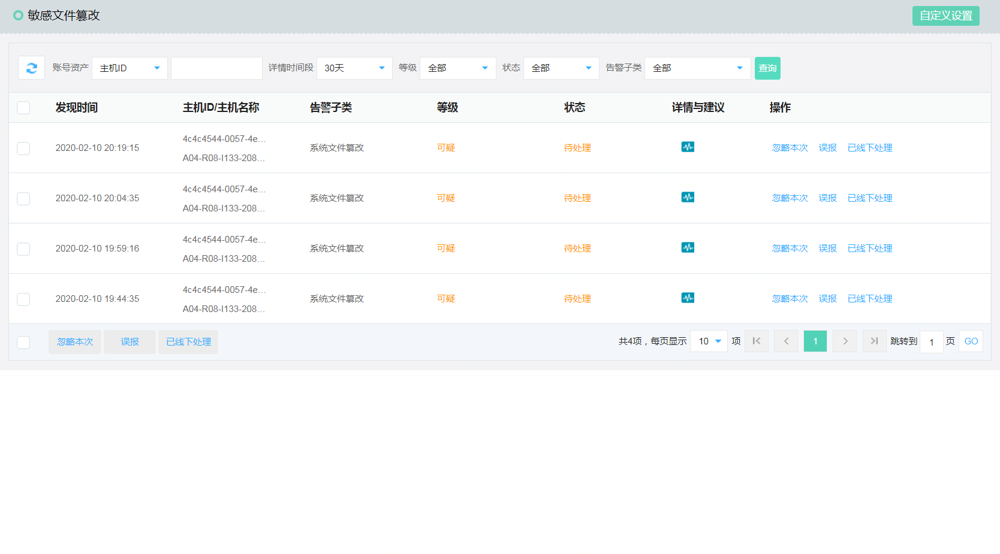
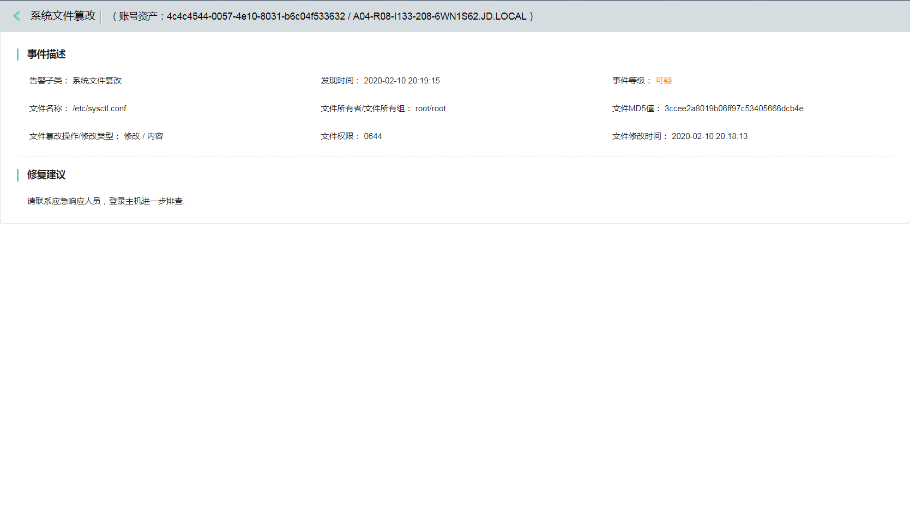
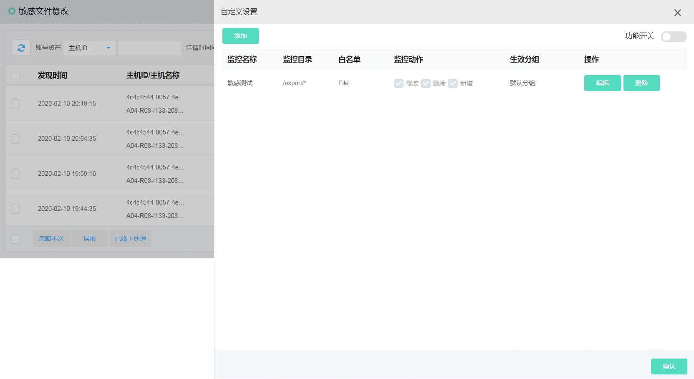

## 敏感文件篡改

#### 功能描述

1、实现 PCI-DSS 等法规和隐私标准的合规性

2、监控特权用户的活动，检测并中断潜在的威胁

3、更快地检测关键文件、系统和应用程序的更改

4、支持监控文件完整性，可发现删除文件、修改文件、新增文件等文件完整性异常行为

#### 产品功能入口

进入控制台->【主机安全】->【入侵威胁】->【敏感文件篡改】 

点击详情与建议

点击【自定义设置】，设置用户自定义目录与文件监控。

