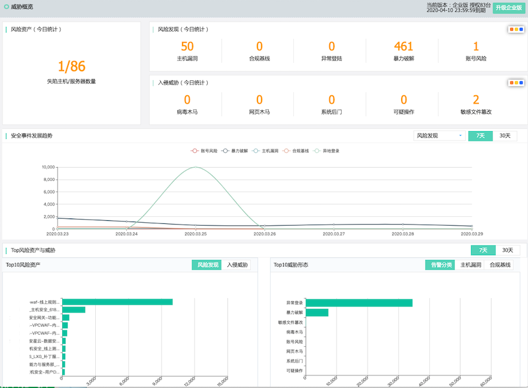
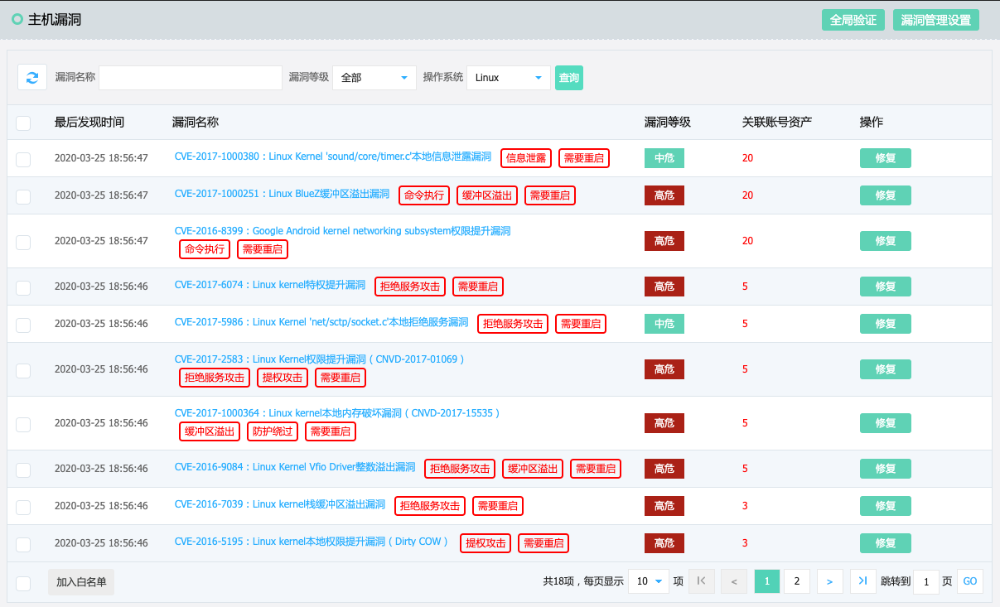
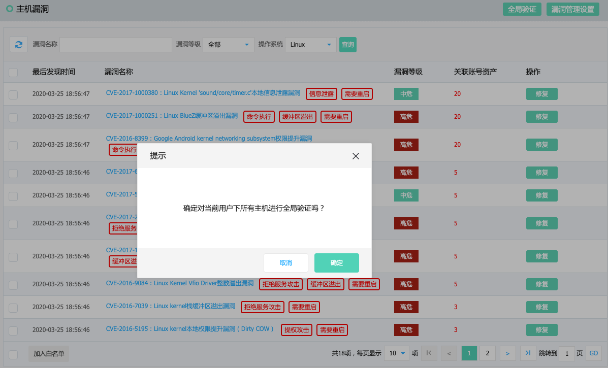
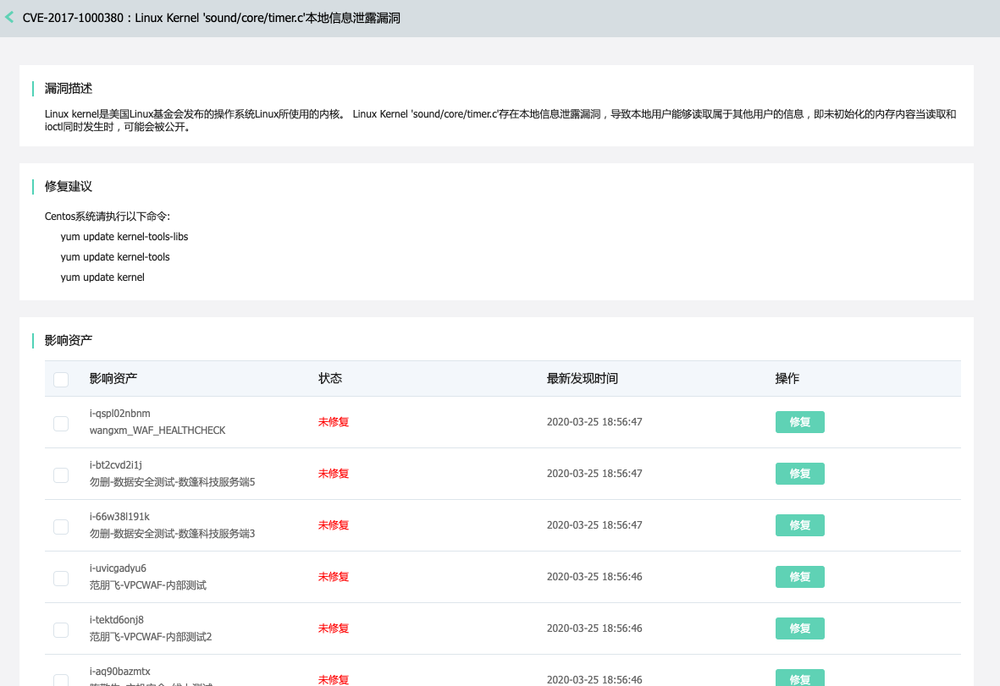
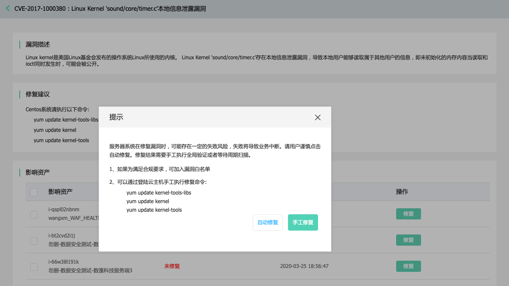
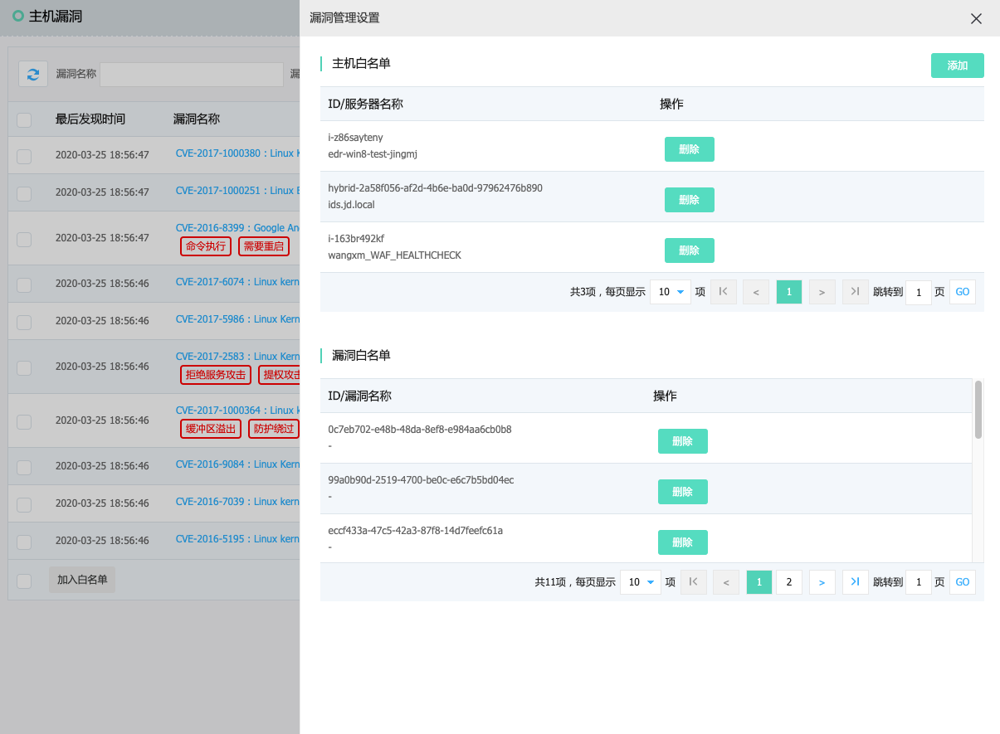

## 主机漏洞

#### 产品功能入口

进入控制台->【主机安全】->【威胁概览】 点击主机漏洞跳转到【主机漏洞】

进入控制台->【主机安全】->【主机漏洞】

#### 操作指导

进入控制台->【主机安全】->【主机漏洞】,点击右上角新建检查全局验证

点击漏洞名称，进入到CVE漏洞详情描述，同时显示受影响的主机列表。

点击【修复】，可手工和自动修复漏洞。

点击【漏洞管理设置】，可添加，删除，修改主机白名单，执行取消漏洞白名单操作。

