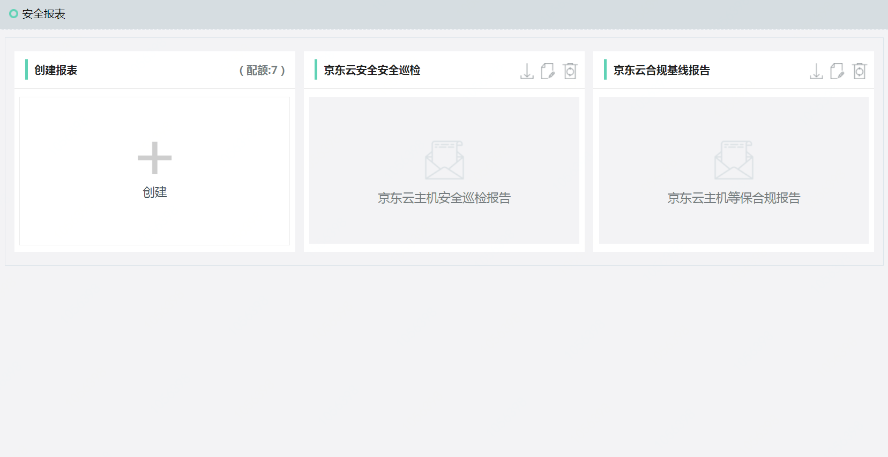
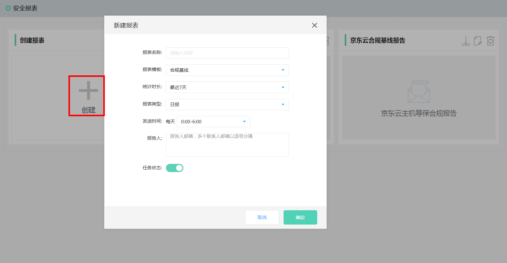
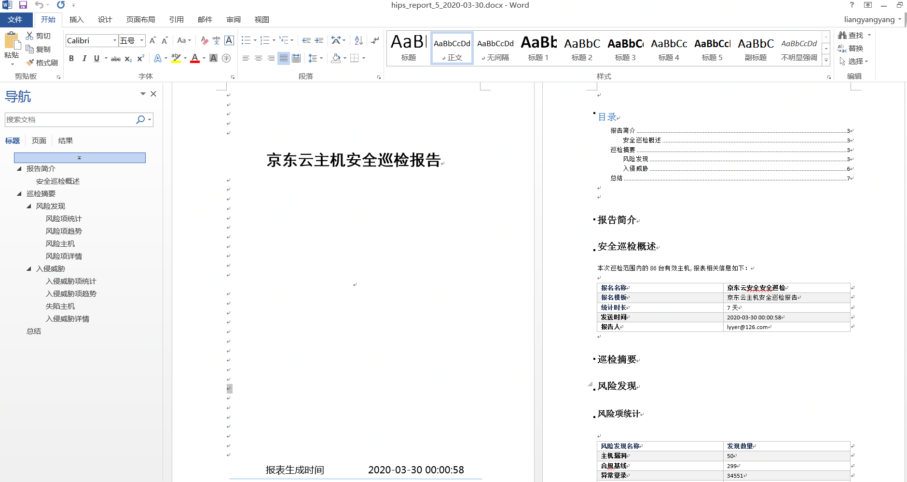

## 系统报表

#### 功能描述

| 类别 | 功能描述|
|---- |-----|
| 合规基线       |   合规基线报表用于导出基线任务中的基线规则检查详情，以帮助用户对合规情况进行分析和响应   | 
| 安全巡检       |   安全巡检主要是对评估范围内的服务器进行安全扫描，对被评估对象进行一系列的安全分析与探测，以发现目标存在的安全隐患并确实的告知修复建议，提升安全等级     | 

#### 产品功能入口

进入控制台->【主机安全】->【系统报表】

#### 操作指导

点击创建，下发报表生成调度任务。

点击下载。

