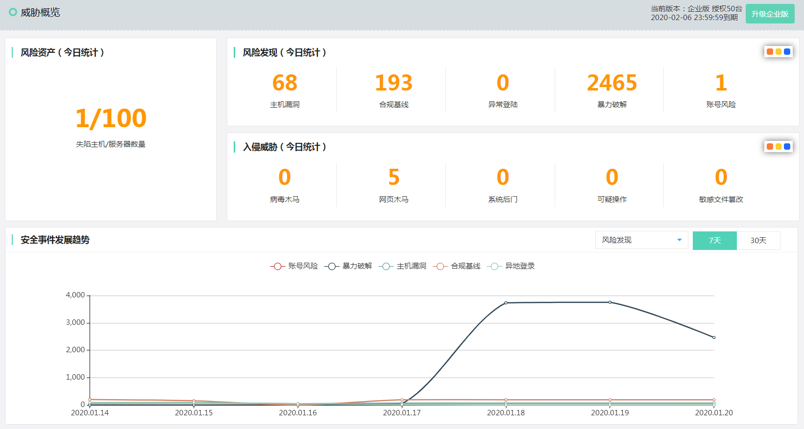
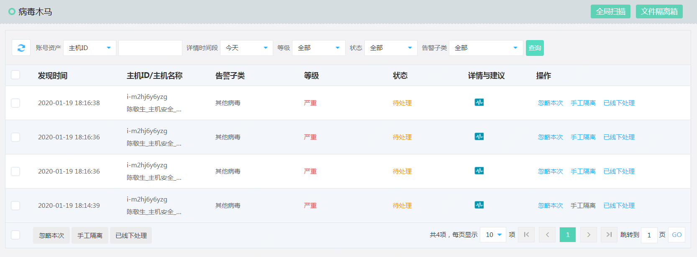
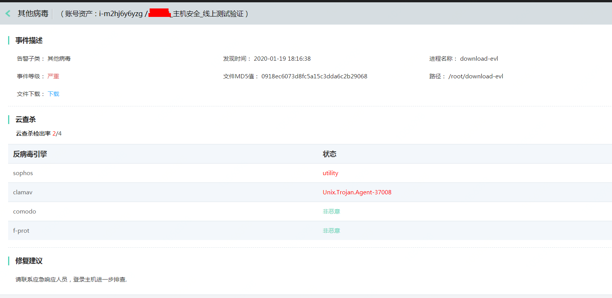
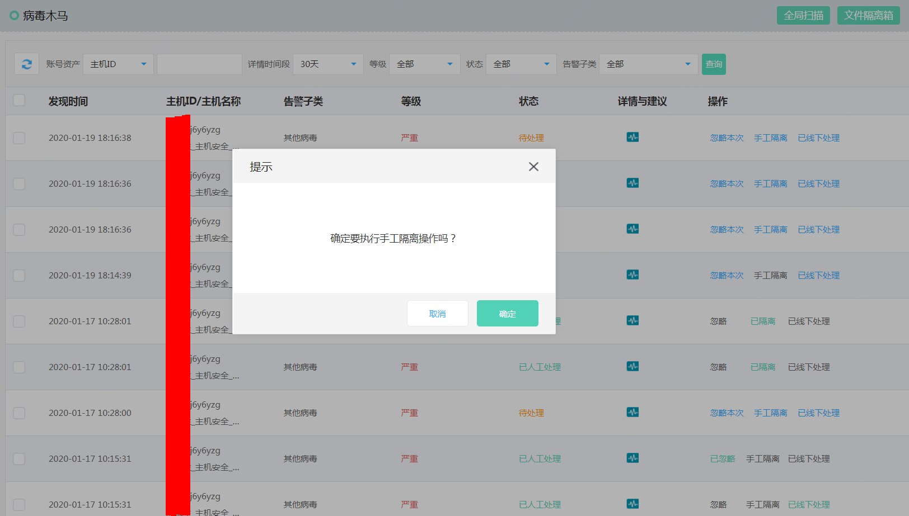
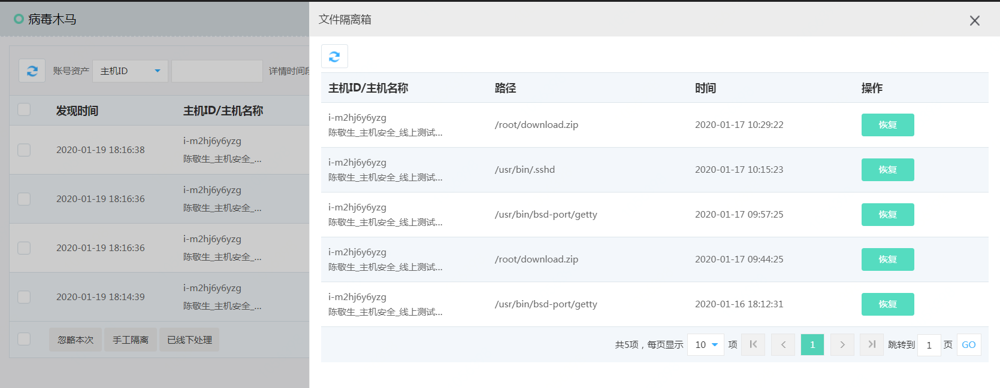
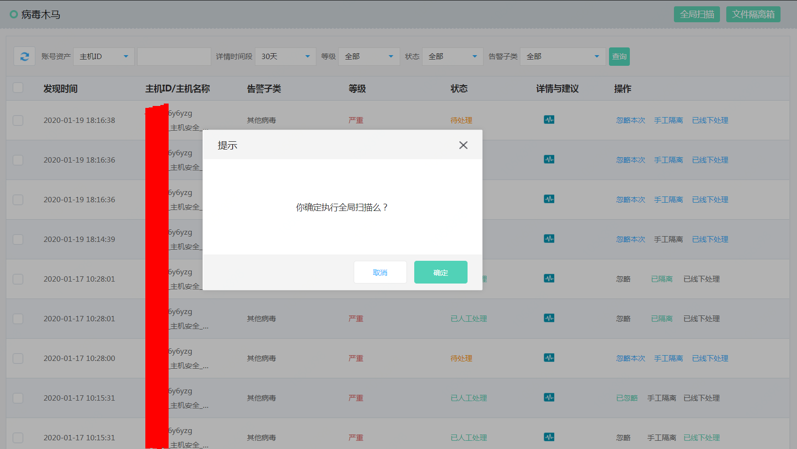

## 病毒木马

#### 功能描述

定期扫描进程并监控进程启动事件，通过云查杀机制检测恶意病毒和木马进程，控制台支持一键隔离恶意文件，同时提供隔离文件恢复功能。

#### 安全事件展示

进入控制台->【主机安全】->【威胁概览】 点击入侵威胁中病毒木马跳转到【病毒木马】

进入控制台->【主机安全】->【入侵威胁】->【病毒木马】

#### 一键隔离

首先查看查杀结果，进入控制台->【主机安全】->【入侵威胁】->【病毒木马】,点击右侧详情

确认存在恶意软件后进行隔离，进入控制台->【主机安全】->【入侵威胁】->【病毒木马】,点击右侧手工隔离

如果用户发现隔离错误，还可以点击文件隔离箱，找到相应文件，点击恢复隔离文件

#### 全局扫描

当用户发现其他可疑安全事件时，可手工执行全局恶意进程扫描功能，进入控制台->【主机安全】->【入侵威胁】->【病毒木马】,点击右上角全局扫描

