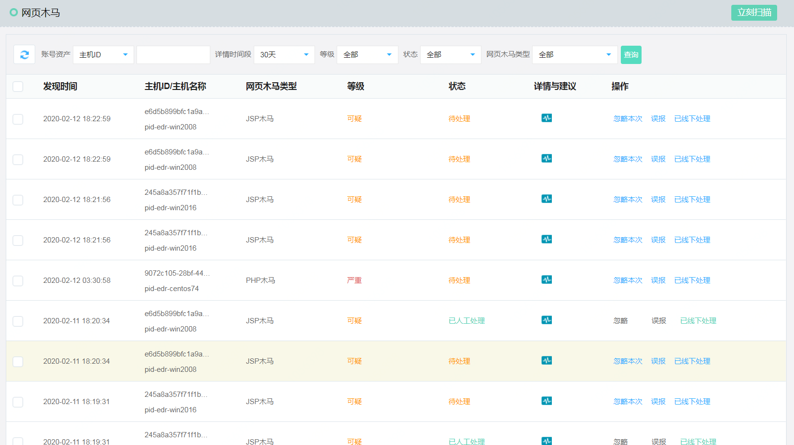
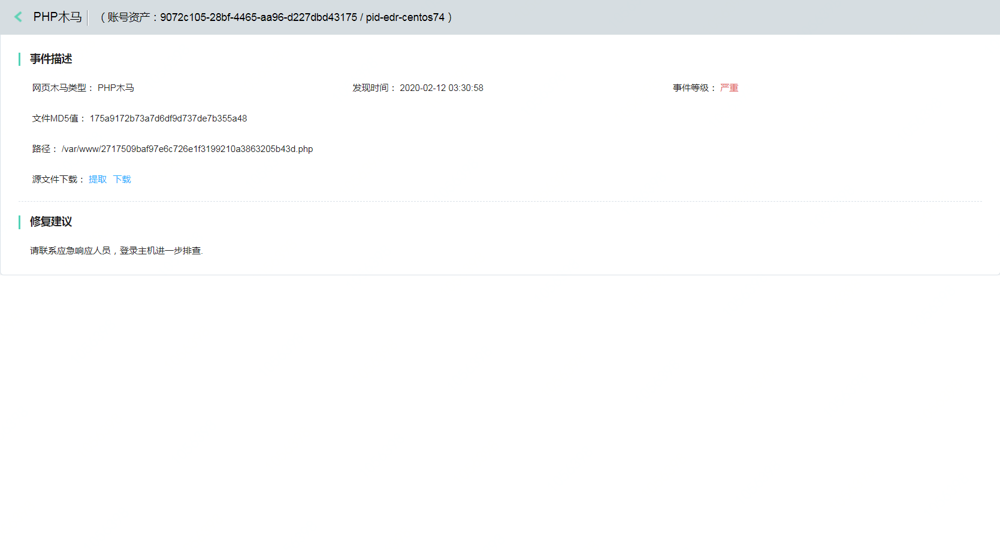
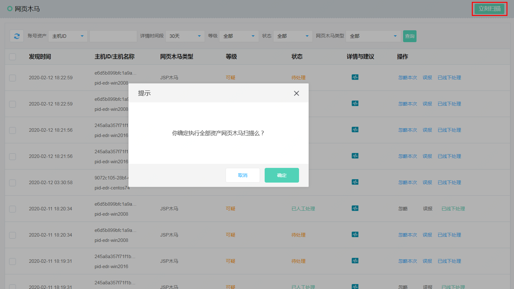

## 网页木马

#### 功能描述

1、检测能力：通过审计用户命令行中输入的可疑操作行为，包括：密码文件修改、 恶意文件下载、代理软件滥用、篡改系统日志、篡改ssh密钥、运行黑客工具、反弹shell、信息泄露、高危命令、破坏安全程序、明文密码登录等。
2、支持全局关闭该功能。

#### 产品功能入口

进入控制台->【主机安全】->【入侵威胁】->【网页木马】 

点击详情与建议

点击【立刻扫描】，对所有云主机web目录进行webshell检测。

