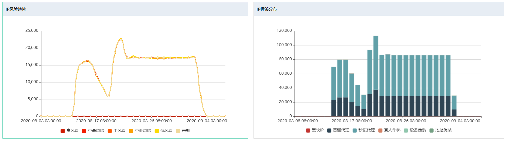
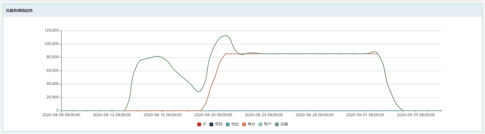

## 统计数据查看

您可以在风险识别控制台查看风险识别API的统计分析数据。风险识别控制台汇总了风险识别API的调用统计数据，支持查询最近3个月内IP、号码、地址等检测接口的总识别量（等于调用次数）、不同风险级别占比以及识别量变化趋势、标签类型分布以及识别量统计数据、各服务调用趋势等。

### 操作步骤

1. 登录京东智联云控制台，点击**安全-风险识别**，进入风险识别控制台。

2. 在左侧导航栏，单击**数据概览**。

3. 通过页签选择要查询的检测接口类型：**IP**、**号码**、**地址**等。

4. 在**数据概览**页面，选择查询时间，并单击**查询**。

   支持查询的时间段为最近3个月内。支持设置的时间跨度为1个月。如下图

   

5. 可以在统计表上看到单个服务识别总量及不同风险级别分布。如下图

   

6. 可以在统计表上看到单个服务识别量变化趋势及不同标签类型分布趋势。如下图，显示IP的识别量趋势及标签分布趋势。

   
   
7. 可以查看不单个服务的详细调用量统计，如下表是IP调用量统计。

    

8. 可以查看调用不同风险识别服务的调用趋势。

 

