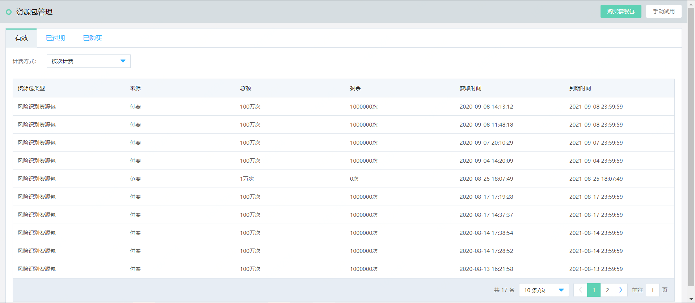

# 购买流程

本文介绍风险识别资源包的购买入口。

## 前提条件

- 已注册京东云账号，并完成实名认证。如果还没有账号请 [注册](https://accounts.jdcloud.com/p/regPage?source=jdcloud&ReturnUrl=//uc.jdcloud.com/passport/complete?returnUrl=http://uc.jdcloud.com/redirect/loginRouter?returnUrl=https%3A%2F%2Fwww.jdcloud.com%2Fhelp%2Fdetail%2F734%2FisCatalog%2F1)，或 [实名认证](https://uc.jdcloud.com/account/certify)。

## 		购买方式

风险识别产品的API可以使用按量资源包抵扣或包年资源包使用。

购买流程如下：

方式一：**官网购买**

1. 登录您的京东云账号。
2. 进入京东云官网，选择**产品-云安全-风险识别**，点击**立刻购买**，前往**风险识别产品购买页**。
3. 选择按次计费或包年包月类型。
4. 点击**立即购买**，并完成支付。

  方式二：**控制台购买**

​	 1、登录您的京东云账号。

​	 2、进入京东云控制台，选择**云安全-风险识别**-**资源包管理**页面，点击**购买套餐包**，前往**风险识别产品购买页**。

​	 3、选择按次计费或包年包月类型。

​	 4、点击**立即购买**，并完成支付。

流量包说明如下表：

| 类型/说明 | 资源包类型                                                   | 资源包规格                                                   | 购买时长                                                     |
| :-------- | :----------------------------------------------------------- | :----------------------------------------------------------- | :----------------------------------------------------------- |
| 按次计费  | 一次性流量包。使用完或者到期即失效，可以购买多个，按照购买的时间顺序抵扣。 | 规格无法升级或降级，也无法续费。可以一次购买多个（规格越高，折扣越大）。 | 购买成功后即刻生效。一年后流量包到期。未用完的流量包不支持退订。 |
| 包年包月  | 包年不限次，单个品类建议购买1个。                            | 根据需要识别的信息进行购买                                   | 购买成功后即刻生效。一年后停止服务。                         |

