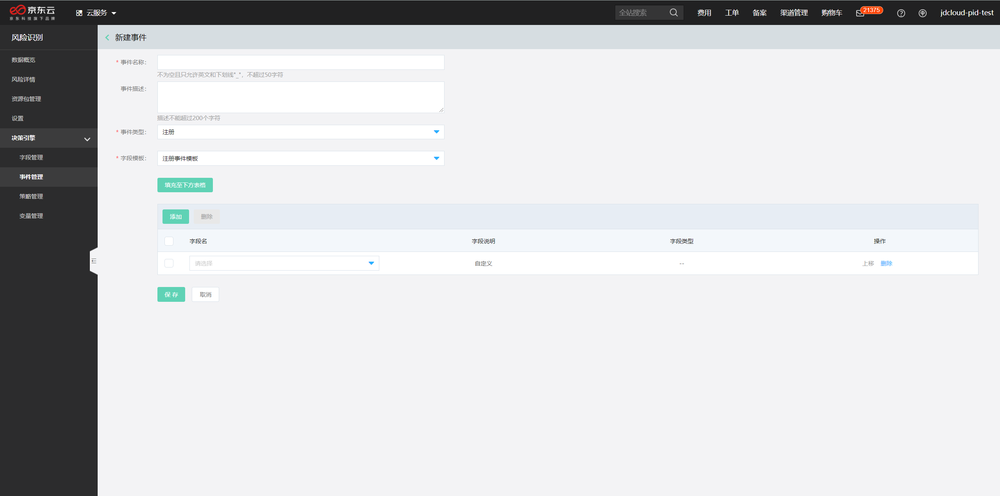
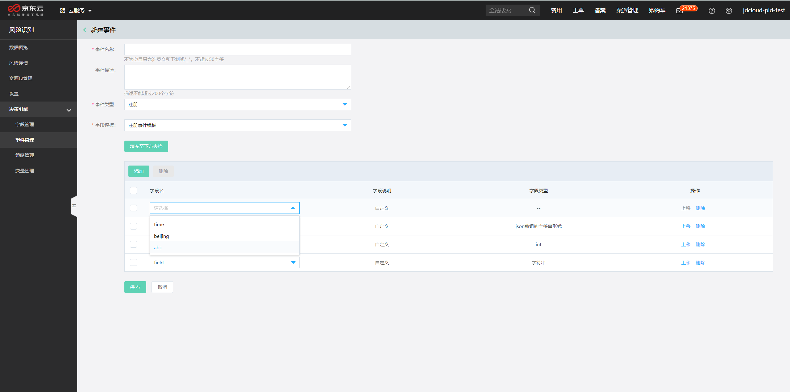
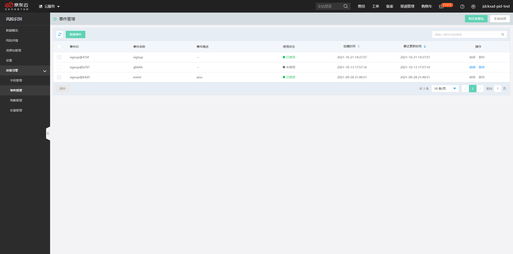

## 事件管理

**本文介绍如何在决策引擎中创建事件。**

## 背景信息

- 事件的含义：事件用于定义复杂决策的业务场景，例如手机端注册，双十一大促活动。用户可以将一个用户行为定义为一个事件，例如注册，绑定手机号，交易等，也可以将一个系统行为定义为一个事件，例如发放红包奖励，发放优惠券等。
- 使用场景：当某个业务场景需要区分设定和运营一整套策略决策时，可以通过创建事件来定义一个场景。当调用引擎时，传入相应的事件ID，决策引擎会将不同事件的数据请求路由到相应的策略集合中进行相应运算。

## 操作步骤

1. 登录[风险识别控制台](https://bri-console.jdcloud.com/fieldManagement)。

2. 在左侧导航栏，选择**决策引擎** > **事件管理**。

3. 在**事件管理**页面，单击**新建事件**。

4. 配置新建事件的参数。

   您可以参考以下说明配置参数。

   - **事件ID**：系统默认生成，当调用引擎时，传入相应的事件ID，决策引擎会将不同事件的数据请求路由到相应的策略集合中进行相应运算。

   - **事件名称**：输入事件的名称，建议使用易理解的业务场景名称，事件与策略关联成功后不支持编辑和修改。

   - **事件描述**：输入事件的描述信息。

   - **事件字段**：配置事件的详细字段信息。支持使用以下方式：

     - 选择模板：单击模板下拉列表选择合适的模板后，单击**填充至下方表格**。风险识别为您提供了常用的业务场景模板，可以快速帮您配置事件字段。如果新建事件的场景和已有模板的场景一致，建议您使用模板。

       

     - 增加自定义字段：单击**添加**，选择字段信息后。同一事件下，字段名不能重复。

       

5. 单击保存。

   成功后会返回事件列表页，系统会自动为您创建一个事件ID，该值在决策引擎接入环节非常重要。

   