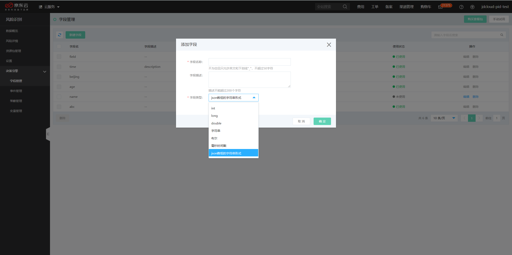

## 字段管理

**本文介绍如何在决策引擎中创建字段。**

## 背景信息

- 字段的含义：字段是事件的组成元素，一个事件通常包括多个字段，例如注册事件包括的字段有手机号、ip、邮箱、注册时间等。您可以在新建事件时，使用决策引擎自带的”系统默认字段“，也可以自行创建“自定义字段”。推荐使用“系统默认字段”。字段按照类型分为：int、long、double、字符串、布尔型、日期型、json数组的字符串形式。

- 使用场景：“系统默认字段”通常可以满足大多数场景，包括注册、登录、营销和订单的字段需求，当所需字段超出该范围时，可自行添加“自定义字段”。

## 操作步骤

1. 登录[风险识别控制台](https://bri-console.jdcloud.com/fieldManagement)。

2. 在左侧导航栏选择**决策引擎>字段管理**。

3. 在字段管理界面，单击**新建字段**按钮。

   

4. 填写字段的信息。

   - **字段名称**：字段名称，建议取有业务含义的名称，例如：orderId。
   - **字段描述**：字段的描述信息，例如：订单ID。
   - **字段类型**：字段类型包括：int、long、double、字符串、布尔型、日期型、json数组的字符串形式。