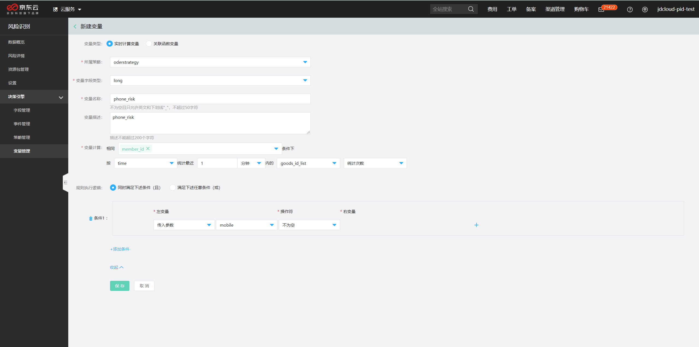
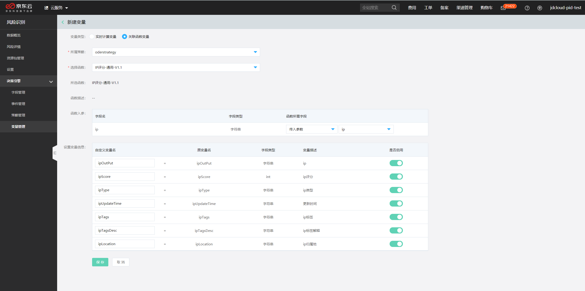

## 变量管理

本文介绍如何在决策引擎中创建和使用变量。

## 背景信息

- 变量含义：变量相较于常量而言是一个动态的计算过程，它使用输入参数按照一定的计算逻辑计算得到变量结果。在决策引擎中变量的计算逻辑支持：关联函数变量（例如：提取IP前三段）、实时计算变量（例如：一小时内，某IP关联账户的个数）等。

## 功能介绍

1. 登录[风险识别控制台](https://bri-console.jdcloud.com/fieldManagement)。

2. 在左侧导航栏选择**决策引擎>变量管理**。

3. 在字段管理界面，单击**新建变量**按钮

在决策引擎系统中新建有两种方法：

1、在新建变量页面选择实时计算变量，进行变量配置。

- **所属策略**：下拉选择变量关联的策略。

- **变量字段类型**：long。

- **变量名称**：输入变量的名称，建议使用易理解的名称，变量与策略关联成功后不支持编辑和修改。

- **变量描述**：变量的描述信息.

- **变量计算**：在相同条件下，按某个自定义的入参，进行次数统计或者去重统计。

- **更多配置**：可添加前置条件，满足条件的前提下，才进行变量计算。

  

实时计算变量可用于计算某个主体的某种行为在一段时间内发生的情况，您可根据自己的业务场景灵活配置。累计变量支持统计次数、去重统计次数等不同维度的计算方式，支持按照天、小时、分钟等时间分片逻辑，如需了解详情，请联系我们。

单击**保存**。

成功后，会跳转到变量列表页面，在策略中就可以选取对应的变量进行配置。

2、在新建变量页面选择关联函数变量，进行变量配置。

- **所属策略**：下拉选择变量关联的策略。

- **选择函数**：下拉选择对应的函数。

- **函数入参**：定义函数所需的字段，可以是事件入参、自定义变量和手动输入的具体值。

- **设置变量信息**：输入自定义变量名，可以与原变量名一致，打开**启用**按钮。

  

单击**保存**。

成功后，会跳转到变量列表页面，在策略中就可以选取对应的变量进行配置。

