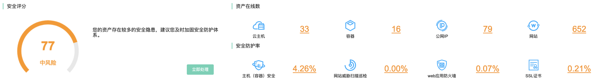
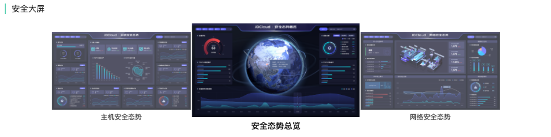
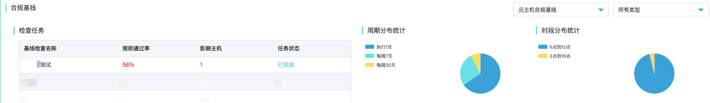
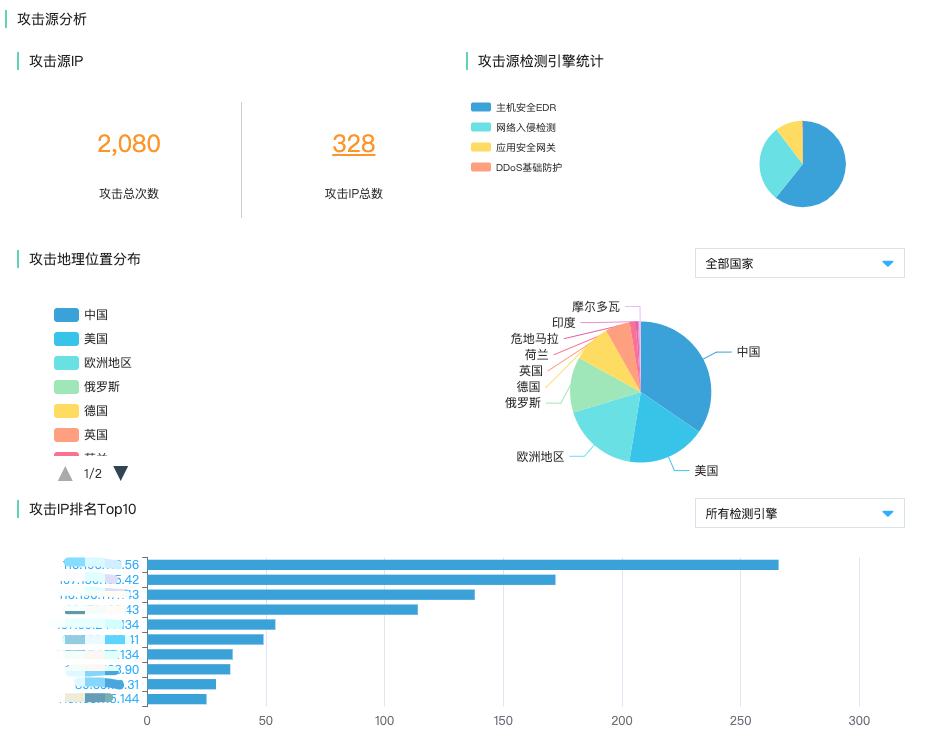

# 安全中心

## 安全合规看板

### 功能说明

​		京东云安全为上云用户提供租户视角的资产与安全的数据集中展示，旨在通过安全合规看板帮助运营人员直观呈现当前整个租户范围内系统运行的安全健康程度（安全评分），统计当前在线资产数量和不同类型资产的配套安全防护产品的安全防护率。同时提供安全监控大屏、实时呈现威胁攻击风险态势，通过操作系统合规基线检查（云主机、容器）、云平台配置检查，检查用户使用的资产存在的潜在风险项；通过构建攻击源画像，分析当前租户系统内受攻击情况、攻击来源与地理位置分布；最后通过趋势图呈现用户近七天资产的漏洞趋势、告警事件的趋势。

### 安全评分&资产在线数&安全防护率

#### 安全评分

​		安全评分主要包含安全风险处置三个部分内容（安全风险评估、安全事件评估、安全能力评估），点击立即处理跳转安全运营中心进行风险处置。

| 维度         | 指标          | 数据来源                                                     |
| ------------ | ------------- | ------------------------------------------------------------ |
| 安全风险评估 | 主机漏洞      | 主机安全 资产类型：云主机、物理服务器                     |
| 安全风险评估 | 应用漏洞      | 网站威胁扫描 资产类型：公网IP、内网IP、域名               |
| 安全风险评估 | 操作系统基线  | 主机安全 资产类型：云主机、物理服务器                    |
| 安全风险评估 | 云产品基线    | 安全运营中心-云产品基线 资产类型：云主机、原生容器、私有网络、负载均衡、云数据库RDS、云数据库MongoDB 云缓存Redis、云缓存Memcached、对象存储、IP高防、Web应用防火墙、主机安全 |
| 安全事件评估 | 安全告警      | 主机安全 Web应用防火墙 应用安全网关 DDoS基础防护 网络入侵检测 威胁诱捕（蜜罐） 威胁情报 文件鉴定器（沙箱） AI异常检测 容器安全 |
| 安全事件评估 | 安全事件      | 安全运营中心-MITRE ATT&CK攻击模型检测                        |
| 安全能力评估 | 安全蜜罐      | 计算方式：已部署蜜罐子网数量/租户子网总数 资产类型：子网  |
| 安全能力评估 | 主机安全      | 计算方式：已部署主机安全资产数/资产总数 资产类型：云主机、容器、物理服务器 |
| 安全能力评估 | Web应用防火墙 | 计算方式：配置waf的域名&公网IP资产数量/域名&公网IP资产总数 资产类型：公网IP、域名 |
| 安全能力评估 | 数据库审计    | 计算方式：已部署数据库审计的云数据库数量/数据库资产总数 资产类型：云数据库RDS、云数据库MongoDB |
| 安全能力评估 | DDoS防护      | 计算方式：已部署DDoS基础防护的公网IP数量/公网IP总数 资产类型：公网IP |

#### 资产在线数

| 资产类型 | 备注                    |
| -------- | ----------------------- |
| 云主机   | 在线状态云主机实例总数  |
| 容器     | 在线状态容器实例总数    |
| 公网IP   | 在线状态公网IP总数      |
| 网站     | 在线状态域名&子域名总数 |

#### 安全防护率

| 安全防护能力           | 备注                                | 资产类型                 |
| ---------------------- | ----------------------------------- | ------------------------ |
| 主机（容器）安全防护率 | 部署主机安全的资产数/资产总数       | 云主机、容器、物理服务器 |
| 网站威胁扫描巡检       | 周期扫描任务中包含的资产数/资产总数 | 公网IP、内网IP、域名     |
| Web应用防火墙          | 配置WAF的资产数/资产总数            | 公网IP、域名             |
| SSL证书                | 配置SSL证书的资产数/资产总数        | 域名                     |

### 安全大屏

​		安全态势大屏主要包含安全态势总览、网络安全态势、主机安全态势三部分。分别提供当前系统的整体资产的安全态势进行综合评估与可视化呈现，通过**安全态势概览、网络安全态势、主机安全态势**进行呈现，在重大活动保障时期为用户提供整体安全态势评估。支持自定义是时间区间进行筛选查询。

| 大屏类型     | 备注                                           | 版本                                 |
| ------------ | ---------------------------------------------- | ------------------------------------ |
| 安全态势总览 | 呈现租户视角整体安全风险态势                   | 跳转查看，需要购买安全运营中心企业版 |
| 网络安全态势 | 呈现租户视角网络攻击风险态势                   | 跳转查看，需要购买安全运营中心企业版 |
| 主机安全态势 | 呈现租户视角所有部署主机安全的全部资产风险态势 | 跳转查看，需要购买安全运营中心企业版 |

### 合规基线

​		合规基线旨在通过检查任务的方式，根据主机实例类型资产不同操作系统的实际情况进行合规检查。

- 支持一键任务化基线检测，检查结果可视化直观呈现。
- 自动跟踪配置状态的变更，大大提升了安全运营管理效率。
- 参考国内外基线检测的最佳实践，完美满足监管机构合规审计要求。

| 合规基线       | 基线类型                  | 备注  |
| -------------- | ------------------------- | ----- |
| 云主机合规基线 | Windows等级保护三级       | 142项 |
| 云主机合规基线 | Linux等级保护三级         | 18项  |
| 云主机合规基线 | 京东云Linux最佳安全实践   | 16项  |
| 云主机合规基线 | 京东云Windows最佳安全实践 | 11项  |
| 容器合规基线   | Docker最佳实践            | 37项  |
| 容器合规基线   | Kubernetes最佳实践        | 91项  |

#### 检查任务&检查周期&检查时段

​		呈现当前所有检查任务中最近进行合规基线检查的三个基线任务，包括基线检查名称、规则通过率、影响主机、任务状态。以及检查任务周期分布与时间分布。

| 合规基线              | 备注                                         |
| --------------------- | -------------------------------------------- |
| 检查任务列表（近3个） | 基线检查名称、规则通过率、影响主机、任务状态 |
| 周期分布统计          | 执行1次、每隔1天、每隔7天、每隔30天、        |
| 时段分布统计          | 0点-6点、6点-12点、12点-18点、18点-24点      |

### 攻击源分析

#### 攻击源分析

​		攻击源分析包含当前租户系统受攻击IP总次数、攻击IP总数量、攻击源检测引擎分布、攻击地理位置分布、攻击IP攻击次数排名。

#### 攻击源IP&检测引擎

| 攻击源统计项 | 备注                                                         |
| ------------ | ------------------------------------------------------------ |
| 攻击总次数   | 所有检测引擎上报攻击次数之和                                 |
| 攻击IP总数   | 所有检测引擎上报攻击IP数量之和                               |
| 攻击检测引擎 | 主机安全引擎、网络入侵检测引擎、应用安全网关 web应用防火墙、DDoS基础防护、威胁诱捕（蜜罐） |

#### 攻击地理位置

​		直观呈现当前攻击源IP的地址位置分布来源（国家-城市）

#### 攻击IP排名TOP10

​		直观呈现当前通过检测引擎上报而来的攻击IP对应的攻击次数排名，可以通过下拉选择特定检测引擎进行检索，点击攻击IP跳转“安全运营中心 > 安全防范 > 攻击面分析”

### 云平台配置检查

#### 检查统计

| 统计维度         | 备注                                                         |
| ---------------- | ------------------------------------------------------------ |
| 存在风险的检查项 | 从身份认证、网络访问控制、数据安全、日志审计、基础安全防护五个维度为您提供云产品安全配置的检测，帮助您及时发现当前账号下的云产品配置风险并提供相应的修复方案。 本次云产品基线提供14款云产品共计24项安全配置核查 点击跳转“安全运营中心 > 安全防范 > 云产品基线” |
| 风险项设计资产数 | 受存在风险的检查项影响的资产数量 检查项资产类型：云主机、原生容器、负载均衡、数据库（RDS、MongoDB、Redis、Memcached）、对象存储、ACL规则项、WAF实例、主子账号多因子 点击跳转“安全运营中心 > 安全防范 > 云产品基线” |

#### 影响资产TOP5

检查有风险的资产中，呈现包含最多风险项的Top5资产id

#### 检查项TOP5

​		按照检查项影响资产数量排名，呈现检查子项、受影响资产数量、检查项分类，点击操作“去处理”，点击跳转“安全运营中心 > 安全防范 > 云产品基线”

| 检查项分类   | 备注 |
| ------------ | ---- |
| 网络访问控制 | 11项 |
| 数据安全     | 5项  |
| 身份认证     | 5项  |
| 基础安全防护 | 2项  |
| 日志审计     | 1项  |

### 安全态势发展趋势（漏洞&风险）

| 安全态势发展趋势（近7天） | 备注             |
| ------------------------- | ---------------- |
| 主机漏洞趋势              | 严重、高危、中危 |
| 应用漏洞趋势              | 高危、中危、低危 |
| 告警风险趋势              | 总量、待处理     |
| 事件风险趋势              | 总量、待处理     |

### 
