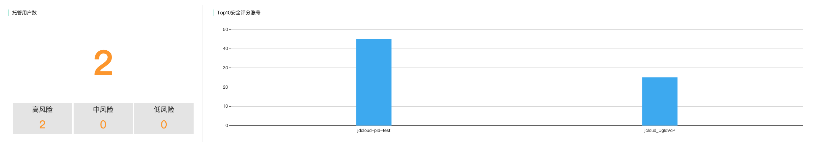
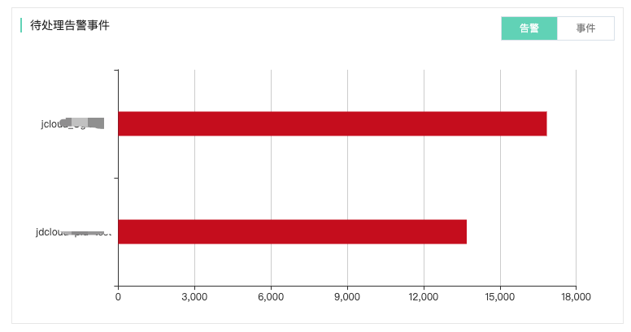
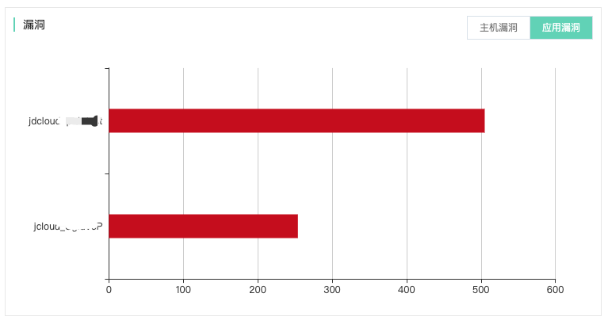
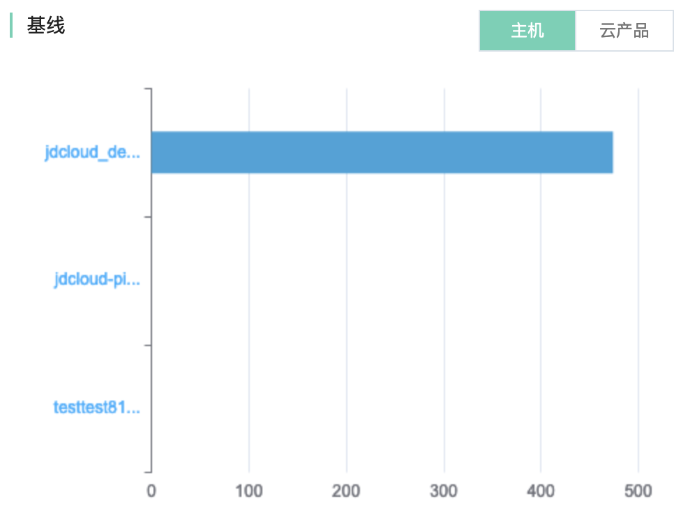
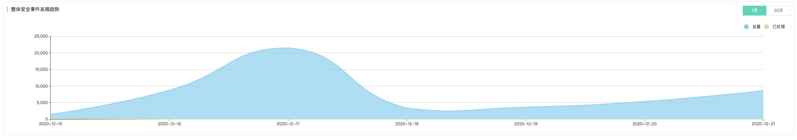
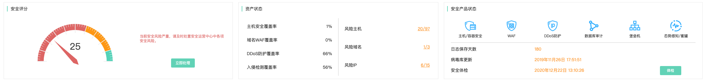
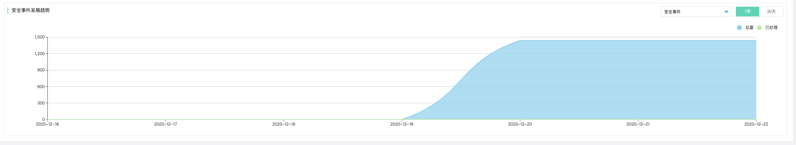

# 安全可视-仪表盘

## 统计看板

### 功能说明

京东智联云安全运营中心针对云上用户安全托管的场景，提供多用户安全托管服务统计看板，可以直观呈现当前账号下所托管的用户数，以及不同用户风险等级情况。针对每个被托管账号进行安全评分，并截取TOP10的安全评分账号进行排名，得分较低的云上账号存在较多的安全风险及漏洞。

### 托管用户数统计&Top10安全评分账号

直观展现当前托管用户的账号数量以及高、中、低风险分布；直观展现当前安全评分最低的10个账号。

### Top5安全状态账号

#### 托管账号待处理告警事件

待处理告警：由各类安全产品的安全检测引擎上报到安全运营中心的针对不同账号的告警事件总数，点击下钻可查看详情；

待处理事件：基于Att&ck攻击模型，分析得出针对不同账号的安全威胁事件总数，点击下钻可查看详情。

#### 托管账号存在漏洞情况

针对不同账号支持针对账号内不同类型的资产存在的漏洞进行分类汇总统计，包含主机类漏洞与网站服务应用类漏洞，点击下钻可查看详情。

#### 托管账号合规基线情况

针对不同账号支持针对账号本身各类产品使用的安全基线情况进行分类汇总统计，包含主机合规基线与使用各类云上产品的基线，点击下钻可查看详情。

### 整体安全态势发展趋势

针对整体安全态势支持基于近7天和近30天的趋势查询，并基于安全告警和安全事件两类不同的趋势进行分别统计。

## 威胁概览

### 功能说明

京东智联云安全运营中心针对当前账号内的整体资产的安全状态进行安全评分，以量化当前账号内的安全程度。此外针对账号内各种类型的资产安全产品的覆盖情况以及当前存在风险的资产进行统计呈现，此外安全运营中心中针对各种类型的资产包含的各类安全能力在安全产品状态中进行集中呈现；同时，直观显示日志保存天数、病毒库最近更新时间以及最近安全体检的时间。

威胁概览的可视化数据看板，可以查询一个特定账号、也可以选择多个账号进行综合查询。

### 安全评分&资产风险状态&安全产品状态

直观展现当前托管用户的账号数量以及高、中、低风险分布；直观展现当前安全评分最低的10个账号。

### 安全状态（告警事件|漏洞|基线）

| 安全状态 | 子项                     | 备注                                                         |
| :------- | :----------------------- | ------------------------------------------------------------ |
| 告警事件 | 待处理告警 待处理事件 | 点击跳转至：威胁检测-安全告警 点击跳转至：威胁检测-安全事件 |
| 漏洞信息 | 主机漏洞 应用漏洞     | 点击跳转至：安全防范-漏洞管理-主机漏洞列表 点击跳转至：安全防范-漏洞管理-应用漏洞列表 |
| 基线信息 | 合规基线 云产品基线   | 点击跳转至：安全防范-合规基线-合规检测列表 点击跳转至：安全防范-云产品基线-云产品基线检查项列表 |

### 整体安全态势发展趋势

针对整体安全态势支持基于近7天和近30天的趋势查询，并基于（告警事件|安全事件|主机漏洞|应用漏洞|合规基线|云产品基线）多种不同维度的趋势进行分别统计。

