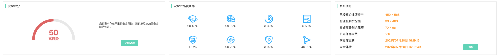
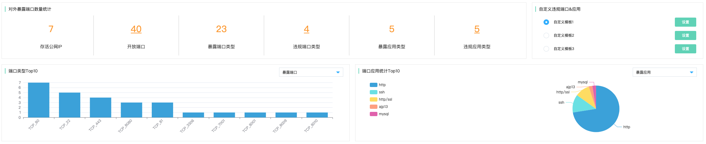
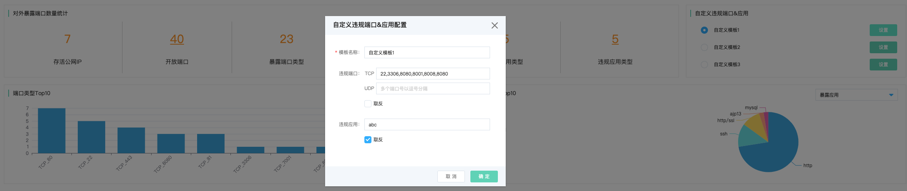
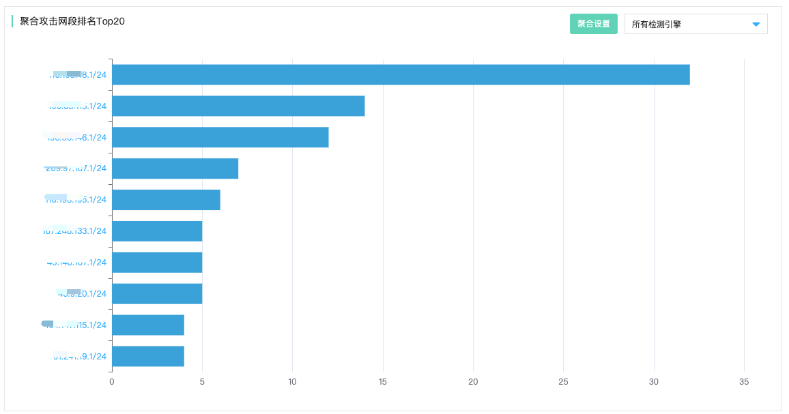
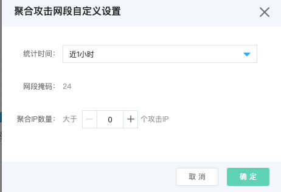

# 安全可视-仪表盘

## 统计看板

### 功能说明

京东云安全运营中心针对云上用户安全托管的场景，提供多用户安全托管服务统计看板，可以直观呈现当前账号下所托管的用户数，以及不同用户风险等级情况。针对每个被托管账号进行安全评分，并截取TOP10的安全评分账号进行排名，得分较低的云上账号存在较多的安全风险及漏洞。

### 托管用户数统计&Top10安全评分账号

直观展现当前托管用户的账号数量以及高、中、低风险分布；直观展现当前安全评分最低的10个账号。

### Top5安全状态账号

#### 托管账号待处理告警事件

待处理告警：由各类安全产品的安全检测引擎上报到安全运营中心的针对不同账号的告警事件总数，点击下钻可查看详情；

待处理事件：基于Att&ck攻击模型，分析得出针对不同账号的安全威胁事件总数，点击下钻可查看详情。

#### 托管账号存在漏洞情况

针对不同账号支持针对账号内不同类型的资产存在的漏洞进行分类汇总统计，包含主机类漏洞与网站服务应用类漏洞，点击下钻可查看详情。

#### 托管账号合规基线情况

针对不同账号支持针对账号本身各类产品使用的安全基线情况进行分类汇总统计，包含主机合规基线与使用各类云上产品的基线，点击下钻可查看详情。

### 整体安全态势发展趋势

针对整体安全态势支持基于近7天和近30天的趋势查询，并基于安全告警和安全事件两类不同的趋势进行分别统计。

## 威胁概览

### 功能说明

京东云安全运营中心针对当前账号内的整体资产的安全状态进行安全评分，以量化当前账号内的安全程度。此外针对账号内各种类型的资产安全产品的覆盖情况以及当前存在风险的资产进行统计呈现，此外安全运营中心中针对各种类型的资产包含的各类安全能力在安全产品状态中进行集中呈现；同时，直观显示日志保存天数、病毒库最近更新时间以及最近安全体检的时间。

威胁概览的可视化数据看板，可以查询一个特定账号、也可以选择多个账号进行综合查询。

### 安全评分&安全产品覆盖率&系统信息

#### 安全评分

安全评分主要包含安全风险处置三个部分内容（安全风险评估、安全事件评估、安全能力评估）

##### 安全风险评估

安全风险评估分值为60分，主要针对**安全漏洞**与**安全基线**两方面，进行安全检查。

安全漏洞包含主机安全产品检测出的**主机漏洞**与针对IP及域名资产进行主动扫描的**应用漏洞**（包含web站点漏洞、服务应用漏洞）

安全基线包含针对两类操作系统（Windows、Linux）的云主机，结合四类基线检查模板（**Linux等级保护三级、Windows等级保护三级、京东云Linux最佳安全实践、京东云Windows最佳安全实践**）进行操作系统基线检测。

| 安全风险评估内容 | 分值 | 计分算法                                                     |
| ---------------- | ---- | ------------------------------------------------------------ |
| 应用漏洞         | 20分 | 高危：0.5分/实例 中危：0.2分/实例 低危：0.1分/实例 扣完即止 |
| 主机漏洞         | 20分 | 严重：0.5分/实例 高危：0.2分/实例 中危：0.1分/实例 扣完即止 |
| 主机基线         | 10分 | 0.1分/实例/检查项 扣完即止                               |
| 云产品基线       | 10分 | 0.1分/实例/检查项 扣完即止                               |

##### 安全事件评估

安全事件评估分值为20分，针对包含**安全告警**与**安全事件**两个部分，安全告警主要由各类安全检测引擎上报的告警日志；安全事件主要由覆盖MITRE ATT&CK攻击模型与攻击链分析，帮助客户快速精准的定位安全事件，包含**暴力破解后安装、使用代理发送本地流量数据、使用后门创建新用户、钓鱼攻击绕过杀软、定时任务盗取git等敏感数据、ssh劫持攻击后注入动态库**。

| 安全事件评估内容 | 分值 | 计分方法                                                     |
| ---------------- | ---- | ------------------------------------------------------------ |
| 安全告警         | 10分 | 严重：0.5分/实例 可疑：0.2分/实例 提醒：0.1分/实例 扣完即止 |
| 安全事件         | 10分 | 严重：0.5分/实例 可疑：0.2分/实例 提醒：0.1分/实例 扣完即止 |

##### 安全能力评估

安全能力评估分值为20分，主要针对**横向渗透威胁检测能力（蜜罐）、终端安全防护能力（主机安全）、web应用防护能力（WAF）、数据操作行为审计能力（数据库审计）、网络抗DDoS攻击能力（DDoS防护）**等方面的安全能力在相应受保护资产的覆盖率进行统计

| 安全能力             | 安全防护主体                     | 计分方法                                                     |
| -------------------- | -------------------------------- | ------------------------------------------------------------ |
| 安全运营中心（蜜罐） | 内网VPC子网对应IP及实例          | 覆盖率＜30%：扣3分 30%≤覆盖率≤60%：扣2分 60%≤覆盖率≤90%：扣1分 覆盖率＞90%：不扣分 |
| 主机安全             | 云主机、物理服务器终端           | 覆盖率＜30%：扣3分 30%≤覆盖率≤60%：扣2分 60%≤覆盖率≤90%：扣1分 覆盖率＞90%：不扣分 |
| Web应用防火墙        | 对外提供web应用的IP及实例        | 覆盖率＜30%：扣3分 30%≤覆盖率≤60%：扣2分 60%≤覆盖率≤90%：扣1分 覆盖率＞90%：不扣分 |
| 数据库审计           | 云内外数据库实例                 | 覆盖率＜30%：扣3分 30%≤覆盖率≤60%：扣2分 60%≤覆盖率≤90%：扣1分 覆盖率＞90%：不扣分 |
| DDoS防护             | 资产网络安全防护与业务服务连续性 | 覆盖率＜30%：扣3分 30%≤覆盖率≤60%：扣2分 60%≤覆盖率≤90%：扣1分 覆盖率＞90%：不扣分 |

### 安全状态（告警事件|漏洞|基线）

| 安全状态 | 子项                     | 备注                                                         |
| :------- | :----------------------- | ------------------------------------------------------------ |
| 告警事件 | 待处理告警 待处理事件 | 点击跳转至：威胁检测-安全告警 点击跳转至：威胁检测-安全事件 |
| 漏洞信息 | 主机漏洞 应用漏洞     | 点击跳转至：安全防范-漏洞管理-主机漏洞列表 点击跳转至：安全防范-漏洞管理-应用漏洞列表 |
| 基线信息 | 合规基线 云产品基线   | 点击跳转至：安全防范-合规基线-合规检测列表 点击跳转至：安全防范-云产品基线-云产品基线检查项列表 |

### 整体安全态势发展趋势

针对整体安全态势支持基于近7天和近30天的趋势查询，并基于（告警事件|安全事件|主机漏洞|应用漏洞|合规基线|云产品基线）多种不同维度的趋势进行分别统计。

## 攻击面概览

### 功能说明

攻击面概览主要为用户提供当前业务系统对外暴露的攻击面，包括但不限于存活资产（公网IP、云主机、容器、物理服务器、网站），开发端口、暴露端口类型，端口应用分布统计，端口类型Top10，并支持自定义违规端口应用模板。针对攻击源提供攻击总次数统计，攻击IP总数统计、检测引擎分布统计、攻击IP排名Top10、攻击地址位置分布统计、聚合攻击网段排名Top20。

### 业务对外暴露攻击面

#### 对外暴露端口数量统计

| 统计项       | 描述                                 |
| ------------ | ------------------------------------ |
| 存活公网IP   | 当前IP资产在线的数量                 |
| 开放端口     | 对外开放的端口数量                   |
| 暴露端口类型 | 对外暴露的端口类型数量               |
| 违规端口类型 | 根据自定义模板匹配的违规端口数量     |
| 暴露应用类型 | 对外暴露的服务应用数量               |
| 违规应用类型 | 根据自定义模板匹配的违规服务应用数量 |

#### 自定义违规端口&应用

| 配置项   | 描述                                  |
| -------- | ------------------------------------- |
| 模板名称 | 可自定义填写、默认为自定义模板1、2、3 |
| 违规端口 | TCP、UDP，支持取反                    |
| 违规应用 | 支持取反                              |

### 攻击源分析

#### 攻击源分析

​		攻击源分析包含当前租户系统受攻击IP总次数、攻击IP总数量、攻击源检测引擎分布、攻击地理位置分布、攻击IP攻击次数排名。

#### 攻击源IP&检测引擎

| 攻击源统计项 | 备注                                                         |
| ------------ | ------------------------------------------------------------ |
| 攻击总次数   | 所有检测引擎上报攻击次数之和                                 |
| 攻击IP总数   | 所有检测引擎上报攻击IP数量之和                               |
| 攻击检测引擎 | 主机安全引擎、网络入侵检测引擎、应用安全网关 web应用防火墙、DDoS基础防护、威胁诱捕（蜜罐） |

#### 攻击地理位置

​		直观呈现当前攻击源IP的地址位置分布来源（国家-城市）

#### 攻击IP排名TOP10

​		直观呈现当前通过检测引擎上报而来的攻击IP对应的攻击次数排名，可以通过下拉选择特定检测引擎进行检索，点击攻击IP跳转“安全运营中心 > 安全防范 > 攻击面分析”

#### 聚合攻击网段排名TOP20

​		支持攻击IP按照所属C段网段聚合，同时支持按照检测引擎筛选。而且还支持按照一定统计时间维度、聚合IP数量进行聚合统计

### 资产在线数量看板

| 资产类型   | 备注                    |
| ---------- | ----------------------- |
| 云主机     | 在线状态云主机实例总数  |
| 容器       | 在线状态容器实例总数    |
| 物理服务器 | 云外物理服务器资产总数  |
| 网站       | 在线状态域名&子域名总数 |

