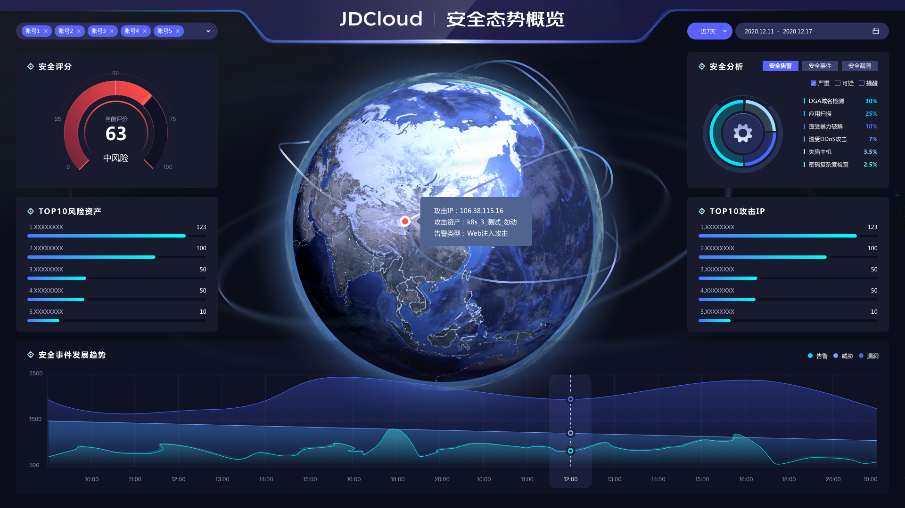
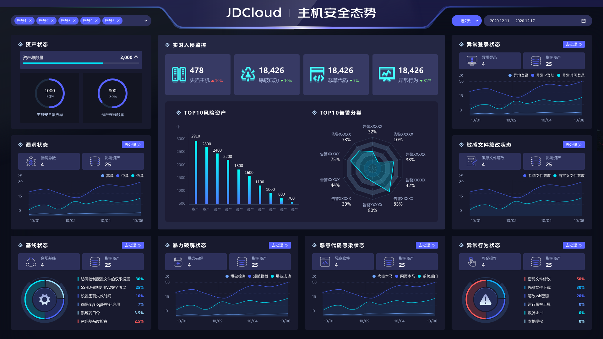

# 安全可视-安全大屏

### 功能说明

​		京东云安全运营中心针对当前账号内的整体资产的安全态势进行综合评估与可视化呈现，通过**安全态势概览、网络安全态势、主机安全态势**进行呈现，在重大活动保障时期为用户提供整体安全态势评估。支持自定义是时间区间进行筛选查询。

### 安全态势总览

​		屏幕正中央通过实时动态的攻击路径线，展示当前托管账号体系下存在的实时攻击行为，并能够呈现攻击IP、攻击来源、攻击手法、被攻击资产等信息。左上角可以直观查看当前整体安全评分情况，左侧为面临风险的TOP5资产；右上角可以针对当前安全态势按照安全告警、安全事件、安全漏洞三个维度进行安全分析，发现当前风险占比较高的风险类型，右侧为当前较为活跃的TOP5攻击源IP，下方描绘整体安全事件发展的趋势，通过右上角的时间筛选维度进行分时查看。

#### 1、安全评分

针对当前账号内整体安全风险状况进行风险评估，得出综合得分，如果存在安全托管关系，则为所有pin账号加权平均值，呈现当前整体安全运营中心的风险状态指标（高风险、中风险、低风险）。

#### 2、安全分析

通过安全告警、安全事件、安全漏洞等维度，呈现不同维度的安全攻击情况，安全告警（严重、可疑、提醒）、安全事件（严重、可疑、提醒）、安全漏洞（主机漏洞、web漏洞、应用漏洞）。直观呈现告警、威胁、漏洞等维度的各类安全攻击类型。

#### 3、TOP5风险资产

直观呈现当前最高风险的5个资产名称，支持点击资产下钻至安全告警查询具体信息。

#### 4、TOP5攻击IP

直观呈现当前攻击次数最多的IP地址，支持点击攻击IP下钻至安全告警查询具体信息。

#### 5、安全发展趋势

直观呈现一定时间范围内安全事件（告警、威胁、漏洞）的安全趋势。

### 网络安全态势

​		屏幕正中央通过3D立体拓扑图呈现京东云纵深安全防御体系，最外侧的互联网接入层呈现的DDoS攻击防护，对应左侧DDoS攻击事件看板，呈现当前网络健康状态以及清洗&黑洞状态，并列举当前TOP5受DDoS攻击影响的公网IP；在web应用层，由web应用防火墙提供攻击防护，通过左下侧的web攻击事件看板，可以看到当前web攻击分类（按比例呈现），以及受web攻击影响的TOP5风险域名；在租户网络内部，通过漏洞扫描系统针对租户内部的各类资产进行例行周期扫描，统计当前账号体系下对外开放的端口数量、暴露端口应用的数量，以及呈现对外开放数量最多的TOP端口类型；在租户计算实例级别，通过主机终端安全以及威胁诱捕系统，发现隐藏的实例级别的高级威胁和可能发生的横向攻击。

​		拓扑图右侧将DDoS攻击事件、Web攻击事件、对外开放端口数量、高级威胁事件进行技术统计，并结合右上角的筛选时间区间，呈现同比上一个时间区间的各类事件的数据增长or下降的比例。最下方的实时安全态势，通过右上角的时间筛选维度进行分时查看。

#### 1、DDoS攻击事件

展示当前在承受DDoS攻击过程中，网络连通性的健康状态，以及Top5的受影响的公网IP统计和当前在遭受攻击资产的攻击次数。

#### 2、web攻击事件

针对**web攻击类型**进行分布占比统计，并列举Top5的受影响的域名。

#### 3、暴露端口应用

针对**端口应用类型**进行分布占比统计，并列举Top5对外开发最多的端口。

#### 4、高级威胁事件

针对**高级威胁事件**进行分布占比统计，并列举Top5的受影响的主机。

#### 5、安全事件发展趋势

直观呈现一定时间范围内安全事件（DDoS攻击、web攻击、开发端口、高级威胁）的安全趋势。

#### 6、攻击事件数据统计

汇总自定义时间区间范围内DDoS攻击事件、web攻击事件、对外开发端口、高级威胁事件等安全事件的数据统计呈现。

### 主机安全态势

​		屏幕正中央呈现实时入侵监控状态，包括当前失陷主机数量、暴力破解成功、恶意代码感染以及异常行为数量，并结合右上角的筛选时间区间，呈现同比上一个时间区间的各类事件的数据增长or下降的比例。

​		监控数据下方左侧呈现当前亟需处理的TOP10风险资产以及该资产的风险数量，右侧通过蛛网图呈现TOP10的告警分类，可以直观呈现当前占比较高的告警类型，并有针对性进行处置。

​		环绕主机安全态势大屏的八个看板，左侧一列分别呈现资产信息、漏洞状态、合规基线与影响资产，右侧一列将异常行为分列为异常登录、敏感文件篡改、可疑操作，并结合数据统计和趋势图呈现。下方左侧的暴力破解则由暴力破解检测、暴力破解拦截、暴力破解成功三类暴破告警行为呈现暴力破解不同阶段的数据趋势统计，下方右侧的恶意代码则由病毒木马、网页木马、系统后门分类呈现告警事件的趋势统计。

#### 1、实时入侵监控

​		展示部署了主机安全的各类实例级资产的实时安全入侵监控状态，包含失陷主机数、暴破成功数、恶意代码数、异常行为数的入侵数据统计。直观呈现**TOP10风险资产与TOP10告警分类**。

#### 2、资产状态

展示失陷主机与资产总数在一定时间范围内的变化趋势。

#### 3、漏洞状态

展示漏洞公告数量与影响资产的数量在一定时间范围内的变化趋势，点击**去处理**跳转至“**安全防范-漏洞管理**”；

注：漏洞公告数量是指当前需要用户紧急修复的漏洞公告，非漏洞总数量。

#### 4、合规状态

展示当前合规基线检查数量和检查后影响的资产数量，以及当前合规基线检查出现的问题项，点击**去处理**跳转至“**安全防范-合规基线**”。

#### 5、爆破状态

展示当前遭受暴力破解数量和影响的资产数量，以及遭受暴力破解的资产在一定时间范围内的变化趋势，并支持基于**暴破检测、暴破拦截、暴破成功**的暴力破解的不同阶段进行查询，点击**去处理**跳转至“**威胁检测-安全告警**”。

#### 6、异常登录状态

展示当前发现异常登录的告警数量和影响的资产数量，以及发现异常登录的事件在一定时间范围内的变化趋势，并支持基于**异常时间登录、异地登录、异常IP登录**的不同异常情况进行查询，点击**去处理**跳转至“**威胁检测-安全告警**”。

#### 7、病毒感染状态

展示当前发现病毒感染的恶意软件数量和影响的资产数量，以及发现恶意软件的事件在一定时间范围内的变化趋势，并支持基于**病毒木马、网页木马、系统后门**的不同病毒感染情况进行查询，点击**去处理**跳转至“**威胁检测-安全告警**”。

#### 8、敏感文件篡改状态

展示当前发现敏感文件篡改的文件数量和影响的资产数量，以及发现文件篡改的事件在一定时间范围内的变化趋势，并支持基于**系统文件篡改、自定义文件篡改**的不同敏感文件篡改情况进行查询，点击**去处理**跳转至“**威胁检测-安全告警**”。

#### 9、执行命令状态

展示当前可疑操作告警事件数量和影响的资产数量，以及当前可疑操作包含的具体操作，点击**去处理**跳转至“**威胁检测-安全告警**”。