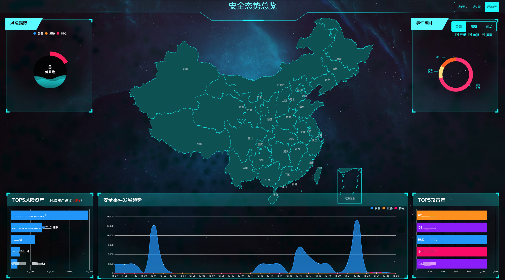
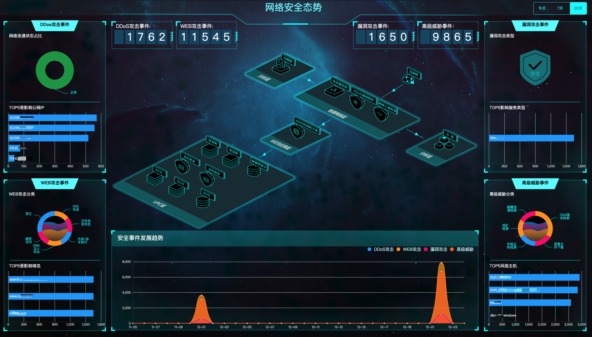
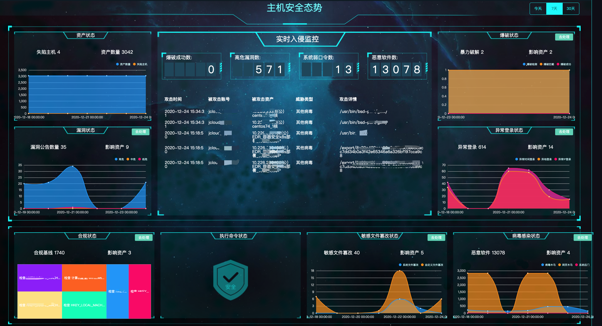

# 安全可视-安全大屏

### 功能说明

京东智联云安全运营中心针对当前账号内的整体资产的安全态势进行综合评估与可视化呈现，通过**安全态势总览、网络安全态势、主机安全态势**进行呈现，在重大活动保障时期为用户提供整体安全态势评估。支持针对近1天、近7天、近30天的选择查询。

### 安全态势总览

#### 1、风险指数

通过告警、威胁、弱点等维度，呈现当前整体安全运营中心的风险状态指标（高风险、中风险、低风险）。

#### 2、事件统计

直观呈现告警、威胁、弱点等维度的安全事件，以及各类安全攻击类型，并支持按照事件严重等级进行筛选（严重、可疑、提醒）。

#### 3、TOP5风险资产

直观呈现当前最高风险的5个资产名称，以及相关资产的安全事件数量统计。

#### 4、安全发展趋势

直观呈现一定时间范围内安全事件（告警、威胁、弱点）的安全趋势。

#### 5、TOP5攻击者

直观呈现当前账号下，外部攻击者的IP地址。

### 网络安全态势

#### 1、DDoS攻击事件

展示当前在承受DDoS攻击过程中，网络连通状态的占比情况，以及Top5的受影响的公网IP统计和当前在遭受攻击资产的攻击次数。

#### 2、web攻击事件

针对**web攻击类型**进行分布占比统计，并列举Top5的受影响的域名。

#### 3、漏洞攻击事件

针对**漏洞攻击类型**进行分布占比统计，并列举Top5的受影响的服务类型。

#### 4、高级威胁事件

针对**高级威胁事件**进行分布占比统计，并列举Top5的受影响的主机。

#### 5、安全事件发展趋势

直观呈现一定时间范围内安全事件（DDoS攻击、web攻击、漏洞攻击、高级威胁）的安全趋势。

#### 6、攻击事件数据统计

汇总一定时间范围内（今天、7天、30天）DDoS攻击事件、web攻击事件、漏洞攻击事件、高级威胁事件等安全时间的数据统计呈现。

### 主机安全态势

#### 1、实时入侵监控

展示部署了主机安全的各类实例级资产的实时安全入侵监控状态，包含爆破成功数、高危漏洞数、系统弱口令数、恶意软件数的入侵数据统计。直观呈现**攻击事件、被攻击账号、被攻击资产、威胁类型与攻击详情**。

#### 2、资产状态

展示失陷主机与资产总数在一定时间范围内的变化趋势。

#### 3、漏洞状态

展示漏洞公告数量与影响资产的数量在一定时间范围内的变化趋势，点击**去处理**跳转至“**安全防范-漏洞管理**”；

注：漏洞公告数量是指当前需要用户紧急修复的漏洞公告，非漏洞总数量。

#### 4、合规状态

展示当前合规基线检查数量和检查后影响的资产数量，以及当前合规基线检查出现的问题项，点击**去处理**跳转至“**安全防范-合规基线**”。

#### 5、爆破状态

展示当前遭受暴力破解数量和影响的资产数量，以及遭受暴力破解的资产在一定时间范围内的变化趋势，并支持基于**暴破检测、暴破拦截、暴破成功**的暴力破解的不同阶段进行查询，点击**去处理**跳转至“**威胁检测-安全告警**”。

#### 6、异常登录状态

展示当前发现异常登录的告警数量和影响的资产数量，以及发现异常登录的事件在一定时间范围内的变化趋势，并支持基于**异常时间登录、异地登录、异常IP登录**的不同异常情况进行查询，点击**去处理**跳转至“**威胁检测-安全告警**”。

#### 7、病毒感染状态

展示当前发现病毒感染的恶意软件数量和影响的资产数量，以及发现恶意软件的事件在一定时间范围内的变化趋势，并支持基于**病毒木马、网页木马、系统后门**的不同病毒感染情况进行查询，点击**去处理**跳转至“**威胁检测-安全告警**”。

#### 8、敏感文件篡改状态

展示当前发现敏感文件篡改的文件数量和影响的资产数量，以及发现文件篡改的事件在一定时间范围内的变化趋势，并支持基于**系统文件篡改、自定义文件篡改**的不同敏感文件篡改情况进行查询，点击**去处理**跳转至“**威胁检测-安全告警**”。

#### 9、执行命令状态

展示当前可疑操作告警事件数量和影响的资产数量，以及当前可疑操作包含的具体操作，点击**去处理**跳转至“**威胁检测-安全告警**”。