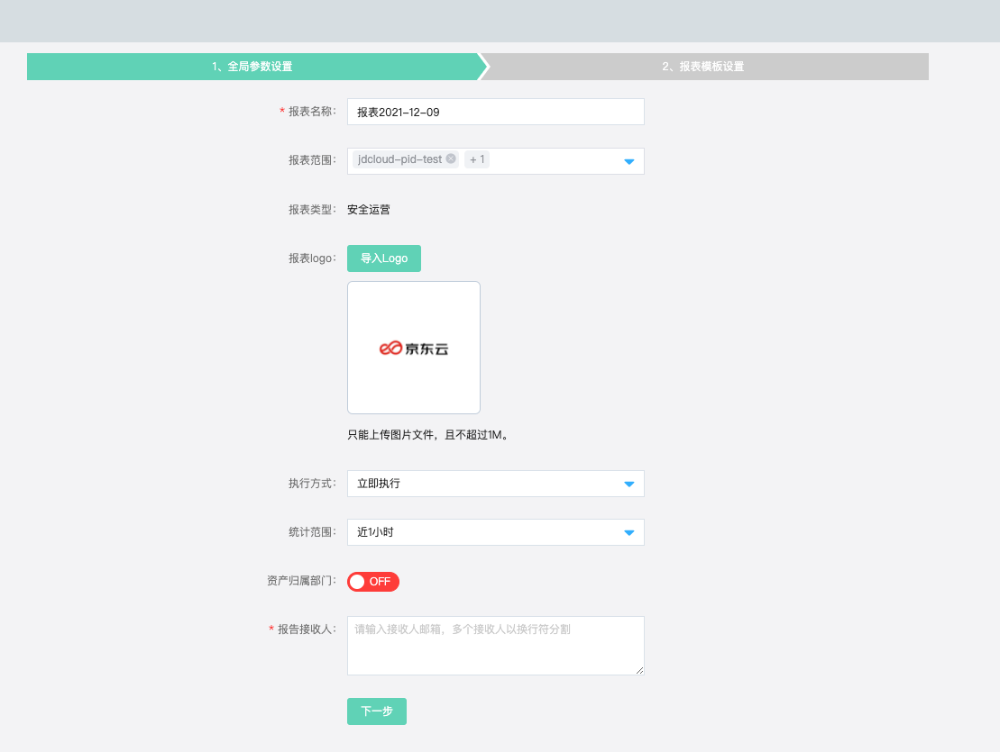

# 安全可视-安全报表

### 功能说明

​		京东云安全运营中心安全报表，可以针对一定时间区间安全数据进行报表分类统计输出。

### 创建报表

#### 报表配置项

| 配置项       | 描述                                                         |
| ------------ | ------------------------------------------------------------ |
| 报表名称     | 支持自定义，默认”报表年-月-日“                               |
| 报表范围     | 存在安全托管关系支持按pin进行报表输出筛选 没有安全托管关系默认为系统账号 |
| 报表logo     | 自定义上传报表logo，图片格式，且不超过1M                     |
| 执行方式     | 立即支持下、定时执行、周期执行                               |
| 统计范围     | 近1小时、近8小时、今天、近7天、近30天、自定义时间区间        |
| 资产归属部门 | 默认不勾选，勾选后报表内容可根据资产归属组织结构             |
| 报告接收人   | 设置接收人邮箱                                               |

#### 报表模块

| 模块       | 描述                                                         |
| ---------- | ------------------------------------------------------------ |
| 简报       | 包含安全报表时间、报表范围、整体安全态势、各类监控项         |
| 资产分析   | 资产统计（资产总量、存在风险资产、未受保护资产） 安全能力覆盖率（主机安全、web应用防火墙、数据库审计、DDoS防护、威胁诱捕（蜜罐）） 未受保护资产列表（终端安全防护、web应用防护、DDoS基础防护、数据库审计监控、蜜罐监控） 存在风险资产列表（主机漏洞、应用漏洞、安全告警、安全事件） |
| 弱点分析   | 主机漏洞：主机漏洞综述（漏洞公告总数、影响资产）、漏洞级别分布（严重、高危、中危、低危）、Top10存在漏洞公告归属账号、Top10存在漏洞的资产归属账号、Top10主机漏洞风险列表（漏洞等级、漏洞公告、归属账号） 应用漏洞：主机漏洞综述（漏洞种类、漏洞总数、影响资产数）、Top10漏洞归属账号、Top10漏洞归属账号、Top10 应用漏洞风险列表。 云产品基线：云产品基线综述（风险率、检查范围-账号、风险资产）、Top10云产品基线风险项、Top10风险项归属账号、Top10风险资产归属账号、Top10云产品基线风险列表 合规基线：操作系统基线总数（共计运行监测任务、通过小于100%任务梳理）、Top10风险检查项、Top10风险检查项归属账号、Top10风险资产归属账号、Top10 合规基线风险列表  |
| 监控分析   | 安全告警：安全告警综述（共计发生告警次数统计、影响资产数量、已人工处理、待处理、已拦截）、告警级别分布（严重、可疑、提醒）、Top10告警类型、归属账号Top10告警、存在告警的资产Top10账号、Top10安全告警类型列表 安全事件：安全事件总数（共计发生事件次数统计、影响资产数量、已人工处理、待处理）、事件级别分布、Top10攻击链名称、归属账号Top10事件、存在事件的资产Top10账号、Top10安全事件类型列表 攻击源分析：  |
| 攻击源分析 | 综述：攻击发生攻击IP次数 Top10攻击源IP Top10攻击链名称 Top20攻击源IP风险列表（攻击源IP、告警类型、威胁情报、攻击地址位置、攻击次数、攻击历史信息）  |

#### 报表管理

安全报表被使用于日常安全运营人员按一定时间维度进行安全报告分析，如果存在托管关系通过右上角进行账号筛选查询，查看指定的账号下的安全报表，点击任意报表，下钻至报表列表页针对该报表进行管理。

| 列表       | 描述                                                         |
| ---------- | ------------------------------------------------------------ |
| 生成时间   | 报表生成时间                                                 |
| 报表范围   | 默认为当前pin账号的报表数据范围 在托管关系建立后，支持多pin报表生成 |
| 执行方式   | 立即执行、定时执行、周期执行                                 |
| 统计范围   | 近1小时、近8小时、今天、近7天、近30天、自定义区间的时间      |
| 报告接收人 | 接收人邮箱，支持多个邮箱填写                                 |
| 创建人     | 创建账号                                                     |
| 报表状态   | 生成成功、生成中、生成失败                                   |
| 操作       | 手动触发生成、预览报表、下载报表                             |

