# 资产中心概览

### 功能说明

京东智联云资产中心，包含**资产看板、资产详情、资产导入、资产查询**四部分。

| 资产中心 | 作用                                                         |
| -------- | ------------------------------------------------------------ |
| 资产看板 | 主要呈现资产各个维度的统计以及资产来源归属及风险趋势         |
| 资产详情 | 将所有类型的资产以及资产自身安全状态、受保护状态进行分列表呈现，并支持自定义标签标记与查询 |
| 资产导入 | 支持非京东智联云上的资产进行手动导入，支持单个资产导入以及资产批量导入 |
| 资产查询 | 支持按照资产的各类维度数据进行全局资产查询，支持**基础查询和高级检索**两种资产查询模式 |

## 资产看板

### 资产总量统计

统计当前账号下，资产总数（当日资产数量变化）、存在风险资产数量（当日资产数量变化）、未受保护的资产数量（当日资产数量变化）、待确认资产数量（当日资产数量变化）。点击跳转至“**资产详情-所有资产**”。

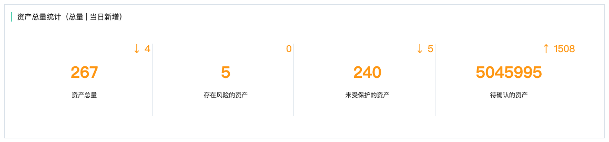

### 资产来源统计

通过资产来源分布看板，可以直观查看当前账号下资产来源分布，来源包括但不限于**京东智联云、其它云平台、云下IDC机房**等，并通过右侧筛选不同资产状态（**所有资产、存在风险的资产、未受保护的资产、待确认的资产**）的资产来源分布。

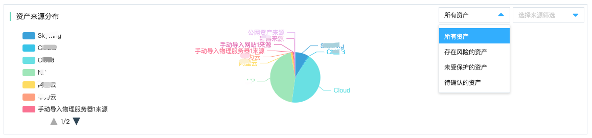

### 资产类型统计

通过资产类型分类统计，可以直观呈现八种资产类型、四种资产状态的资产数量分布。点击数字可跳转至对应的资产及其对应状态的资产列表中进行查看。

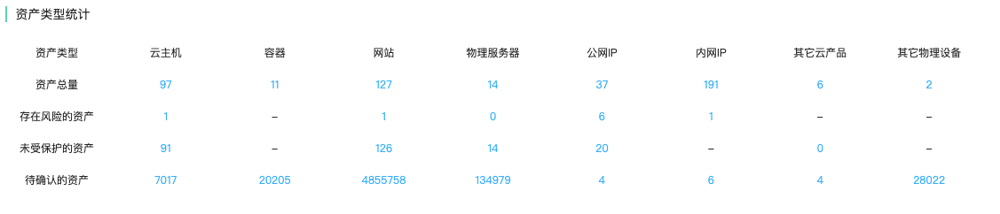

### 资产类型分布

通过资产类型分布呈现，可以直观呈现当前账号下，八种类型的资产的数量以及相应占比，通过下拉选择资产状态，可以看到不同资产状态（**所有资产、存在风险的资产、未受保护的资产、待确认的资产**）下的资产分布。

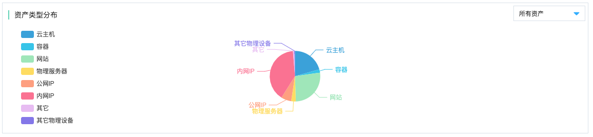

### 资产趋势统计

通过资产趋势统计，可以直观呈现资产在一定时间范围内的数量变化趋势，并支持按照资产不同状态（**所有资产、存在风险的资产、未受保护的资产、待确认的资产**）进行筛选查看。

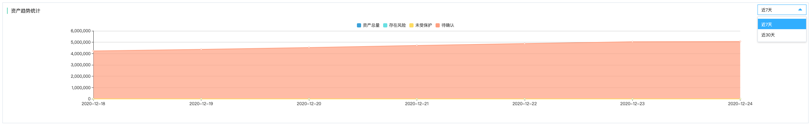

### 风险资产归属Top10&地域Top10

通过下拉筛选选择资产的归属组织与来源地域，分别呈现涉及Top10的风险资产的归属组织、Top10的风险资产的来源地域，并且还可以支持基于不同资产状态（**所有资产、存在风险的资产、未受保护的资产、待确认的资产**）进行筛选查看。此外点击更多信息，可跳转至“**所有资产-特定分组（归属分组、来源分组）**”。

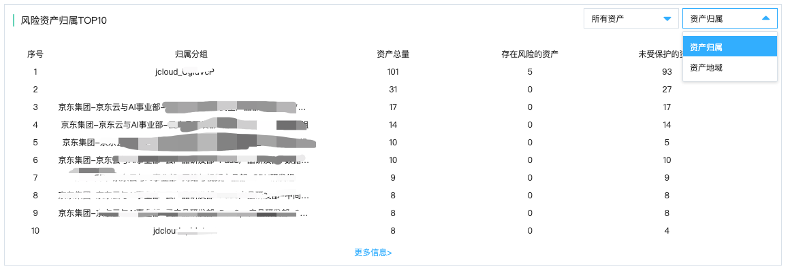

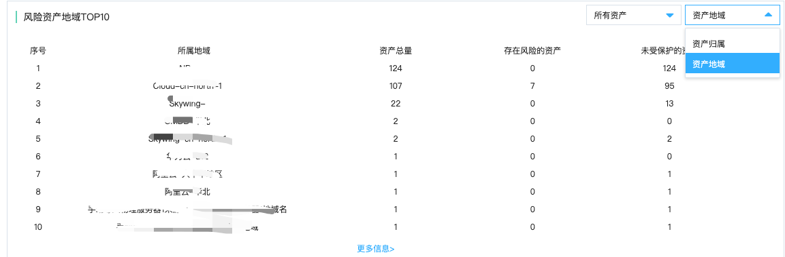

### 存在风险资产Top10

通过查看top10的风险资产，可以直观呈现当前资产包含的漏洞等级与数量。通过右侧可以支持下拉筛选单个资产类型进行查询存在风险的资产。

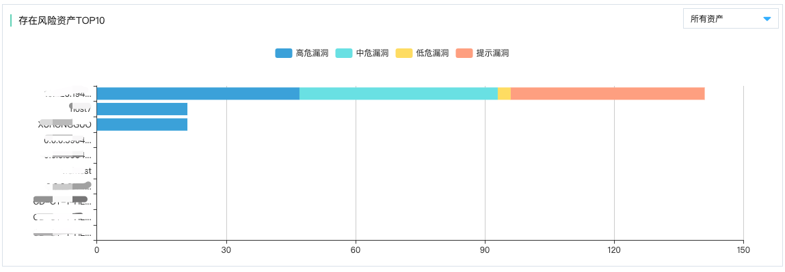

## 资产详情

### 功能说明

资产详情支持各种类型、各种状态的资产进行分类查看、检索、导出、导入、标记、忽略以及单个资产详情查询。

| 资产查看维度 | 具体分类信息                                                 | 备注                                                         |
| ------------ | ------------------------------------------------------------ | ------------------------------------------------------------ |
| 资产类型     | 所有资产列表 单类资产列表：云主机、容器、网站、物理服务器、公网IP、内网IP、其它云产品、其它物理设备 | 其它云产品当前包含云上负载均衡、各类云数据库、NAT网关等      |
| 资产分组     | 待确认资产组、所有资产组、存在风险的资产组、未受保护的资产组、资产归属组、资产来源分组 | 仅所有资产列表中存在待确认资产组                             |
| 资产操作     | 列表刷新、资产导出、资产标记、资产确认、资产忽略（取消忽略）、自定义资产列表项 | 仅所有资产列表-待确认的资产组存在资产确认操作             |
| 资产监控     | 安全状态监控：监控该资产的安全产品覆盖情况 风险状态监控：监控该资产的是否存在风险情况 | 安全产品部署情况以状态灯的方式查看 风险状态以当前是否存在风险来查看 |
| 标签管理     | 已经标记标签的资产会出现在标签列表中，通过标签管理按钮可以就该标签内的资产进行取消标记操作 | 标签管理仅在所有资产里进行管理操作 在单类资产中的标签仅呈现存在该类资产的标签 |
| 单个资产详情 | 在资产列表中，点击资产名称、进入单个资产详情页               | 不同类型的资产，详情页呈现的内容不尽相同                     |

### 所有资产列表

所有资产列表中，可以查看资产分组（**待确认资产、所有资产、存在风险的资产、未受保护的资产、资产归属分组、资产来源分组、已忽略资产组**）、自定义标签列表、资产列表。

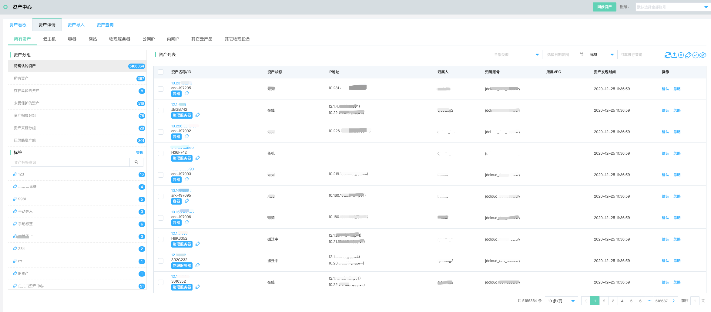

#### 资产分组定义

| 资产分组       | 定义                                                         |
| -------------- | ------------------------------------------------------------ |
| 待确认的资产   | 从当前账号下发现的各类新增资产都会实时同步到待确认资产列表中，便于安全运营人员第一时间发现，部署相关安全产品，排查安全风险后进行资产确认，将资产纳入日常安全运营之中。 |
| 所有资产       | 所有资产包含自动同步的已确认资产和手动资产导入的已确认资产。 |
| 存在风险的资产 | 经过各类安全产品及引擎（包括但不限于**主机安全、网站威胁扫描、网络入侵检测、DDoS基础防护、IP高防、WAF、SSL证书、数据库审计**等）检测，发现各类风险（漏洞、威胁、攻击、防护到期等）的资产。 |
| 未受保护的资产 | 当该资产没有部署或部署到期相关的安全产品时，监控状态灯为红灯，则该资产没有通过各类安全产品进行防护，会被纳入未受保护的资产列表中，便于运营人员直观发现，并及时购买部署相关安全防护产品进行保护。 |
| 资产归属分组   | 可以直观呈现归属分组、归属人名下的全部资产、存在风险的资产、未受保护的资产数据汇总合计，同时支持点击跳转所有资产列表。 |
| 资产来源分组   | 可以直观呈现资产的所属来源、所属地域、所属机房名下的全部资产、存在风险的资产、未受保护的资产数据汇总合计，同时支持点击跳转所有资产列表。 |
| 已忽略资产组   | 当部分资产在一定时间内不需要进行关注的时候，可以点击勾选资产点击忽略按钮予以忽略，这样该资产会被列入已忽略的资产列表中，这样在各类安全风险统计中不会被计入。 |

#### 资产列表批量操作

批量操作资产前需要先勾选相关资产

| 批量按钮         | 批量操作内容                                                 |
| ---------------- | ------------------------------------------------------------ |
| 刷新             | 刷新整个资产列表                                             |
| 导出             | 选取特定资产导出资产列表                                     |
| 自定义列表       | 自定义资产列表title项                                        |
| 标签             | 选取特定资产进行批量标记                                     |
| 确认             | 待确认资产组中：选取特定资产，在待确认列表中进行批量确认     |
| 忽略（取消忽略） | 待确认资产组中：选取特定资产，在待确认列表中进行批量忽略 已忽略资产组中：选取特定资产，在待确认列表中进行批量取消忽略 |

## 资产导入

### 功能说明

安全运营中心支持用户将京东智联云外的资产导入至资产中心进行统一运营管理，支持**单个资产导入、批量资产导入**两种模式。

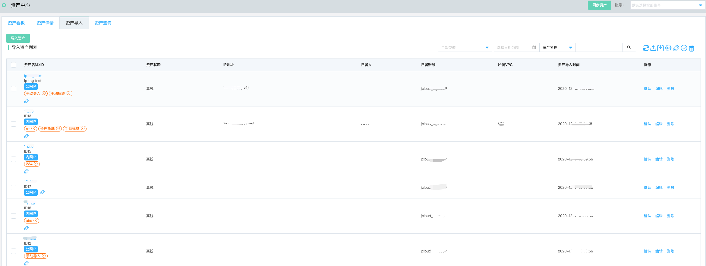

注：批量资产导入需要点击导入资产、选择批量资产导入，下载批量资产导入模板进行外部资产信息填写，再进行上传导入。

### 导入列表操作

| 操作 | 操作内容说明                                                 |
| ---- | ------------------------------------------------------------ |
| 确认 | 确认手动导入资产无误，确认后该条资产同步入相关资产分类中     |
| 编辑 | 点击编辑可以修改资产导入时的字段信息，以校正批量资产导入时可能由于人工操作导致的部分字段信息填写错误。 |
| 删除 | 删除该条导入资产                                             |

## 资产查询

### 功能说明

安全运营中心支持全局检索各类资产中心内的资产，支持**基础查询与高级检索**两种查询模式。需要注意的一点是查询资产范围为当前安全运营过程中关心的**已确认**资产，待确认资产（包含自动同步待确认、手动导入资产列表两类待确认资产）及已忽略资产不在查询范围内。

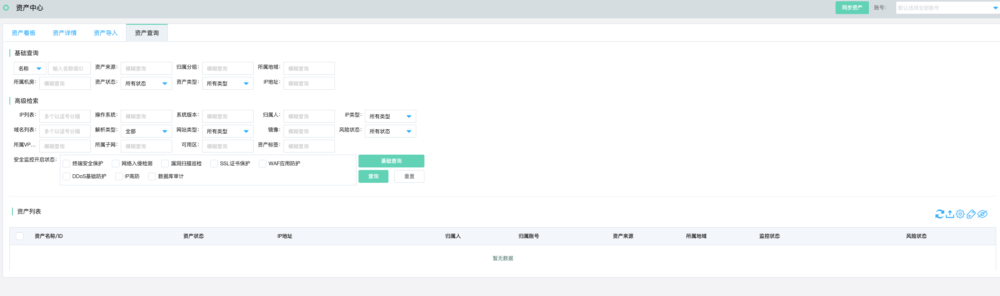