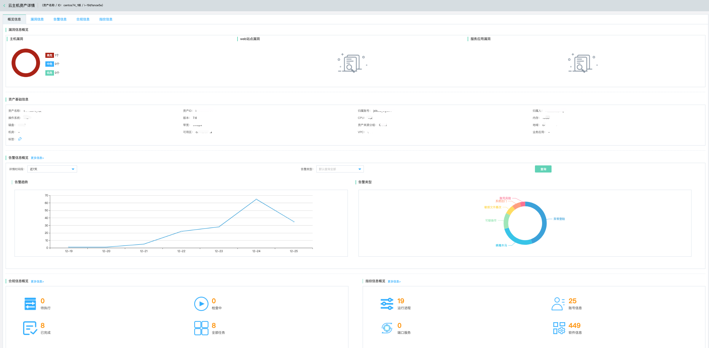
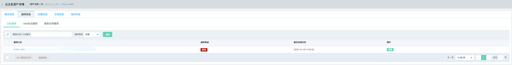
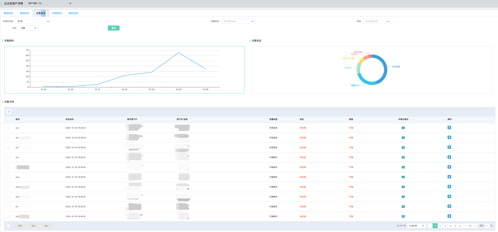
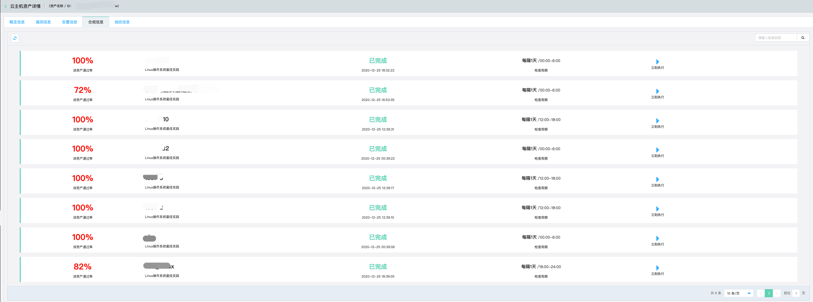
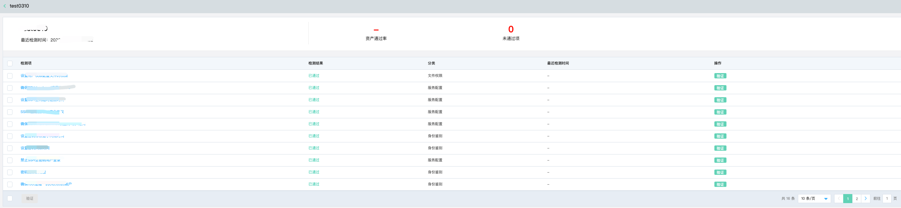
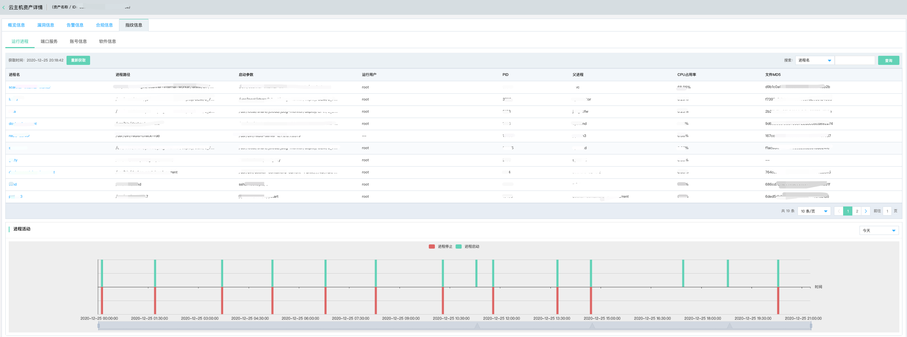

# 资产中心-单个资产详情页

### 功能说明

京东智联云资产中心，在资产详情页中，查看资产列表，点击资产名称，跳转单个资产详情。

单个资产详情页，主要是面向一线安全运营人员，在实际排查资产问题时，就待安全运营资产的所有信息进行汇总呈现的界面。旨在帮助一线运营人员，通过该页面直接获取该资产的全部信息，以及安全事件的集中处理。

不同的资产类型，资产详情页中的需要关心的内容不尽相同，整理如下：

| 资产类型     | 资产详情                                         |
| ------------ | ------------------------------------------------ |
| 云主机       | 概览信息、漏洞信息、告警信息、合规信息、指纹信息 |
| 容器         | 概览信息、漏洞信息、告警信息                     |
| 网站         | 概览信息、漏洞信息（包含在概览中呈现）           |
| 物理服务器   | 概览信息、漏洞信息、告警信息、合规信息、指纹信息 |
| 公网IP       | 概览信息、告警信息                               |
| 内网IP       | 概览信息、告警信息                               |
| 其它云产品   | 暂未涉及                                         |
| 其它物理设备 | 暂未涉及                                         |

### 单个资产详情页

以云主机为例，介绍单个资产的详情页

#### 概览信息

##### 漏洞信息概览

包含该云主机的主机漏洞、以及涉及的web站点漏洞、服务应用漏洞，通过图形方式直观呈现当前资产存在的漏洞等级信息以及漏洞数量分布。

##### 资产基础信息

资产基础信息包含该资产的全量信息，包括资产名称、资产ID、归属账号、归属人、操作系统、版本、CPU、内存、磁盘、带宽、资产来源分组、地域、机房、可用区、VPC、标签等信息

##### 告警信息概览

针对该资产存在告警事件进行趋势呈现，告警类型分布进行呈现，可自由选择查询时间（近7天、近14天、近30天、自定义），自由筛选告警类型进行查询。

##### 合规信息概览

包括涉及该资产的合规信息检查，分别呈现**待执行、检查中、已完成、全部任务**合规基线的数量，点击**更多信息**，跳转**合规信息**。

##### 指纹信息概览

包含涉及该资产的指纹信息，分别呈现**运行进程、账号信息、端口服务、软件信息**指纹信息的数量，点击**更多信息**，跳转**指纹信息**。

#### 漏洞信息

漏洞信息包含该资产的主机漏洞、web站点漏洞、服务应用漏洞等维度的信息列表

#### 告警信息

漏洞信息包含该资产的主机漏洞、web站点漏洞、服务应用漏洞等维度的信息列表

#### 合规信息

该资产包含的所有合规基线检查任务，点击详情，查看各类检查项。

#### 指纹信息

指纹信息包含了该资产的**运行进程、端口服务、账号信息、软件信息**，可以通过根据**进程名、文件MD5、端口、软件名、软件版本**进行查询相关指纹信息。