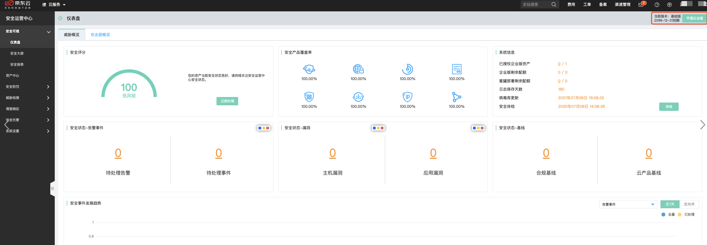
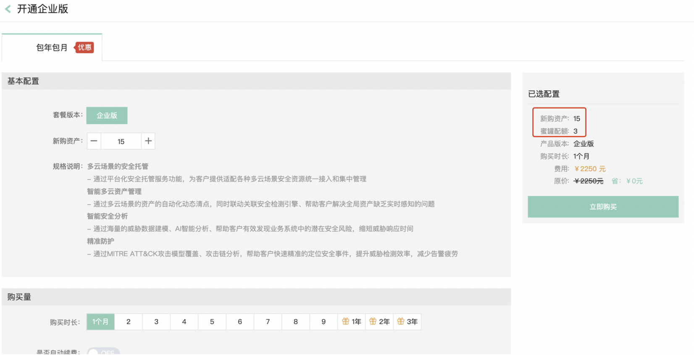
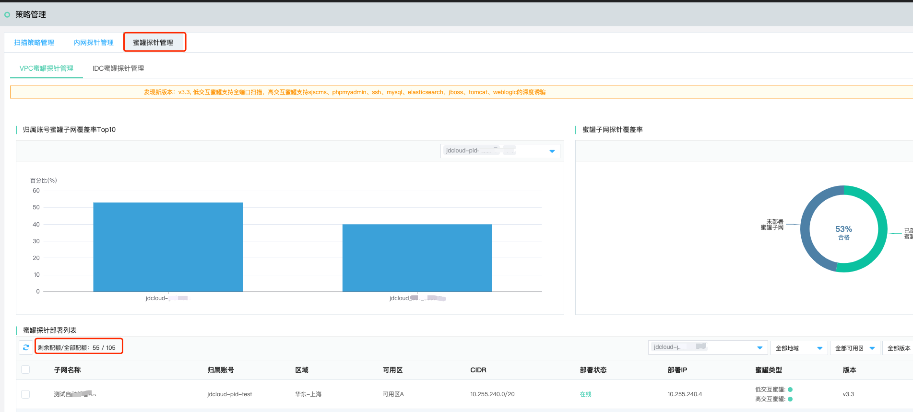
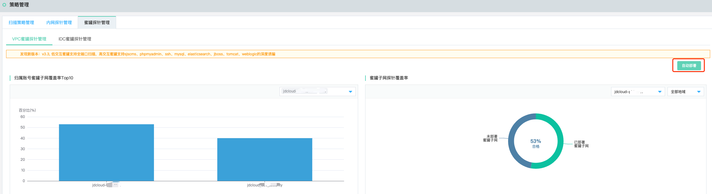
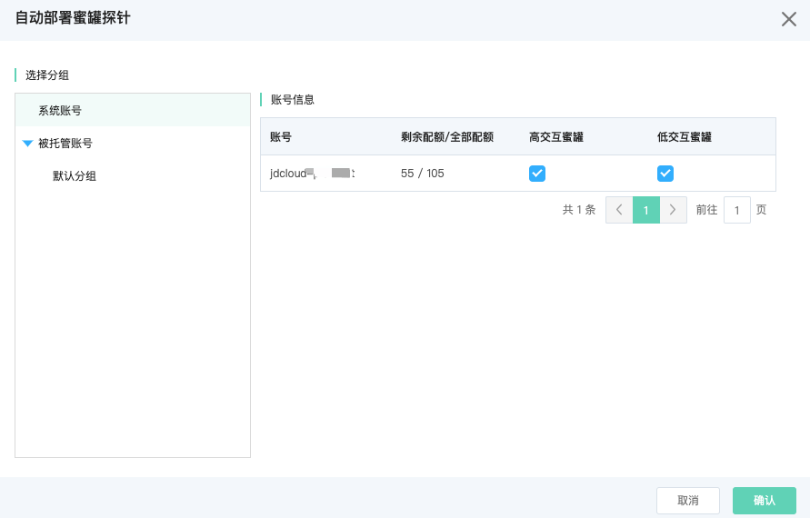
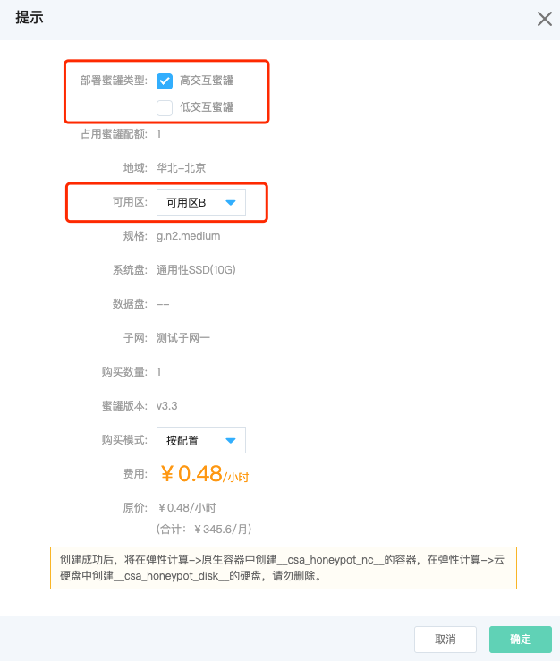
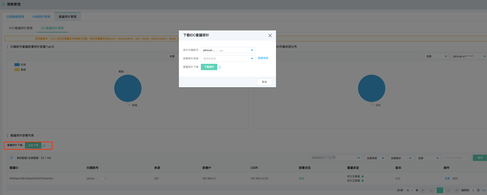
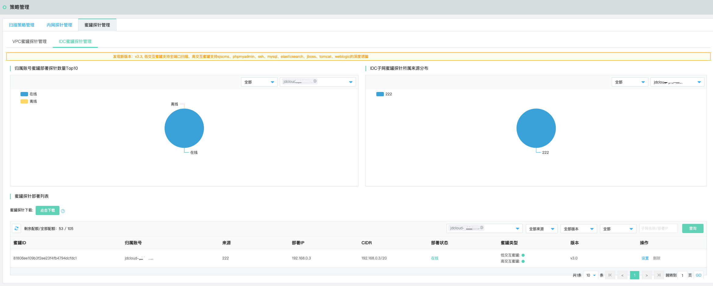

# 安全防范-策略管理

## 扫描策略管理

### 功能说明

扫描策略管理旨在通过安全运营中心的资产扫描功能，单次或周期性针对资产中心的各类资产进行漏洞扫描巡检，以期及时发现资产漏洞及安全隐患，并及时进行修复与升级。

### 创建扫描任务策略

点击创建扫描任务策略，在多账号托管体系下，选择需要扫描的账号（默认为全部账号），选择完成后相应的资产信息列表会更新，选择特定的资产（网站、网IP、内网IP）移入下方已选择资产列表，编辑任务名称、选择扫描速率（快速、标准、低速）与扫描计划（立即、定时、周期），点击确定即可进行扫描。

功能亮点：针对特定等级（提示、低危、中危、高危）特定类型的漏洞进行扫描

注：自定义选项配置为扫描任务策略的高级选项，包括扫描端口自定义与web扫描爬虫深度和最大爬取总数的自定义配置。

| 扫描资产列表 | 描述                                                         |
| ------------ | ------------------------------------------------------------ |
| 自定义扫描   | 网站列表、公网IP列表、内网IP列表                             |
| 一键扫描     | 扫描资产来源：京东云、云外来源资产 扫描资产类型：IP资产（公网、内网）（IPv4、IPv6）、域名、子域名资产（公网、内网） 扫描资产地域：京东云各Region、云外地域 扫描资产机房：特定机房下的资产 扫描资产名称：特定资产扫描（支持模糊搜索） 扫描目标白名单配置：请输入筛选条件内包含且不想要进行扫描的资产，多个资产（IP、域名）以逗号分隔 |

### 扫描任务列表

支持针对选择不同用户，扫描状态（扫描中、待执行、已停止、已完成）扫描速率（快速、标准、低速）扫描周期（立即扫描、定时扫描、周期任务（天|周|月）），填写扫描任务名称进行查询检索。

扫描任务列表包含扫描任务名称、涉及账号（及账号相关资产数量）、扫描资产总数、扫描速率、扫描周期、扫描状态、最近扫描时间、web站点漏洞分布、服务应用漏洞分布，报表生成与下载、操作（启停、编辑、删除）等信息。

针对周期扫描任务，支持在周期时间点到来前提前启动，也支持停止周期扫描任务，“停止”按钮位置：扫描周期列内。

## 内网探针管理

### 功能说明

内网探针管理旨在在多云场景下，通过部署内网扫描探针，扫描用户环境内内网资产漏洞，内网包含**云上VPC内网环境、云下IDC内网环境**两类。

### VPC探针管理

VPC内网扫描探针部署，通过在云上VPC每个内网网段部署一个容器实例的扫描探针的方式去扫描该网段的内网资产，主要包含“**归属账号部署探针覆盖率Top10、VPC子网扫描探针覆盖率、扫描探针部署列表**”。

- 在扫描探针部署列表中，点击部署操作

**需要注意的一点是，部署内网扫描探针由于需要消耗云上计算资源（容器实例），故需要单独进行付费购买。**

### IDC探针管理

IDC内网扫描探针管理，适用于多云场景下，客户在云外公司或IDC等机房内部署扫描探针，扫描检测内网资产的安全状态的场景，通过部署IDC内网扫描探针实现云外资产发现与扫描检测。

- **IDC探针下载：有鉴于扫描安全的需要，如您需要在京东云外的IDC机房部署扫描探针，请联系客服协助您进行部署**。

- 部署IDC内网探针

多账号托管场景下，选择需要部署IDC内网探针的归属账号，填写归属地（即探针部署来源），下载扫描探针（.sh脚本），需要客户通过该脚本在本地手动部署完成，在本地部署网络与互联网互联互通可达的前提下，IDC内网扫描探针部署列表会呈现该探针部署状态为“在线”。即可自动发现IDC内网资产并进行后续扫描操作。

**需要注意的两点是：**

- 部署IDC扫描探针需要**先定义或选择部署探针的来源**
- 部署**多个探针需要重新下载**

## 蜜罐探针管理

### 功能说明

在网络入侵的必经之路进行通过在子网部署威胁诱捕检测探针（蜜罐），精准感知黑客攻击行为，并且溯源入侵者，形成告警，帮助安全运营人员进一步处置响应。威胁诱捕系统（蜜罐）提供高、低交互两种蜜罐检测类型可供用户选择。

> 低交互蜜罐：只会让攻击者非常有限地访问操作系统。“低交互”意味着，对手无法在任何深度上与您的诱饵系统进行交互，因为它是一个更加静态的环境。低交互蜜罐通常会模仿少量的互联网协议和网络服务，足以欺骗攻击者，而不是更多。通常，大多数企业都会模拟TCP和IP等协议，这使得攻击者可以认为他们正在连接到真实系统而不是蜜罐环境。

> 高交互蜜罐：属于欺骗技术中规模的另一端。攻击者不是简单地模拟某些协议或服务，而是提供真实的攻击系统，使得黑客被转移或观察的可能性大大降低。由于系统仅作为诱饵出现，因此发现的任何流量都是恶意存在的，因此可以轻松发现威胁并跟踪和跟踪攻击者的行为。通过使用高交互蜜罐，研究人员可以了解攻击者用于升级权限的工具，或者他们为尝试发现敏感数据而进行的横向移动。

| 蜜罐类型   | 规格说明                                                     |
| ---------- | ------------------------------------------------------------ |
| 低交互蜜罐 | ftp登录尝试、http访问请求、http登录请求、ssh建立连接、ssh远程版本发送、ssh登录尝试、telnet登录尝试、全端口(SYN)扫描识别、NMAP OS扫描识别、NMAP NULL扫描识别、 NMAP XMAS扫描识别、NMAP FIN扫描识别、mysql登录尝试、Git clone请求、ntp monlist请求（默认关闭）、redis命令请求、TCP连接请求、vnc连接请求、rdp协议windows远程登录、snmp扫描、sip请求、mssql登录sql账户认证、mssql登录win身份认证、http代理登录尝试； |
| 高交互蜜罐 | sjscms、phpmyadmin、ssh、mysql、elasticsearch、jboss、tomcat、weblogic的深度威胁诱捕 |

### VPC蜜罐探针管理

VPC蜜罐探针管理主要涉及“**归属账号蜜罐子网覆盖率Top10、蜜罐子网探针覆盖率、蜜罐探针部署列表**”三部分。

#### 购买配额

- 开通位置：进入京东云控制台，【云安全】-> 【安全运营中心】-> 【安全可视】，开通企业版。

- 购买配额：蜜罐配额的逻辑：每购买5个企业版资产，相应配置1个蜜罐部署配额，可以配置一个子网

- 查看配额：

查询位置1：蜜罐探针部署列表——>剩余配额/全部配额

查询位置2：自动部署弹窗（详请见下方）

#### 自动部署

说明：右上角点击“自动部署”按钮，配置账号内的蜜罐自动部署类型（高交互、低交互），配置后当出现新增子网时会进行自动部署，以节省用户安全运营时间。

| 自动部署蜜罐探针           | 描述                                                         |
| -------------------------- | ------------------------------------------------------------ |
| 账号分组，选择特定账号查看 | 系统账号：当前登录的账号pin 被托管账号：如果没有构建托管关系，则忽略即可 |
| 剩余配额/全部配额          | 剩余配额：当前剩余的蜜罐配额数量 全部配额：当前已购买的全部蜜罐配额数量 |
| 高交互蜜罐                 | 勾选：每个子网自动部署高交互蜜罐配额，部署完成后消耗一个蜜罐配额 不勾选：默认不针对该账号进行自动部署高交互蜜罐 |
| 低交互蜜罐                 | 勾选：每个子网自动部署低交互蜜罐配额，部署完成后消耗一个蜜罐配额 不勾选：默认不针对该账号进行自动部署低交互蜜罐 |

#### 手动部署

进入京东云控制台，【云安全】- > 【安全运营中心】- > 【安全防范】- > 【策略管理】- > 【蜜罐探针管理】，在未部署蜜罐的子网中点击【部署】按钮，进行蜜罐部署（在蜜罐配额充足的前提下）

部署过程会弹出下图对话框

| 提示弹窗     | 描述                                                         |
| ------------ | ------------------------------------------------------------ |
| 部署蜜罐类型 | 灵活按需选择部署蜜罐类型（高交互、低交互） 占用配额情况，高交互：1个配额；低交互：1个配额 同时部署两类蜜罐：占用2个蜜罐配额 |
| 占用蜜罐配额 | 根据选择类型，动态呈现占用配额数量                           |
| 可用区       | 可以根据需要灵活选择可用区（可用区A、可用区B、可用区C）      |

### IDC蜜罐探针管理

京东云蜜罐探针管理支持针对云外环境进行蜜罐探针部署

#### 下载蜜罐探针

点击蜜罐探针下载按钮，弹出“下载IDC蜜罐探针”弹窗，选择探针归属账号（无托管关系则为默认pin账号），选择部署探针来源（下拉选，也可以新建来源-填写其它探针来源名称），填写完毕下载探针。

- 提示1：部署IDC蜜罐探针需要先定义或选择部署探针的来源

- 提示2：部署多个探针需要重新下载，每个云外IDC子网部署一个探针

下载探针文件：jd_honeypot_idcagent.zip，在需要部署的本地子网，进行脚本运行，运行成功后，云外蜜罐探针的部署状态会从“离线”——>"在线"

- 提示3：云外部署蜜罐探针的子网，需要保证互联网连通性，以便云外探针状态是能够实时同步到云平台。

### 蜜罐探针部署列表管理

#### VPC蜜罐探针列表

支持按照**pin账号维度、地域维度、可用区维度、蜜罐探针版本维度、部署状态维度**、**输入子网名称/部署IP**进行筛选查询

| 字段     | 描述                                                         |
| -------- | ------------------------------------------------------------ |
| 子网名称 | 子网名称，与云服务-私有网络-子网-子网列表名称信息一致        |
| 归属账号 | 默认为当前pin账号，如果构建托管关系则可以呈现被托管账号的子网信息 |
| 区域     | 华北-北京、华东-上海、华南-广州                              |
| 可用区   | 蜜罐探针（蜜罐容器实例）部署的可用区（可用区A、可用区B、可用区C） |
| CIDR     | 所在网段/掩码                                                |
| 部署状态 | 在线、离线、未部署、部署中、部署失败、卸载中                 |
| 部署IP   | 蜜罐探针（蜜罐容器实例）的实例IP                             |
| 蜜罐类型 | 高交互蜜罐：已部署（状态灯绿色）、未部署（状态灯红色） 低交互蜜罐：已部署（状态灯绿色）、未部署（状态灯红色） |
| 版本     | 各类版本                                                     |
| 计费信息 | 按配置付费、包年包月（目前暂不支持）                         |
| 操作     | 部署：部署蜜罐探针（容器实例）至对应子网 卸载：卸载蜜罐探针（容器实例）至对应子网 升级：升级蜜罐探针（容器实例）的版本到最新版本 设置：设置该子网部署蜜罐探针的类型（高交互、低交互） |
| 批量选项 | 支持批量卸载                                                 |

#### IDC蜜罐探针列表

支持按照**pin账号维度、来源维度、蜜罐探针版本维度、部署状态维度**、**输入子网名称/部署IP**进行筛选查询

| 字段     | 描述                                                         |
| -------- | ------------------------------------------------------------ |
| 蜜罐ID   | 在云外子网部署蜜罐探针，探针随机生成的ID码                   |
| 归属账号 | 默认为当前pin账号，如果构建托管关系则可以呈现被托管账号的子网信息 |
| 来源     | 用户下载探针部署时，填写的探针来源（自定义填写）             |
| 部署IP   | 蜜罐探针（蜜罐容器实例）的实例IP                             |
| CIDR     | 所在网段/掩码                                                |
| 部署状态 | 在线、离线                                                   |
| 蜜罐类型 | 高交互蜜罐：已部署（状态灯绿色）、未部署（状态灯红色） 低交互蜜罐：已部署（状态灯绿色）、未部署（状态灯红色） |
| 版本     | 各类版本                                                     |
| 操作     | 设置：设置该子网部署蜜罐探针的类型（高交互、低交互） 删除：当蜜罐部署状态为离线时可以删除该条信息，在线无法删除 云外在线蜜罐探针无法删除原因：在线状态的蜜罐探针会实时上报在线状态，故而无法删除，如果不再需要可以在本地进行卸载，卸载后蜜罐探针会呈现离线的状态，再在列表中进行删除 |

