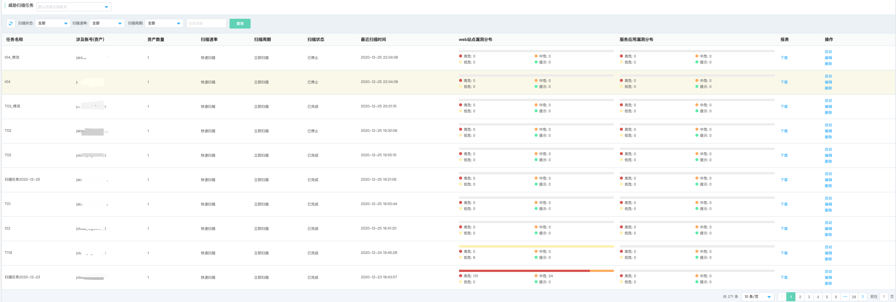
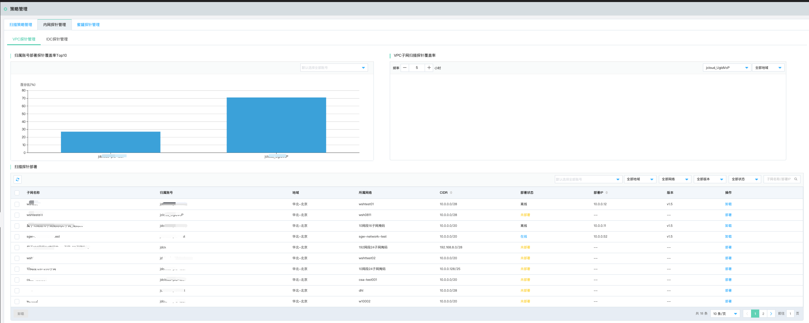
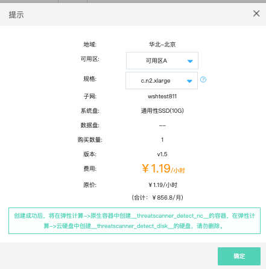
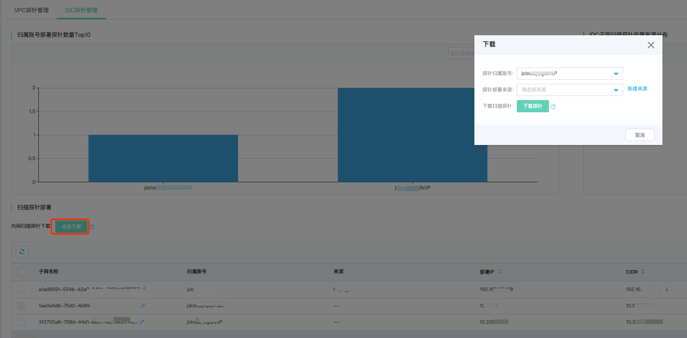
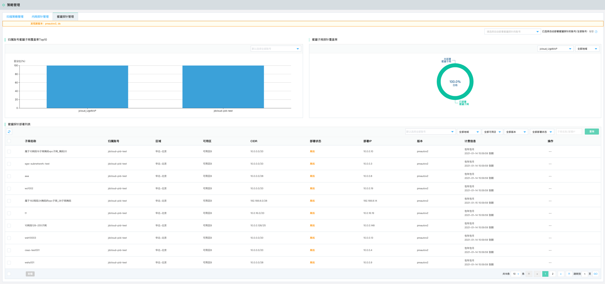

# 安全防范-策略管理

## 扫描策略管理

### 功能说明

扫描策略管理旨在通过安全运营中心的资产扫描功能，单次或周期性针对资产中心的各类资产进行漏洞扫描巡检，以期及时发现资产漏洞及安全隐患，并及时进行修复与升级。

### 创建扫描任务策略

点击创建扫描任务策略，在多账号托管体系下，选择需要扫描的账号（默认为全部账号），选择完成后相应的资产信息列表会更新，选择特定的资产（网站、网IP、内网IP）移入下方已选择资产列表，编辑任务名称、选择扫描速率（快速、标准、低速）与扫描计划（立即、定时、周期），点击确定即可进行扫描。

注：自定义选项配置为扫描任务策略的高级选项，包括扫描端口自定义与web扫描爬虫深度和最大爬取总数的自定义配置。

### 扫描任务列表

支持针对选择不同用户，扫描状态（扫描中、待执行、已停止、已完成）扫描速率（快速、标准、低速）扫描周期（立即扫描、定时扫描、周期任务（天|周|月）），填写扫描任务名称进行查询检索。

扫描任务列表包含扫描任务名称、涉及账号（及账号相关资产数量）、扫描资产总数、扫描速率、扫描周期、扫描状态、最近扫描时间、web站点漏洞分布、服务应用漏洞分布，报表生成与下载、操作（启停、编辑、删除）等信息

## 内网探针管理

### 功能说明

内网探针管理旨在在多云场景下，通过部署内网扫描探针，扫描用户环境内内网资产漏洞，内网包含**云上VPC内网环境、云下IDC内网环境**两类。

### VPC探针管理

VPC内网扫描探针部署，通过在云上VPC每个内网网段部署一个容器实例的扫描探针的方式去扫描该网段的内网资产，主要包含“**归属账号部署探针覆盖率Top10、VPC子网扫描探针覆盖率、扫描探针部署列表**”。

- 在扫描探针部署列表中，点击部署操作

**需要注意的一点是，部署内网扫描探针由于需要消耗云上计算资源（容器实例），故需要单独进行付费购买。**

### IDC探针管理

IDC内网扫描探针管理，适用于多云场景下，客户在云外公司或IDC等机房内部署扫描探针，扫描检测内网资产的安全状态的场景，通过部署IDC内网扫描探针实现云外资产发现与扫描检测。

- 部署IDC内网探针

多账号托管场景下，选择需要部署IDC内网探针的归属账号，填写归属地（即探针部署来源），下载扫描探针（.sh脚本），需要客户通过该脚本在本地手动部署完成，在本地部署网络与互联网互联互通可达的前提下，IDC内网扫描探针部署列表会呈现该探针部署状态为“在线”。即可自动发现IDC内网资产并进行后续扫描操作。

**需要注意的两点是：**

- 部署IDC扫描探针需要**先定义或选择部署探针的来源**
- 部署**多个探针需要重新下载**

## 蜜罐探针管理

#### 功能说明

在黑客入侵必经之路上进行威胁诱捕（蜜罐），精准感知黑客攻击行为，并且溯源入侵者，形成告警，帮助安全运营人员进一步处置响应。

威胁欺骗提供14项横向攻击分类，如下表：

| 攻击类型              | 攻击端口/协议                                                | 风险等级 |
| --------------------- | ------------------------------------------------------------ | -------- |
| ftp登录尝试           | 21/tcp                                                       | 严重     |
| http登陆尝试          | 80/tcp                                                       | 严重     |
| smb登录尝试           | 445/tcp                                                      | 严重     |
| mysql登录尝试         | 3306/tcp 3358/tcp                                         | 严重     |
| sip访问请求           | 5060/udp                                                     | 严重     |
| ntp monlist请求       | 123/udp                                                      | 严重     |
| tftp访问请求          | 69/udp                                                       | 严重     |
| mssql登陆尝试         | 1433/tcp                                                     | 严重     |
| vnc登陆尝试           | 5900/tcp                                                     | 严重     |
| mongodb登陆尝试       | 27017/tcp                                                    | 严重     |
| elasticsearch登陆尝试 | 9200/tcp                                                     | 严重     |
| oracle登陆尝试        | 1521/tcp                                                     | 严重     |
| redis登陆尝试         | 6379/tcp                                                     | 严重     |
| 端口扫描              | TCP SYN SCAN TCP ACK SCAN TCP FIN SCAN XMAS SCAN MAIMON SCAN NULL SCAN | 严重     |

#### 蜜罐探针部署

蜜罐探针管理主要涉及“**归属账号蜜罐子网覆盖率Top10、蜜罐子网探针覆盖率、蜜罐探针部署列表**”三部分。

右上角可以选择需要自动部署蜜罐探针的账号，自动部署蜜罐探针，以节省用户安全运营时间。

**需要注意的一点是：自动化安装蜜罐会针对新增子网自动部署蜜罐，默认根据安全运营中心付费版本到期时间采用包年包月的方式进行部署，暂不支持按配置部署。**

