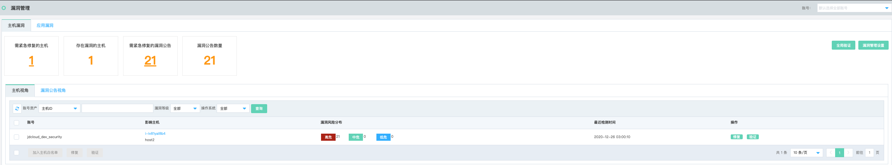
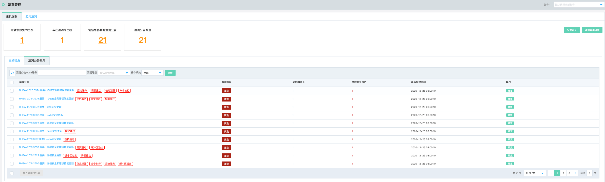
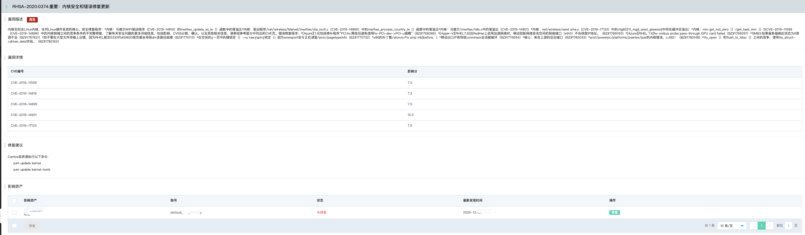
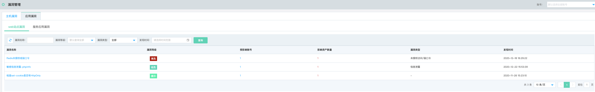
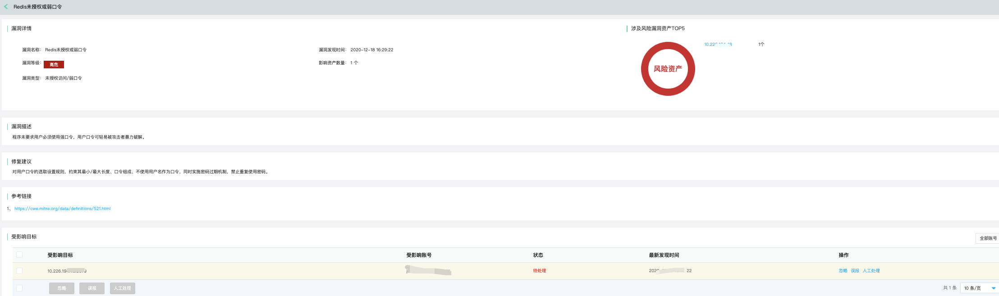
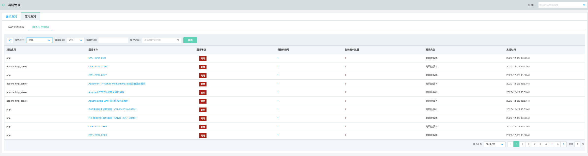

# 安全防范-漏洞管理

## 主机漏洞管理

### 功能说明

为用户提供可视化主机漏洞看板，以主机视角和漏洞公告视角两个统计维度向用户展示主机弱点。

方便安全运营人员修复相关漏洞。

- 主机视角

点击影响主机，跳转该主机存在的漏洞列表页。

- 漏洞公告视角

- - 点击漏洞名称跳转到【漏洞详情页】以及关联的账号资产，点击多选框，可以批量修复。其中Windows系统可以点击修复操作，Linux给出修复建议，用户自行修复。

  

## 应用漏洞管理

### 功能说明

应用漏洞管理主要包含扫描任务下发后出现的各类应用漏洞，包括**web站点漏洞及服务应用漏洞**两类。

#### web站点漏洞

- web站点漏洞列表

- web站点漏洞详情

#### 服务应用漏洞

- 服务应用漏洞列表

- 服务应用漏洞详情

