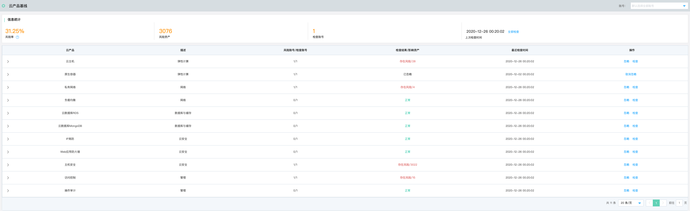
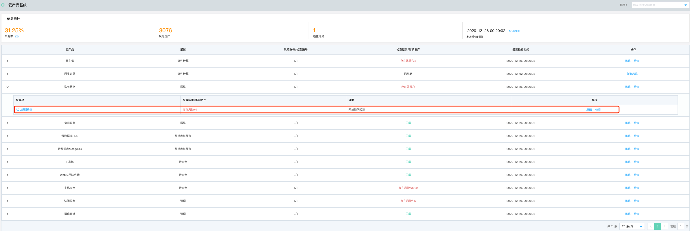
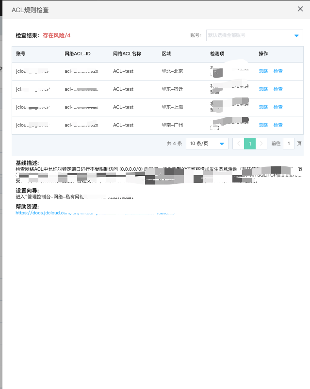
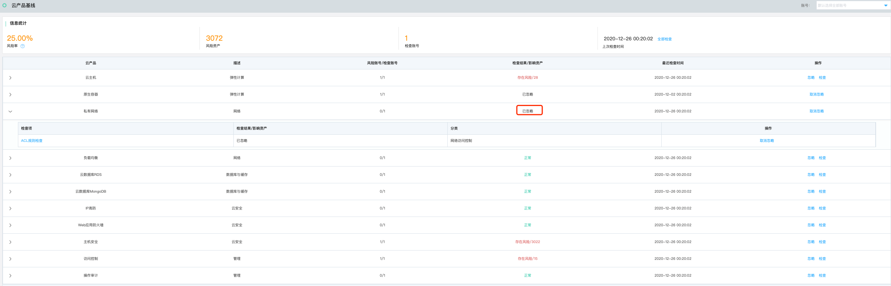

# 安全防范-云产品基线

### 功能说明

从身份认证、网络访问控制、数据安全、日志审计、基础安全防护五个维度为您提供云产品安全配置的检测，帮助您及时发现当前账号下的云产品配置风险并提供相应的修复方案。

#### 云产品范围

本次云产品基线提供11款云产品共计16项安全配置核查，如下表：

| 云产品          | 检查项                 |
| --------------- | ---------------------- |
| 云主机          | 安全组规则检测         |
| 原生容器        | 安全组规则检测         |
| 私有网络        | ACL规则检测            |
| 负载均衡        | 高危端口暴露           |
|                 | 安全组规则检测         |
| 云数据库RDS     | 白名单配置检查         |
|                 | 数据库备份策略检查     |
|                 | SQL审计检查            |
| 云数据库MongoDB | 白名单配置检查         |
|                 | 数据库备份策略检查     |
| IP高防          | 清洗服务开启           |
| Web应用防火墙   | WAF是否开启阻断检查    |
| 主机安全        | 主机安全防护状态检查   |
| 访问控制        | 账号双因素认证检查     |
|                 | IAM密码策略检查        |
| 操作审计        | 云平台操作审计服务检查 |

#### 云产品基线列表

#### 云产品基线检查项

展开检查项，点击检查项，进入检查详情页

针对部分云产品，如果存在用户对当前检查项或者当前云产品检查出的安全风险暂不关注，可以点击忽略，

