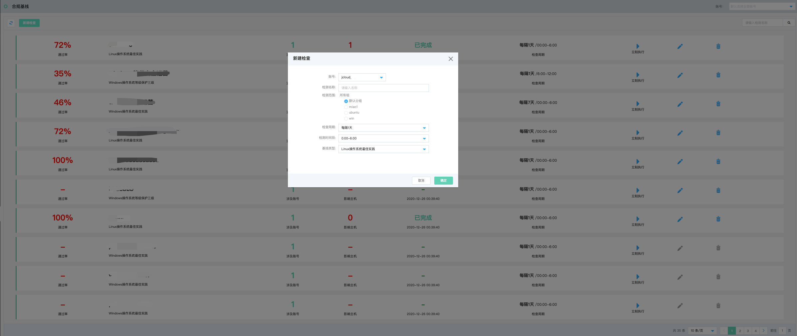
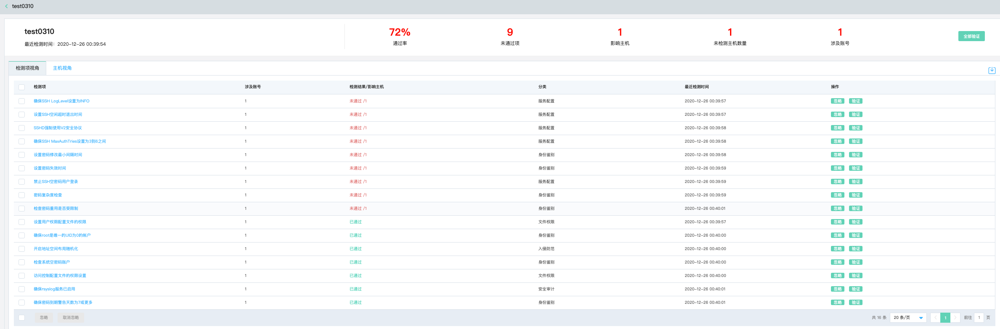
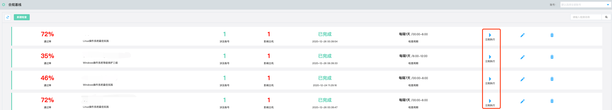
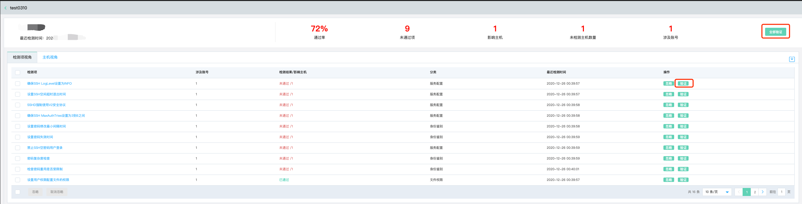
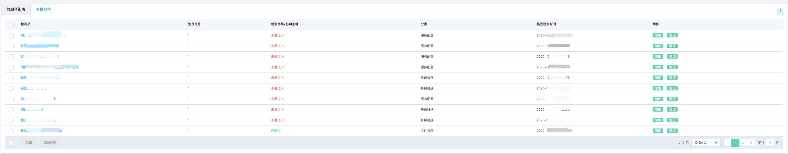
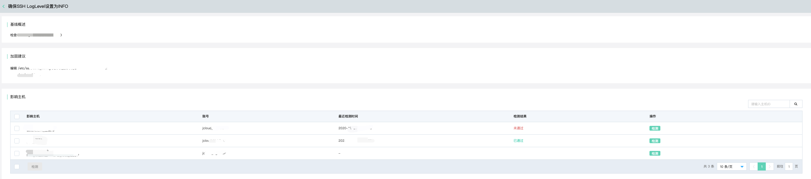
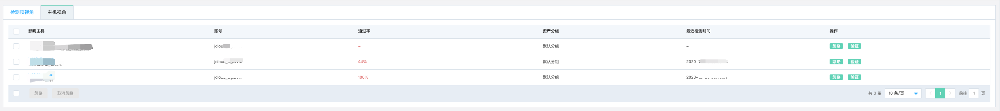
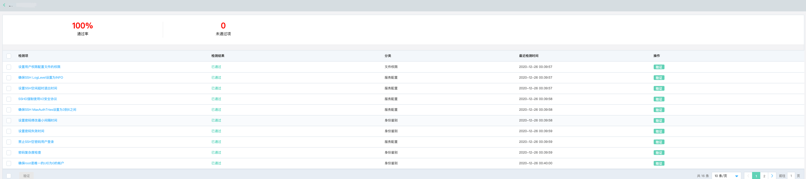

# 安全防范-合规基线

### 功能说明

合规基线旨在通过检查任务的方式，根据主机实例类型资产不同操作系统的实际情况进行合规检查。

- 支持一键任务化基线检测，检查结果可视化直观呈现。

- 自动跟踪配置状态的变更，大大提升了安全运营管理效率。

- 参考国内外基线检测的最佳实践，完美满足监管机构合规审计要求。

#### 新建检查任务

点击左上角新建检查，选择需要进行合规基线检查的账号，编辑检查名称，选择检查范围（**检查范围可在选择账号下的主机安全产品资产管理页中进行自定义分组设置**）、检查周期（**每隔1天|7天|30天，单次执行**）、检测时间段（**根据用户业务高峰的不同，支持0:00~6:00、6:00~12:00、12:00~18:00、18:00~24:00 四个时段**），最后选择基线检查类型（**Linux操作系统最佳实践、Windows操作系统最佳实践、Windows操作系统等级保护三级**）。

需要说明的一点是：检查范围是从当前选择账号下的**主机安全产品页-资产管理**中获取，通过**分组管理功能模块**创建分组信息配置。

#### 执行检查任务

1、根据用户对主机实例的合规基线检测项的不同需求，可忽略、批量忽略单个检查项，同时，当检查项需求发生变化时，可取消忽略、批量取消忽略单个检查项。 

2、如果设定周期性任务扫描，可以提前执行扫描任务。 

3、当检测结果完成后，用户可以根据加固建议完成修复后，再一次验证结果，可以点击**全部验证**或者**只检测单个检查项** 

#### 检查结果呈现

通过**检查项视角**与**主机视角**两个维度进行结果可视化呈现。

**注：在安全托管体系下，支持横跨多个账号多个资产的合规基线检查**

| 视角         | 呈现内容                                                     |
| ------------ | ------------------------------------------------------------ |
| 检查项视角   | （1）合规基线所有检查项 （2）本次检查任务涉及账号 （3）检查结果与影响主机数量 （4）检查项配置分类 （5）最近检测时间 （6）忽略与验证操作 |
| 主机实例视角 | （1）影响主机实例名称及ID （2）该主机实例归属账号 （3）当前主机实例合规基线检查通过率百分比 （4）该主机实例资产的分组名称 （5）最近检测时间 （6）忽略与验证操作 |

- 检查项视角

- 主机视角

