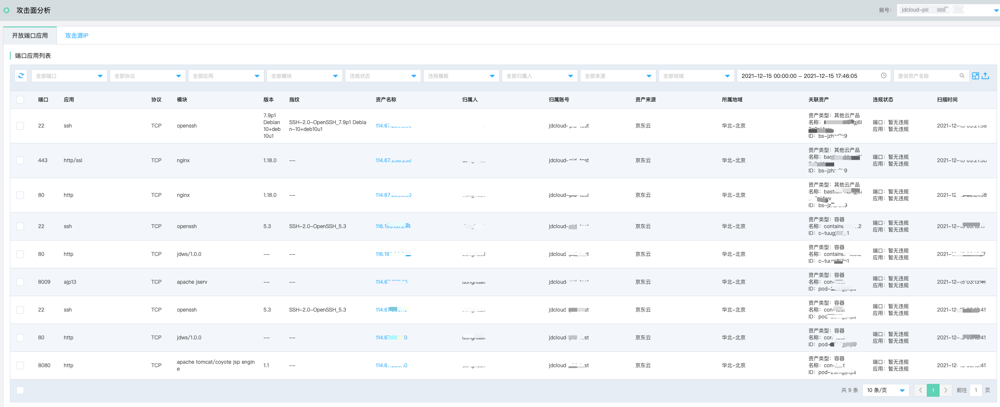
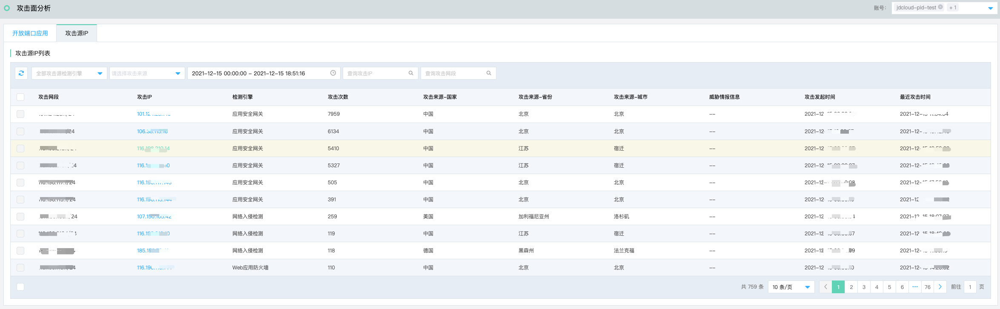

# 安全防范-攻击面分析

## 开放端口应用

### 功能说明

承接攻击面概览看板信息，呈现对外暴露的端口、应用等信息，支持按照端口、协议、应用、模块、违规状态、违规模板、资产归属人、资产来源、资产地域、时间区间、输入资产名称进行筛选查询。同时，支持**批量导出、全部导出**两种导出方式。

| 字段     | 描述                                                         |
| -------- | ------------------------------------------------------------ |
| 端口     | 扫描发现的所有端口，如  21 22 80 81 82 83 84 85 86 87 88 89 443 7001 8001 8009 8010 8020 8030 8040 8080 8081 8082 8083 8084 8085 8087 8088 8089 8090 9000等 |
| 协议     | TCP、UDP                                                     |
| 应用     | 扫描发现的所有应用，如：ajp13 ctf ftp hosts2-ns http http-proxy http/ssl https kerberos-sec mfcobol mit-ml-dev priv-term-l ssh su-mit-tg xfer等 |
| 模块     | 扫描发现的所有模块，如：apache httpd apache jserv apache tomcat/coyote jsp engine jdcloud-fe jdcloud_alb jdws/1.0.0 nginx openssh vsftpd |
| 版本     | 各类应用模块的版本号                                         |
| 指纹     | 部分应用模块扫描出的指纹信息，如SSH-2.0-OpenSSH_7.9p1 Debian-10+deb10u1 |
| 资产名称 | IP信息，下钻可至资产中心-资产详情                            |
| 归属人   | 资产归属人                                                   |
| 归属账号 | 归属pin账号（如未构建托管关系，则默认为当前pin账号）         |
| 资产来源 | 京东云、云外资产（其它云厂商、IDC机房的资产信息）            |
| 所属地域 | 华北-北京、华东-上海、华南-广州、华东-宿迁，以及其他地域     |
| 关联资产 | 资产类型：云主机、容器、物理服务器、其他云产品 名称：资产名称 ID：资产ID |
| 违规状态 | 端口：暂无违规or命中违规模板（违规模板1、违规模板2、违规模板3） 应用：暂无违规or命中违规模板（违规模板1、违规模板2、违规模板3） |
| 扫描时间 | 最近扫描发现的时间                                           |

## 攻击源IP

### 功能说明

承接攻击面概览看板信息，呈现当前系统遭受的外部攻击IP信息，包括攻击检测引擎、攻击发生时间区间、输入攻击IP、查询攻击网段的筛选查询。

| 攻击源IP列表 | 描述                                                         |
| ------------ | ------------------------------------------------------------ |
| 攻击网段     | 攻击网段（C段）聚合，便于发现同一C段密集的攻击事件           |
| 攻击IP       | 攻击源IP，支持下钻跳转“威胁检测-安全告警”                    |
| 检测引擎     | 主机安全EDR、Web应用防火墙、应用安全网关、DDoS基础防护、网络入侵检测、威胁诱捕（蜜罐） |
| 攻击次数     | 同一攻击源IP攻击次数统计                                     |
| 攻击来源-    | 国家、省份、城市                                             |
| 威胁情报信息 | 关联第三方威胁情报信息                                       |
| 攻击发起时间 | 该攻击源IP第一次发起攻击的时间                               |
| 最近攻击时间 | 该攻击源IP最近一次发起攻击的时间                             |

