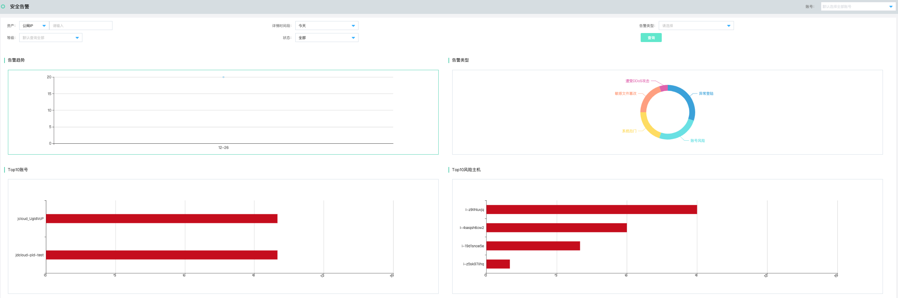
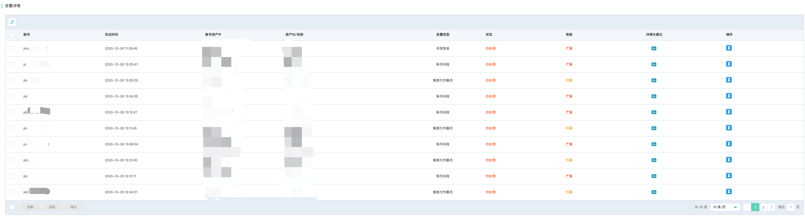
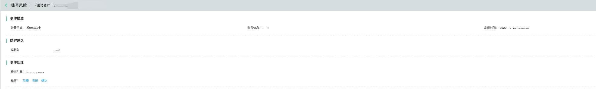
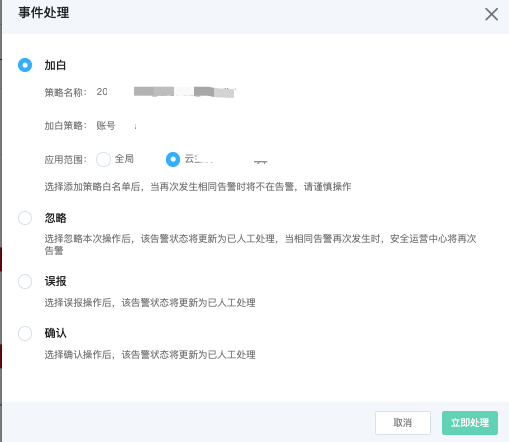

# 威胁检测-安全告警

### 功能说明

为用户提供基于账号资产、详情时间段、攻击类型、威胁等级和当前告警处理状态的查询，以及告警事件详情列表和事件处理状态。同时提供具体事件详情信息与修复建议。

#### 安全告警检索

支持基于资产信息（公网IP、内网IP、资产名称、资产ID）、详情时间段（近1天、近7天、近14天、近30天、自定义时间段）、告警类型（各类检测引擎上报的告警信息）、告警等级（严重、可疑、提醒）、状态（已处理、待处理、已拦截）等进行全局查询检索。

#### 安全告警详情列表

安全告警的列表详细呈现了，多账号托管体系下， 告警信息的账号归属、攻击事件、账号资产IP、资产ID/名称、告警类型、处置状态、告警等级、详情与建议及操作。

- 点击详情与建议

- 点击操作

- 操作步骤
  短信接收【京东智联云】您账号***\***@[jdcloud.com](https://jdcloud.com/)下的云上资产：*.win2012-bj，发现告警事件：遭受DDoS攻击，请登录京东智联云-安全运营中心进行应急响应。
 - 快速查询
   通过账号资产、详情时间段、攻击类型 快速查询到自己关心的告警事件。通过攻击趋势，可以方便的查看到近期同类事件趋势。
   点击 【安全告警】->【操作】-> 【详情与建议】，页面跳转到具体攻击类型的详情页。查看攻击事件的详细情况，给出防护建议。其中包含应急安全解决方案或者云安全产品建议。
  - 事件处理
    如果用户根据反馈的事件详情做出判断，如果是误报，忽略或者确认其事件判断，请点击相应的按钮。如果用户对某条事件特别关注，可以通过工单的形式反馈，由京东智联云运维人员分析原因，做出解答。
    备注：被标记【忽略】标签的事件 不会在用户控制台再次显示。被标记【误报】标签的事件，还会在控制台显示。如果对历史事件进行查询，也可以通过等级和状态过滤。等级分为：紧急和常规。