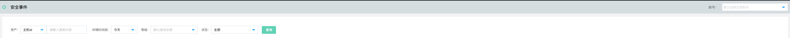
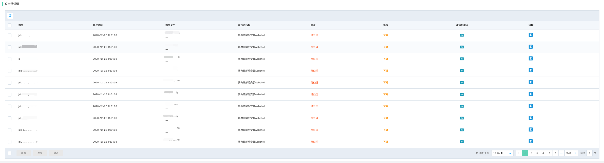
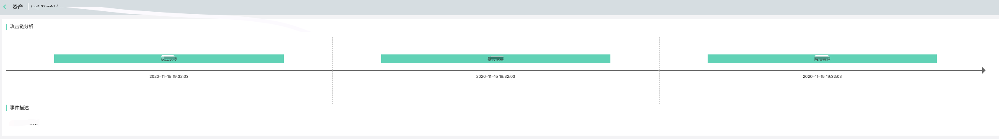
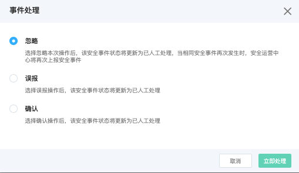

# 威胁检测-安全事件

### 功能说明

为用户提供基于Att&ck攻击模型分析提炼出来的安全事件的攻击链详情列表，通过攻击模型分析有效发现，隐藏在正常访问行为中的异常攻击行为。

#### 安全事件检索

支持基于资产信息（资产名称、资产ID）、详情时间段（近1天、近7天、近14天、近30天、自定义时间段）、告警等级（严重、可疑、提醒）、状态（已人工处理、待处理）等进行全局查询检索。

#### 安全事件列表

安全事件的列表详细呈现了，多账号托管体系下， 安全事件信息的账号归属、发现时间、账号资ID/名称、攻击链名称、处置状态、告警等级、详情与建议及操作。

- 安全事件列表详情与建议

详情建议中呈现了安全攻击链分析时间轴、以及详细安全事件描述信息

- 安全事件列表操作

针对安全事件可以支持标记状态为忽略、误报、确认等事件处理操作。

