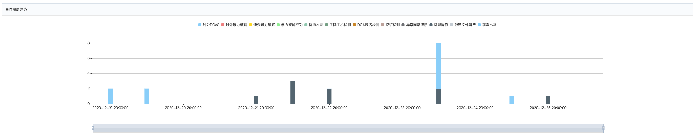
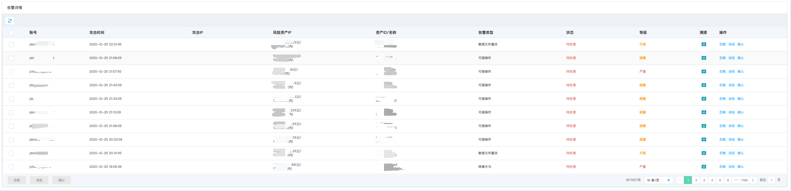
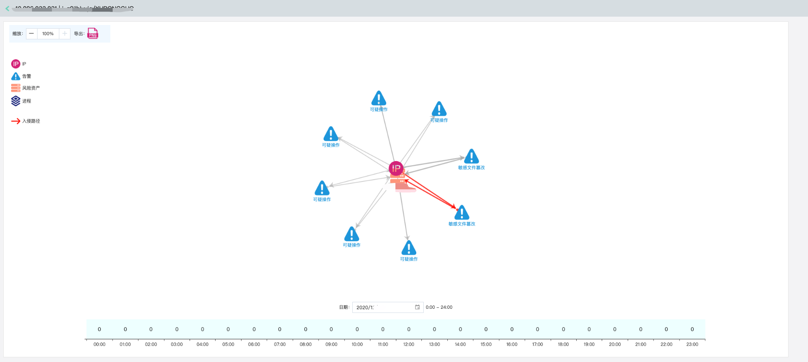

# 调查响应-自动化攻击溯源

### 功能说明

自动化攻击溯源旨在通过追踪攻击者的IP，结合风险资产信息（**公网IP、内网IP、资产名称、资产ID**）、以及一定的时间区间（**近7天、近15天、近30天、自定义**）、告警类型（**各类安全监测引擎上报告警事件**）、告警信息处置状态（**待处理、已人工处理、已拦截**）、告警等级（**严重、可疑、提醒**）进行查询检索，溯源黑客攻击行为。

#### 事件发展趋势

包含**对外DDoS、对外暴力破解、遭受暴力破解、暴力破解成功、网页木马、失陷主机检测、DGA域名检测、挖矿检测、异常网络连接、可疑操作、敏感文件篡改、病毒木马**等告警类型在一定时间区间范围内的数量趋势分布。

#### 告警详情列表

告警详情列表包含当前告警信息的账号归属、攻击事件、攻击IP、风险资产IP、资产ID/名称、告警类型、当前处置状态、告警等级、溯源、操作等

- 点击溯源跳转该资产的攻击溯源页

能够结合IP、告警、进程绘制攻击入侵路径，并结合一定的时间区间，提供整体攻击溯源情报。

