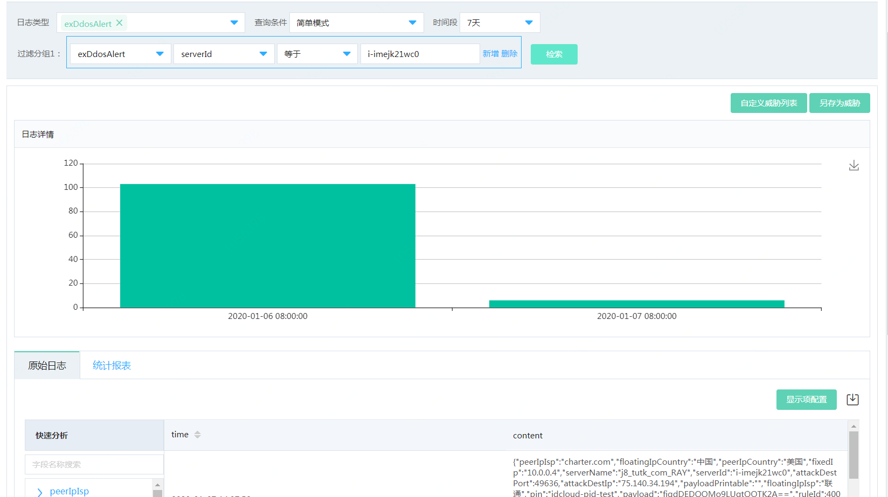
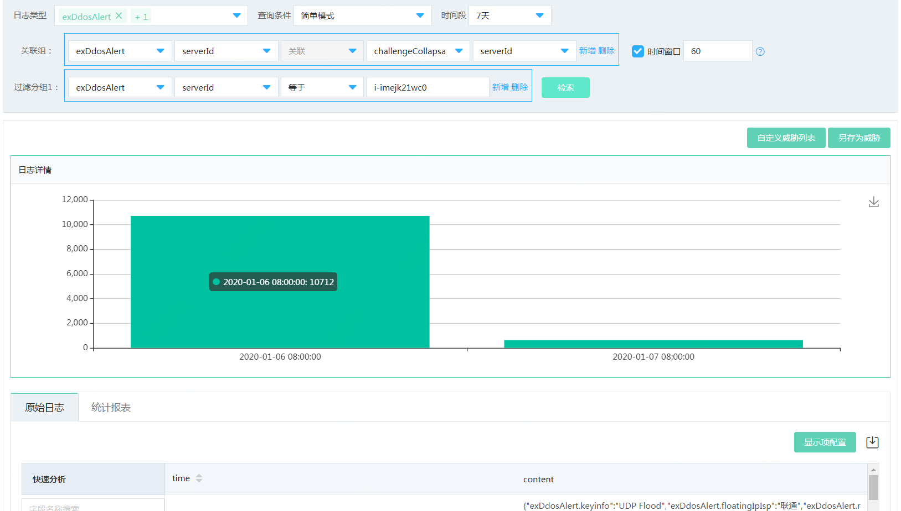

# 调查响应-全量日志分析

### 功能说明

围绕企业用户日志集中管理和搜索分析核心需求，安全运营中心推出了全量日志分析功能，对现有的基础日志、告警日志、安全日志进行管理。

同时支持用户自定义威胁检索，另存为威胁告警，日志导出，自定义报表分析，日志状态管理等功能。

查询方式分为：**检索模式，实时模式**。

**检索模式**：检索模式实际上是周期性查询底层数据，所以需要指定查询周期。如果调度时间为1min，表示一分钟查询一次，目前不支持定时查询。
**实时模式**：采用实时引擎，对任务进行实时处理。实时模式目前只支持处理时间(proctime)，不支持事件时间(rowtime)。

##### 简单查询模式：

1、简单过滤查询：主要用于ETL

- 先选择日志类型
- 添加过滤条件

详细的中英文对照参考：字段说明

2、关联查询：主要用于原始日志的实时关联

- 先选择日志类型。
- 添加关联条件。
- 添加过滤条件。

详细的中英文对照参考：字段说明

##### 复杂查询模式：

**1、查询语句标准sql92**

**2、对下面查询中出现的替换符进行说明：**   

| 变量名称    | 含义                                                         |
| ----------- | ------------------------------------------------------------ |
| table       | 表名                                                         |
| alias       | 别名                                                         |
| field       | 字段                                                         |
| relation    | 关联条件  比如：exDdosAlert.serverId=sufferBruteForce.serverId |
| condition   | 过滤条件  比如：serverId='i-kjewspceko'                      |
| avgFunction | 聚合函数  比如count(*)  sum(age)  second是统计的窗口秒数，比如300，表示5分钟，length是窗口秒数的长度，比如统计窗口为300秒，length=3 |

$avgFunction：

| 名称     | 聚合算法          | 聚合方式      | 约定        |
| -------- | ----------------- | ------------- | ----------- |
| 计数     | count(A)          | A为表字段或者 | A为任意类型 |
| 求和     | sum(A)            | A,表中字段    | A为数值类型 |
| 求最大值 | MAX(A)            | A,表中字段    | A为数值类型 |
| 求最小值 | MIN(A)            | A,表中字段    | A为数值类型 |
| 求平均值 | AVG(A)            | A,表中字段    | A为数值类型 |
| 去重     | count(DISTINCT A) | A,表中字段    | A为任意类型 |

**3、简单过滤查询：主要用于ETL**

使用方式

    select * from $table 
        [where $condition [(AND|OR) $condition]*]

示例

    select * from exDdosAlert where serverId='i-kjewspceko'

**4、统计查询：用于聚合统计以及聚合后的过滤**

使用方式

    SELECT $avgFunction FROM $table
        [WHERE $condition [(AND|OR) $condition]*]
        GROUP BY TUMBLE(proctime, INTERVAL '$second' SECOND($length))
        [, $field]*

TUMBLE表示滚动窗口，
proctime是内置的时间，固定写法

示例

    select * from (
        SELECT TUMBLE_END(proctime, INTERVAL '300' SECOND(3)) as     processtime
        , count(*)** as pvcount 
        FROM ccAttack 
        GROUP BY TUMBLE(proctime, INTERVAL '300' SECOND(3)), serverId
        ) where pvcount>5

上面的查询意思为cc攻击日志按照serverId进行聚合，五分钟的时间窗口，访问次数>5的日志
TUMBLE_END表示该窗口的结束时间

**5、关联查询：主要用于原始日志的实时关联**

使用方式一

    SELECT * FROM $table1 [AS $alias1], $table2 [AS $alias]
        WHERE $relation 
        AND $table1.proctime BETWEEN $table2.proctime - INTERVAL '$second' AND  SECOND($length) AND $table2.proctime + INTERVAL '$second' SECOND($length) 
        [(AND|OR) $relation]*
        [(AND|OR) $condition]*

示例

SELECT * FROM exDdosAlert ,ccAttack where exDdosAlert.serverId = ccAttack.serverId AND exDdosAlert.proctime BETWEEN ccAttack.proctime - INTERVAL '100' SECOND(3) AND ccAttack.proctime + INTERVAL '100' SECOND(3) AND exDdosAlert.serverName='i-kjewspceko'

使用方式二

    SELECT * FROM $table1 [AS $alias]
            [
                join $table2 [AS $alias]
                    on $relation [AND $relation]*
                    AND $table1.proctime BETWEEN $table2.proctime - INTERVAL '$second' SECOND($length) AND $table2.proctime + INTERVAL '$second' SECOND($length) 
                    [(AND|OR) $condition]*
            ]+
            [WHERE condition [(AND|OR) condition]*]

示例

1. 双表
   SELECT t1., t2. FROM flowSession AS t1 
     JOIN exDdosAlert AS t2 ON t1.srcIp = t2.serverId AND t1.proctime BETWEEN t2.proctime - INTERVAL '100' SECOND(3) AND t2.proctime + INTERVAL '100' SECOND(3)
2. 多表
   SELECT t1., t2. FROM flowSession AS t1 
     JOIN exDdosAlert AS t2 ON t1.srcIp = t2.serverId AND t1.proctime BETWEEN t2.proctime - INTERVAL '100' SECOND(3) AND t2.proctime + INTERVAL '100' SECOND(3)
     JOIN ccAttack as t3 ON t1.srcIP = t3.serverId and t1.proctime BETWEEN t3.proctime - INTERVAL '100' SECOND(3) AND t3.proctime + INTERVAL '100' SECOND(3)

**6、维度表查询：**

针对于安全日志的关联，关联日志属于离线数据，如果按照实时关联，实际上查不出结果，对于这种场景，正常的操作应该是通过实时数据区关联维表的数据，目前只支持两张表关联，且第二张表为维度表。

使用方式

    select * from $table1 as t1 
        JOIN $table2 FOR SYSTEM_TIME AS OF t1.proctime as t2 
        ON $relation [(AND|OR) $relation]* 
        [WHERE $condition [(AND|OR) condition]*]

$table2必须为维表，此处指的是安全日志，比如基线数据、漏洞数据

示例

    select * from sufferBruteForce as t1 
        join hostBaseline FOR SYSTEM_TIME AS OF t1.proctime as t2 
        on t2.serverId =t1.serverId 
        where t1.serverId ='i-kjewspceko'

**7、时序查询：**

时序模式用于攻击链分析的场景，数据的输入为所有的告警数据，而不是其中的一个，在做这种分析的时候，通过alertlog代替具体的告警进行分析

使用方式

    SELECT * FROM alertlog
    MATCH_RECOGNIZE '('
          [ PARTITION BY expression [, expression ]* ]   // 指定分区的列，可选项
          [ ORDER BY orderItem [, orderItem ]* ]      // 指定排序的字段，目前只支持proctime
          [ MEASURES measureColumn [, measureColumn ]* ]，相当于select，后面为需要查询的字段
          [ ONE ROW PER MATCH ]  //对于每一次成功的匹配，只会产生一个输出事件;
          [ AFTER MATCH
                ( SKIP TO NEXT ROW   //匹配成功之后，从匹配成功的事件序列中的第一个事件的下一个事件开始进行下一次匹配
                | SKIP PAST LAST ROW //匹配成功之后，从匹配成功的事件序列中的最后一个事件的下一个事件开始进行下一次匹配
                | SKIP TO FIRST variable //匹配成功之后，从匹配成功的事件序列中第一个对应于variable的事件开始下一次匹配
                | SKIP TO LAST variable //匹配成功之后，从匹配成功的事件序列中最后一个对应于variable的事件开始下一次匹配
                | SKIP TO variable )
          ]
          PATTERN '(' pattern ')'    // 定义待识别的事件序列需要满足的规则，需要定义在()中，由一系列自定义的patternVariable构成：patternVariable之间若以空格间隔，表示符合这两种patternVariable的事件紧挨着，中间不存在其他事件；patternVariable之间若以->间隔，表示符合这两种patternVariable的事件之间可以存在其它事件。
          [ WITHIN intervalLiteral ]   // 时间范围，意为此攻击链的分析需要在多长的时间内完成
          DEFINE variable AS condition [, variable AS condition ]*  // 相当于where，后面为过滤条件
          ')'

示例

    select * from alertlog 
        MATCH_RECOGNIZE(
            PARTITION BY serverId 
            ORDER BY proctime 
            MEASURES A.fixedIp AS A_FixedIp 
            ONE ROW PER MATCH AFTER MATCH SKIP PAST LAST ROW 
            PATTERN(A B) 
            DEFINE A as A.logType='exDdosAlert', B as B.logType='sufferBruteForce'

