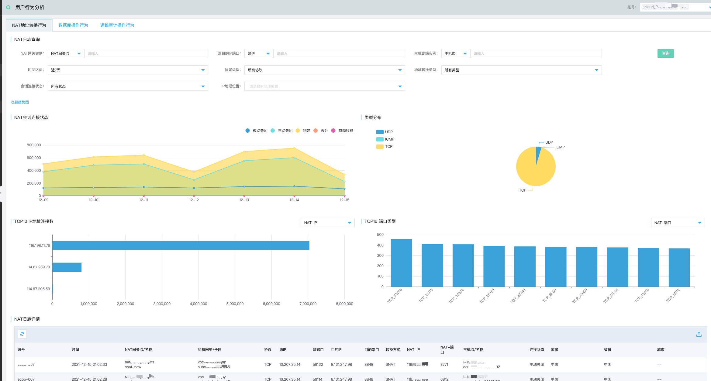
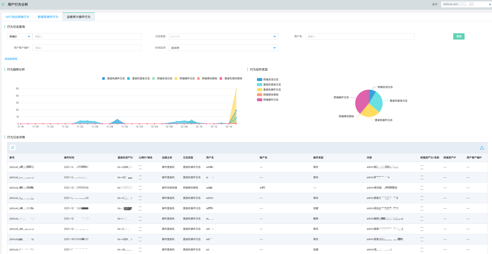

# 调查响应-用户行为分析

### 功能说明

用户实体行为分析旨在通过用户日常使用到的NAT网关、数据库审计、堡垒机等产品，从而发现隐藏在正常行为下的一些异常轨迹。

#### NAT地址转换行为

支持针对NAT网关进行全实例级别的操作行为审计，支持针对NAT网关ID、NAT网关名称、NAT-IP、NAT-端口、源IP、源端口、目的IP、目的端口、主机终端ID、实例名称、时间区间、协议类型、地址转换类型、会话连接状态、IP地理位置进行条件筛选查询

#### 运维审计操作行为

支持针对堡垒机进行全实例级别的操作行为审计，支持针对堡垒机ID、操作终端ID、用户名、用户客户端IP、日志类型、时间区间进行筛选查询。

| 日志类型       | 描述                                               |
| -------------- | -------------------------------------------------- |
| 访问堡垒机日志 | 堡垒机操作日志 堡垒机登录日志 堡垒机修改密码 |
| 访问终端日志   | 终端操作日志 终端会话日志 终端修改密码     |

 

#### 数据库操作行为

支持针对数据库审计进行全实例级别的操作行为审计，支持针对数据库审计ID、实例名称、客户端IP、客户端端口、命中规则名称、时间区间、风险级别、数据库名称、执行结果、SQL语句进行条件筛选查询。

