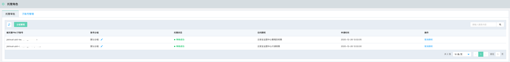
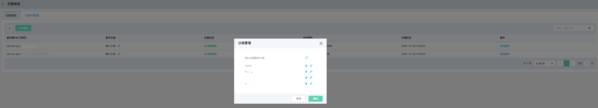
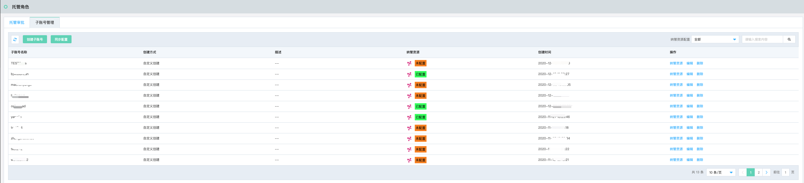

# 安全托管-托管角色

### 功能说明

安全托管服务旨在通过账号安全托管实现在重大活动保障期间，用户将账号内的资产安全运营进行托管，以保证专业安全团队集中处理告警事件、避免在重保期间遭受攻击及黑客入侵。

#### 托管审批列表

托管角色受到需要被托管账号上报的需要审批的托管申请后，在该列表中进行审批，并通过账号分组进行账号管理。当托管账号结束对该账号的托管后，托管角色可以点击取消托管，解除对被托管账号的托管。

- 分组管理

#### 子账号管理

通过创建托管账号的子账号，关联各个被托管账号的资源进行分权管理。

| 托管账号 | 托管账号子账号 | 管理—> | 被托管账号 |
| -------- | -------------- | ------ | ---------- |
| pinS     | pinS-subnet1   | 管理—> | pinA       |
|          | pinS-subnet2   | 管理—> | pinB       |
|          | pinS-subnet3   | 管理—> | pinC       |

