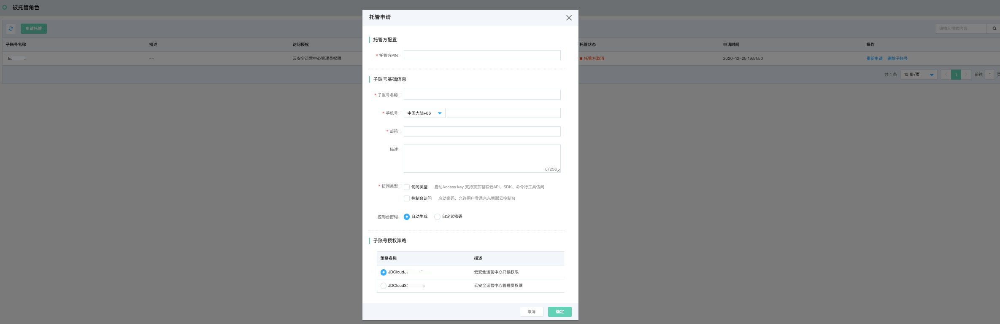
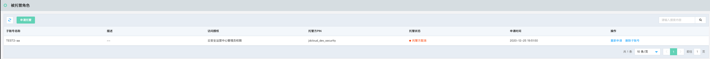

# 安全托管-被托管角色

### 功能说明

安全托管服务旨在通过账号安全托管实现在重大活动保障期间，用户将账号内的资产安全运营进行托管，以保证专业安全团队集中处理告警事件、避免在重保期间遭受攻击及黑客入侵。

#### 申请托管

被托管账号点击左上角申请托管，进行账号托管申请，填写申请托管单，填写托管方pin、包括托管方子账号基础信息（子账号名、手机号、邮箱、描述），选择访问类型（支持AKSK访问、控制台访问），子账号授权策略（只读、读写（即管理员授权））

| 访问类型   | 访问方式                                              |
| ---------- | ----------------------------------------------------- |
| AKSK访问   | 启动Access key 支持京东智联云API、SDK、命令行工具访问 |
| 控制台访问 | 控制台访问启动密码，允许用户登录京东智联云控制台      |

#### 托管申请列表

被托管账号申请列表包含子账号名称、描述、访问授权、托管方PIN、托管状态、申请时间以及操作（重新申请、删除子账号）

