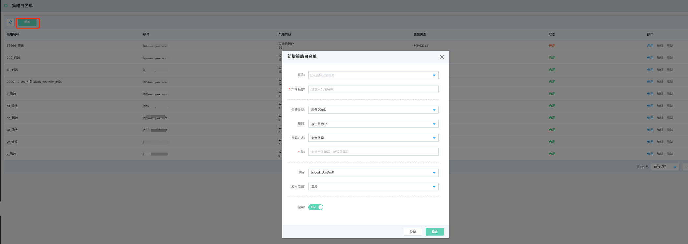
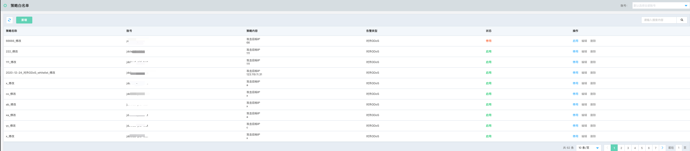

# 系统设置-策略白名单

### 功能说明

通过配置策略白名单，可以一些用户已知且当前并不关注的告警通知进行白名单设置，避免被太多无用告警通知频繁打扰。

- 新增策略白名单

在多账号托管体系下，选择账号，编辑策略名称，选择当前不关心的告警类型、规则、匹配方式、以及针对单个账号的个性化配置应用范围（全局、单个实例），以及配置后的策略启停状态。

- 策略白名单列表

策略白名单列表包含策略名称、账号、策略内容、告警类型、状态以及操作（启停状态）等可视化呈现。

