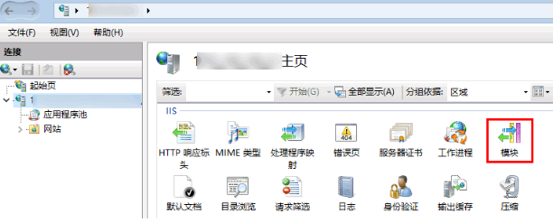
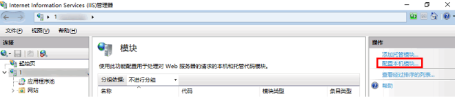
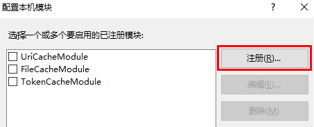
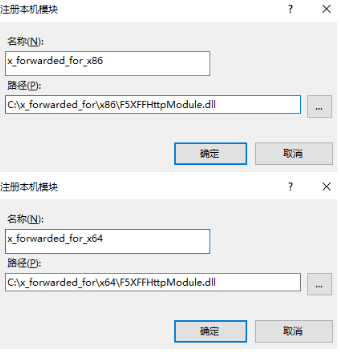
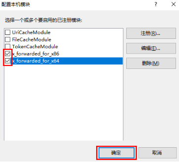
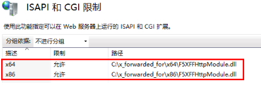

# 获取客户端真实IP

网站部署了流量代理服务（例如Web应用防火墙、IP高防、CDN）后，源站服务器可以通过解析回源请求中的X-Forwarded-For记录，获取客户端的真实IP。本文介绍了不同类型的Web应用服务器（包括Nginx、IIS 7、Apache）如何进行相关设置，以获取客户端的真实IP。

## 背景信息

在大部分实际业务场景中，网站访问请求并不是简单地从客户端（访问者）的浏览器直接到达网站的源站服务器，而是在客户端和服务器之前经过了根据业务需要部署的Web应用防火墙、IP高防、CDN等代理服务器。

透明的代理服务器在将客户端的访问请求转发到下一环节的服务器时，会在HTTP的请求头中添加一条X-Forwarded-For记录，用于记录客户端的IP，格式为`X-Forwarded-For:客户端IP`。如果客户端和服务器之前有多个代理服务器，则X-Forwarded-For记录使用以下格式记录客户端IP和依次经过的代理服务器IP：`X-Forwarded-For:客户端IP, 代理服务器1的IP, 代理服务器2的IP, 代理服务器3的IP, ……`。

因此，常见的Web应用服务器可以通过解析X-Forwarded-For记录获取客户端真实IP。

下文分别针对Nginx、IIS 7、Apache服务器，介绍相应的X-Forwarded-For配置方案。

## Nginx 配置方案

1. 当 Nginx 作为服务器时，获取客户端真实 IP，需使用 http_realip_module 模块，默认安装的 Nginx 是没有安装 http_realip_module 模块的，需要重新编译 Nginx 增加 --with-http_realip_module。

   ```
   wget  http://nginx.org/download/nginx-1.18.0.tar.gz 
   tar  zxvf nginx-1.18.0.tar.gz 
   cd nginx-1.18.0
   ./configure --with-http_realip_module
   make
   make install
   ```

2. 修改 nginx.conf。

   ```
   vi /etc/nginx/nginx.conf
   ```

   修改如下红色部分：

   ```
   set_real_ip_from IP地址;   //IP地址为WAF的回源IP地址，可以在Web应用防火墙控制台，实例管理列表中回源IP段可以查看。
   real_ip_header X-Forwarded-For;
   ```
   
3. 重启 Nginx。

   ```
   service nginx restart
   ```


## IIS 7 配置方案

1. 下载与安装插件 **F5XForwardedFor** 模块，根据自己的服务器操作系统版本将`x86\Release`或者`x64\Release`目录下的`F5XFFHttpModule.dll`和`F5XFFHttpModule.ini`拷贝到某个目录，这里假设为`C:\F5XForwardedFor`，确保 IIS 进程对该目录有读取权限。
2. 选择【IIS 服务器】，双击【模块】功能。
3. 
4. 单击【配置本机模块】。
5. 在弹出框中单击【注册】。
   
6. 添加下载的 DLL 文件，如下图所示：
   !
7. 添加完成后，勾选并单击【确定】。
   !
8. 在 IIS 服务器的 “ISAPI 和 CGI 限制”中，添加如上两个 DLL ，并将限制设置为允许。
   
9. 重启 IIS 服务器，等待配置生效。


## Apache 配置方案

1. Apache v2.4 自带mod_remoteip，可获取到客户端真实IP。

2. 添加如下文件配置

   ```
   # vim /usr/local/apache/conf/httpd.conf
   ```

   启用模块

   Include conf/extra/httpd-remoteip.conf

   ```
   # vim /usr/local/apache/conf/extra/httpd-remoteip.conf
   ```

   添加如下内容
   ```
   LoadModule remoteip_module modules/mod_remoteip.so
   RemoteIPHeader X-Forwarded-For
   RemoteIPTrustedProxy IP地址  //IP地址为WAF的回源IP地址，可以在Web应用防火墙控制台，实例管理列表中回源IP段可以查看。
   ```

3. 添加完成后，重启 Apache。

   ```
   /usr/sbin/apachectl -k restart
   ```


