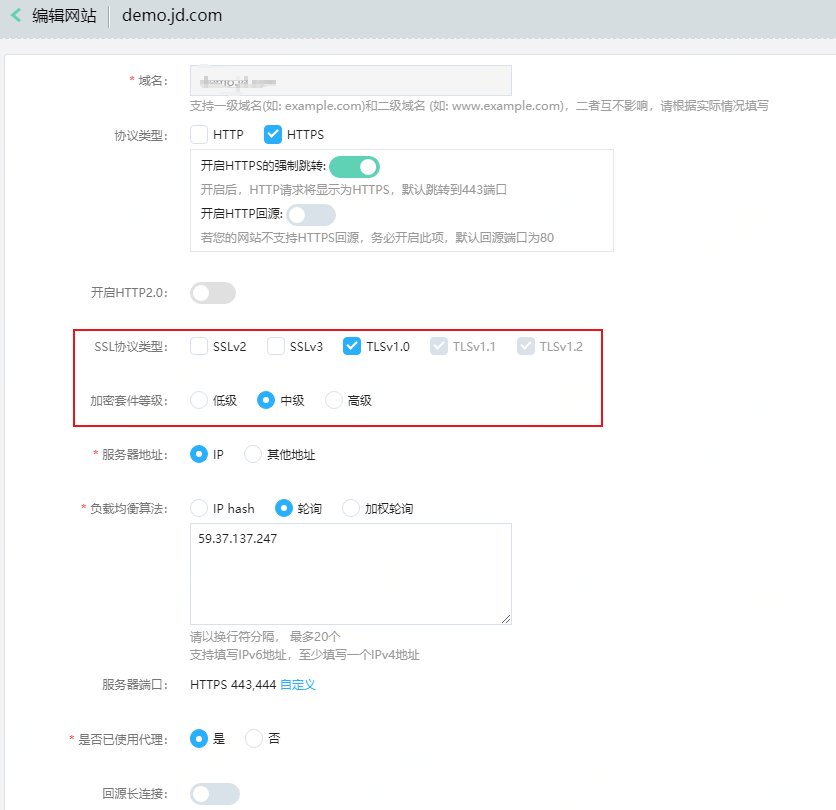

# 配置TLS协议最佳实践

传输层安全性协议（Transport Layer Security，TLS），是一种安全协议，目的是为了保障互联网通信的安全和数据完整性。HTTPS协议是由TLS+HTTP协议构建的可进行加密传输、身份认证的网络协议，当防护域名的**“协议类型”**为“HTTPS”时，您可以通过WAF为域名设置支持的TLS版本和加密套件等级，使不满足TLS版本的请求无法正常访问网站，以满足行业客户的安全需求。

### 场景说明

您可以根据业务实际需求，为防护域名配置对应的最低TLS版本和加密套件，下表为您介绍不同场景下如何配置TLS最低版本以及加密套件等级，以满足网站安全性需求。

| 场景                                    | TLS选择版本                                                  | 加密套件等级 |
| --------------------------------------- | ------------------------------------------------------------ | ------------ |
| 网站安全性能要求很高                    | TLS v1.1和TLSv1.2，WAF将自动拦截TLS v1.,1以下协议版本的访问请求。 | 高           |
| 网站安全性能要求一般                    | TLS v1.0、TLSv1.1、TLSv1.2 WAF将自动拦截TLS1.0以下协议版本的访问请求 | 中           |
| 客户端APP无安全性要求，可以正常访问网站 | SSLv2 、SSLv3、TLS v1.0、TLSv1.1、TLSv1.2                    | 低           |

### 前提条件

- 已添加防护域名。
- 防护域名的**“协议类型”**使用了HTTPS协议。

### 配置TLS加密套件操作

1. 登录[Web应用防火墙控制台](https://cloudwaf-console.jdcloud.com/overview/business?start=1595887129926&end=1595890728926)。

2. 在左侧导航栏，单击**网站配置**。

3. 在网站配置页面上方，选择当前实例。定位到目标域名所在行的**操作**列，点击**编辑**。

4. 进入**编辑网站**页面，选择SSL协议信息（前提是勾选HTTPS）。

   

5. 选择适合的**SSL协议类型**和“**加密套件等级**。

   配置前，可以先通过“https://myssl.com/ssl.html”检测您的网站支持的TLS版本

6. 单击“确定”，TLS配置完成。

