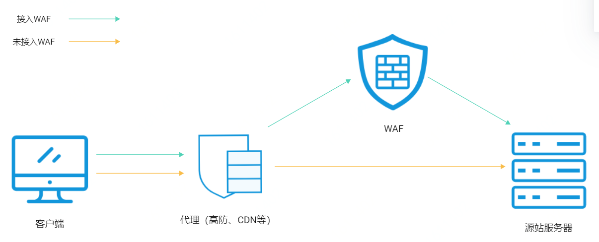
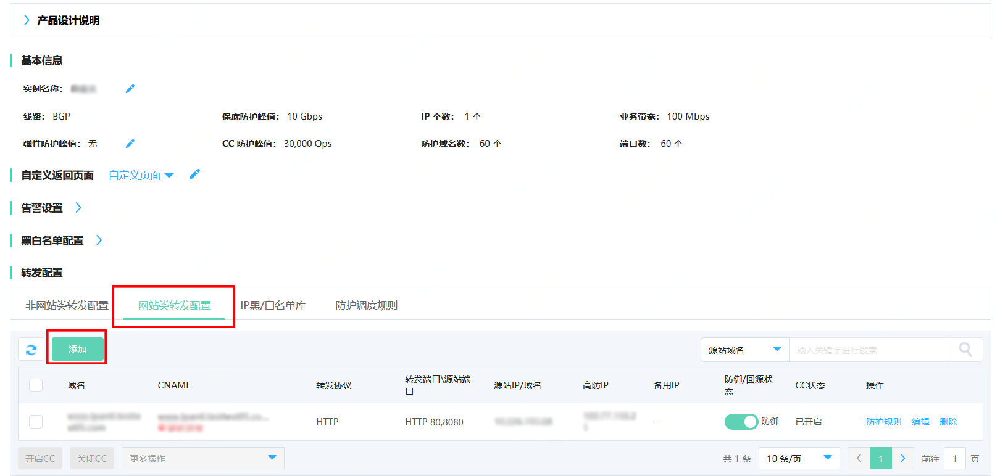
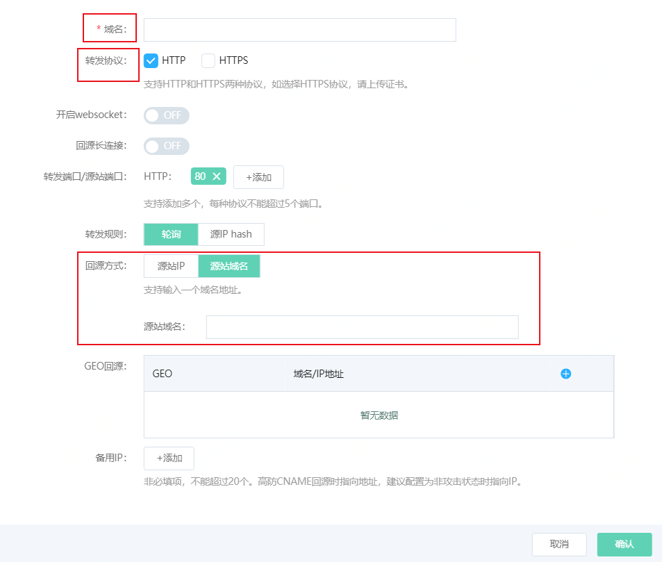

# 同时部署IP高防和WAF

Web应用防火墙（简称WAF）本身拥有京东智联云默认提供的最大**2Gbps**的DDos基础防护能力，如果您希望同时为业务接入Web攻击防护和DDos高级防护，我们推荐您组合使用京东智联云Web应用防火墙（WAF）和IP高防。本文介绍了为业务同时部署WAF和IP高防的配置方法。//如果流量过大，就会被黑洞，服务就不可访问了。

## 前提条件

- [开通Web应用防火墙](https://docs.jdcloud.com/cn/web-application-firewall/purchase-process)

- [开通IP高防并创建实例](https://docs.jdcloud.com/cn/anti-ddos-pro/create-instance)

## 背景信息

WAF的核心能力是防护应用层的攻击，典型的是一些由恶意攻击者精心构造的攻击请求，而WAF本身不具备DDoS高级防护能力。IP高防的核心能力在于防护DDoS攻击，偏向于流量攻击。更多信息，请参见[什么是IP高防](https://docs.jdcloud.com/cn/anti-ddos-pro/product-overview)。  

网络攻击者往往不会仅用单一的攻击方式发起攻击，多采用混合型的攻击方式，既有流量型攻击，又混杂精巧的Web应用层攻击等其他攻击方式。因此，单一使用一种网络安全防护产品无法起到全面的防护效果，一般建议您根据遭受的攻击进行分析来选择适合的防护手段。

WAF与IP高防完全兼容。您可以参照以下架构为网站业务同时部署WAF和IP高防：IP高防（入口层，实现DDoS防护）> Web应用防火墙（中间层，实现应用层防护）> 源站

IP高防和WAF部署原理：现将域名解析到IP高防，再将IP高防回源地址修改为WAF的“CNAME”，这样流量才会被IP高防转发到WAF，WAF再将流量转到源站，实现网站流量检测和攻击拦截。

## 操作步骤

1.在Web应用防火墙中添加网站配置。

​		i. 登录[Web应用防火墙控制台](https://cloudwaf-console.jdcloud.com/overview/business?start=1595887129926&end=1595890728926)。

​		ii. 在左侧导航栏，单击**网站配置**。

​		iii.在网站配置页面上方，选择当前实例。选择实例后，点击**添加网站**。

​		iv.进入**添加网站**页面，填写网站信息。并在网站信息中完成以下信息：

​			    **域名**：防护域名。

​				**服务器地址**：勾选**IP**并填写ECS公网IP、SLB公网IP、云外机房服务器的IP。

​				**是否使用代理**：勾选**是**。

​				更多信息，请参见**添加网站**。信息填写完成后，单击确定，成功添加网站配置。

​		 v.在**网站配置**列表中，定位到刚才添加的域名，将鼠标悬浮到CNAME上方，可以看到WAF CNAME值，复制网站的WAF CNAME地址。

2.在IP高防中添加网站配置。

​	i. 登录[IP高防控制台](https://ip-anti-console.jdcloud.com/instance-list)。

​	ii.默认展示**实例列表**页面，定位到已购买的某个实例，单击**实例名称**或操作栏下的**转发配置**，进入**实例详情**页面。

​	iii.在**实例详情**页面，切换至**网站类转发**，单击**添加**。

​		   iv.弹出填写域名的**添加规则**页面，完成以下配置，并点击**确认**。

​					**域名**：填写被防护网站的域名。

​					**转发协议**：勾选网站支持的协议类型。

​					**回源方式**: 请选择**源站域名**。并填写步骤1中获得的WAF CNAME地址。

​				   成功添加网站配置后，点击确认。相关信息，参见[IP高防-添加网站](https://docs.jdcloud.com/cn/anti-ddos-pro/web-service-forwarding-rule)。

​	域名添加成功后，可以获得IP高防的CNAME地址。

3.更新域名DNS解析。前往域名的DNS服务商处，设置域名解析，添加一条CNAME记录，将网站域名的解析地址指向步骤2获得的IP高防CNAME地址。更多信息，请参见[IP高防-接入配置](https://docs.jdcloud.com/cn/anti-ddos-pro/update-dns-settings)。

## 执行结果

完成上述配置后，网站流量先经过IP高防，再转发到Web应用防火墙。
