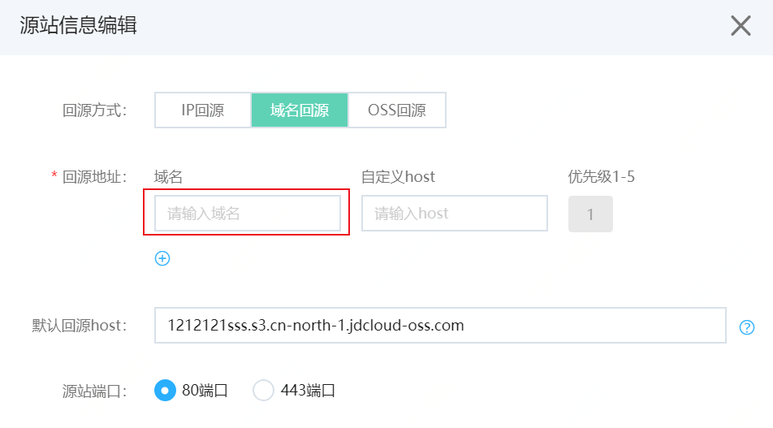

# 同时部署CDN和WAF

Web应用防火墙（简称WAF）可以与CDN（如网宿、七牛、京东智联云CDN等）结合使用，为开启内容加速的域名提供Web攻击防御。

## 前提条件

- [开通Web应用防火墙](https://docs.jdcloud.com/cn/web-application-firewall/purchase-process)
- 已将网站信息[添加到WAF](https://docs.jdcloud.com/cn/web-application-firewall/step-1)
- [放行WAF回源IP](https://docs.jdcloud.com/cn/web-application-firewall/step-2)
- [本地验证](https://docs.jdcloud.com/cn/web-application-firewall/step-3)
- 域名已[接入CDN](https://docs.jdcloud.com/cn/cdn/create-domain)
- 在域名DNS服务商处有添加域名的权限

## 背景信息

您可以参照以下架构为网站业务同时部署WAF和CDN：

CND和WAF同时部署原理：先将域名解析到CDN，再将CDN回源地址修改为WAF的“CNAME”这样流量才会被CDN转发到WAF，WAF将网站流量检测和攻击拦截后，讲安全的流量转到源站。配置完成后，流量会先经过CDN，再转发到WAF，最后转到源站，实现加速和网站防御。

## 使用京东智联云CDN操作步骤

1.参见[CDN快速接入](https://docs.jdcloud.com/cn/cdn/getting-started)，将要防护的域名（即加速域名）接入CDN。

2.在Web应用防火墙中添加网站配置。

​		i. 登录[Web应用防火墙控制台](https://cloudwaf-console.jdcloud.com/overview/business?start=1595887129926&end=1595890728926)。

​		ii. 在左侧导航栏，单击**网站配置**。

​		iii.在网站配置页面上方，选择当前实例。选择实例后，点击**添加网站**。

​		iv.进入**添加网站**页面，填写网站信息。并在网站信息中完成以下信息：

​			    **域名**：防护域名。

​				**服务器地址**：勾选**IP**并填写ECS公网IP、SLB公网IP、云外机房服务器的IP。

​				**是否使用代理**：勾选**是**。

​				更多信息，请参见**添加网站**。信息填写完成后，单击确定，成功添加网站配置。

​		 v.在**网站配置**列表中，定位到刚才添加的域名，将鼠标悬浮到CNAME上方，可以看到WAF CNAME值，复制网站的WAF CNAME地址。

3.将CDN配置中的源站修改为Web应用防火墙分配的CNAME地址。

​	i. 登录[京东智联云CDN控制台](https://cdn-console.jdcloud.com/domain/add)。

​	ii.在域名管理页面，选择要操作的域名，单击域名，进入域名管理页面，点击**回源配置**Tab页。

​	iii.找到源站信息，点击**修改配置**。选择**域名回源**。

​	iv.将域名修改为WAF分配的CName，host为源站的host。

## 执行结果

完成上述配置后，网站流量先经过CDN，再转发到Web应用防火墙进行安全检测防护。

## 使用非京东智联云CDN

1. 配置CDN，将域名接入CDN。
2. 在Web应用防火墙中创建网站配置。具体请参见**使用京东智联云CDN第二步**。
3. 查看WAF CNAME地址。具体请参见**使用京东智联云CDN第二步**。
4. 将CDN配置的源站改为WAF CNAME地址。

