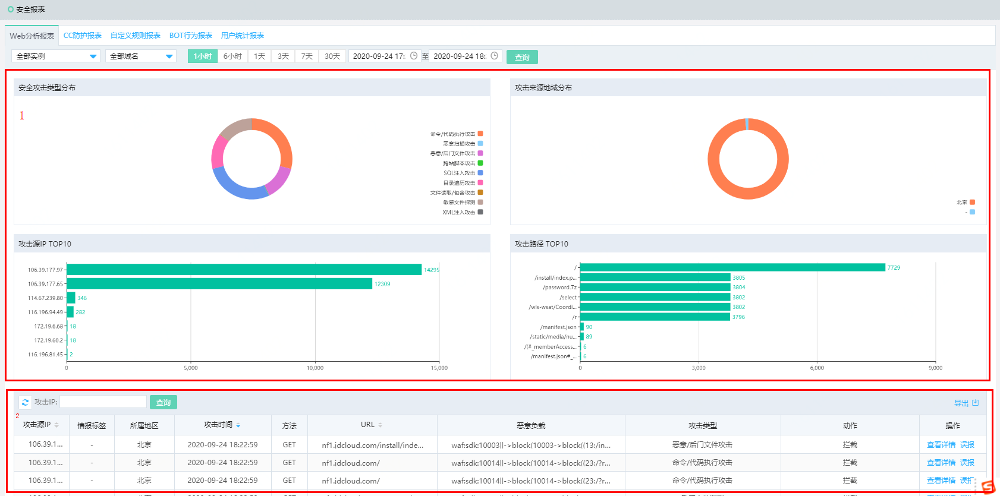
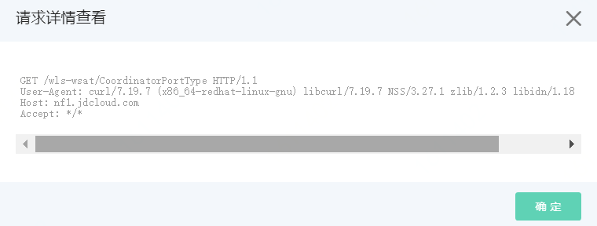

# Web应用防护最佳实践

本文介绍了使用Web应用防火墙的Web应用防护功能进行Web防护的最佳实践，包含应用场景、防护策略、防护效果。

## 应用场景

Web应用防火墙（Web Application Firewall，简称WAF）主要帮助网站防御不同类型的Web应用攻击，例如SQL注入、XSS跨站攻击、远程命令执行、Webshell上传、后门隔离、路径穿越等攻击。

**说明** 主机层服务的安全问题（例如Redis、MySQL未授权访问等）导致的服务器入侵不在WAF的防护范围之内。

## 防护策略

您在完成网站接入后，Web应用防火墙的**Web应用攻击防护**功能默认开启，并使用检测模式、默认选择正常等级的防护策略，为网站防御常见的Web攻击。您可以在**网站配置**页面定位到域名的**防护配置**，打开防护配置页面的Web防护页签，定位到**Web应用攻击防护**区域，查看规则的防护状态。具体操作请参见[设置Web应用攻击防护](https://docs.jdcloud.com/cn/web-application-firewall/web-application-firewall-engine)。

**防护状态解读**

- **状态**：是否开启Web应用攻击防护功能，默认开启。
- **模式**：WAF检测发现网站的访问请求中包含Web攻击时要执行的动作，包含拦截和检测两种模式。
  - 拦截模式：WAF自动拦截攻击请求，并在后台记录攻击日志。
  - 检测模式：WAF不会拦截攻击请求，仅在后台记录攻击日志。
- **防护规则策略等级**：Web应用攻击防护使用的防护规则策略等级，默认提供：正常、严格、宽松的检测强度。
  - **正常**：防护粒度较宽松且防护规则策略精准，可以拦截常见的具有绕过特征的攻击请求。
  - **严格**：防护粒度最精细，可以拦截具有复杂的绕过特征的攻击请求，相比正常等级带来的误拦截可能更多。
  - **宽松**：防护粒度较粗，只拦截攻击特征比较明显的请求。

**使用建议**

- 如果您对自己的业务流量特征还不完全清楚，建议您先切换到检测模式进行观察。一般情况下，建议您观察一至两周，然后分析检测模式下的攻击日志。
  - 如果没有发现任何正常业务流量被拦截的记录，则可以切换到**拦截**模式。
  - 如果发现攻击日志中有正常的业务流量，您可以联系京东云安全专家沟通具体的解决方案。
- 业务操作方面应注意以下问题：
  - 正常业务的HTTP请求中尽量不要直接传递原始的SQL语句、JavaScript代码。
  - 正常业务的URL尽量不要使用一些特殊的关键字（UPDATE、SET等）作为路径，例如`www.example.com/xyz/update/mod.php?set=1`。

## 防护效果

开启Web应用攻击防护后，您可以在**分析报表->安全报表**页面查询 **Web防护**报表，了解Web应用攻击防护的防护记录。具体操作请参见**查看安全报表**。

**Web防护**报表支持查询最近30天内的攻击记录。报表下方提供了详细的攻击记录列表，您可以筛选出**攻击防护**记录，然后单击记录操作栏下的**查看详情**，查询攻击详情。例如，下图中的**攻击详情**表示一条已被WAF拦截的SQL注入请求。

**说明** 如果您发现WAF误拦截了正常的业务流量，建议您先通过**访问控制->白名单**功能对受影响的URL配置白名单策略，然后联系京东云安全专家沟通具体的解决方案。具体操作请参见[设置白名单](https://docs.jdcloud.com/cn/web-application-firewall/set-up-whitelist-rules)。

如果您发现少量的攻击流量没有被WAF拦截，可以观察攻击流量特征添加[Web防护自定义规则](https://docs.jdcloud.com/cn/web-application-firewall/set-up-custom-protection)，或者联系京东云安全专家，确定防护方案。

