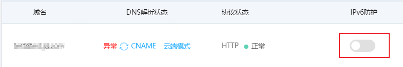

# 开启IPv6防护

网站接入Web应用防火墙后，您可以为其一键开启IPv6防护功能。IPv6防护为网站防御IPv6环境下发起的攻击，帮助源站实现对IPv6协议请求的安全防护。

## 前提条件

- 已开通Web应用防火墙实例，更多信息，请参见[开通Web应用防火墙](https://docs.jdcloud.com/cn/web-application-firewall/purchase-process)。
  - 实例套餐是**企业版**及以上规格。更多信息，请参见[版本功能说明](https://docs.jdcloud.com/cn/web-application-firewall/price-overview)。
- 已完成网站接入。更多信息，请参见[添加域名](https://docs.jdcloud.com/cn/web-application-firewall/step-1)。

## 背景信息

随着IPv6协议的迅速普及，新的网络环境以及新兴领域均面临着新的安全挑战，Web应用防火墙的IPv6防护功能帮助您轻松构建覆盖全球的安全防护体系。

开启IPv6安全防护功能后，Web应用防火墙自动生成的CNAME地址将实现双路解析。解析规则如下：

- IPv4客户端发起的解析请求将解析到一个IPv4地址的防护集群。
- IPv6客户端发起的解析请求将解析到一个IPv6地址的防护集群。

双路解析实现了对IPv4和IPv6流量的威胁检测与防御，并将安全的访问流量转发至源站服务器，其中IPv6流量将自动转换为IPv4流量并转发回源站服务器。

## 操作步骤

​	1、登录[Web应用防火墙控制台](https://cloudwaf-console.jdcloud.com/overview/business)。

​	2、在左侧导航栏，单击**网站配置**。

​	3、在**网站配置**页面定位到要操作的域名，为其开启**IPv6状态**开关。

