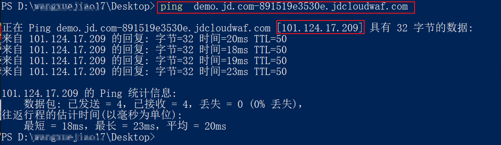
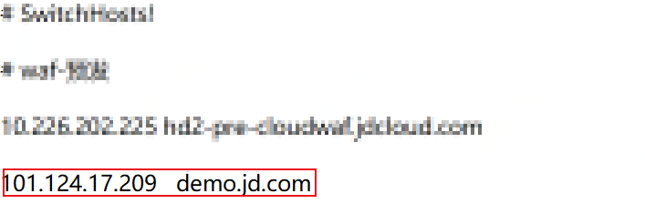
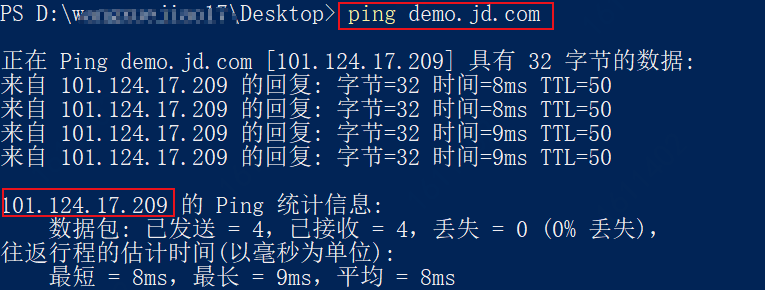
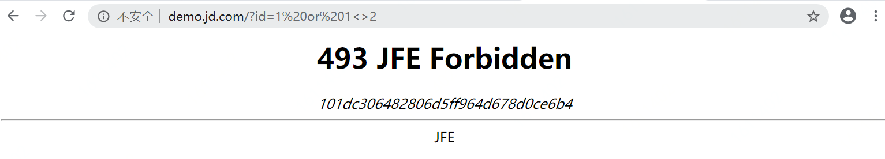
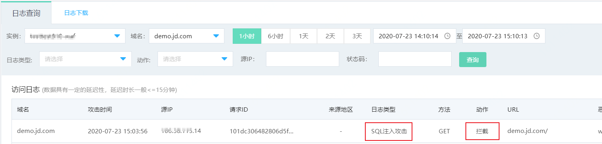

# 本地验证

已在Web应用防火墙中添加网站后，还未修改防护域名的DNS解析（将网站域名解析到Web应用防火墙）时，建议您先通过本地验证确保一切配置正常。本地验证是指通过本地计算机DNS解析，在本地计算机上验证Web应用防火墙的域名接入设置正确有效。本文以Windows操作系统为例，介绍了本地验证的操作步骤。

## 前提条件

已在Web应用防火墙中添加域名，并确保源站服务器协议、地址、端口配置正确。更多信息，请参见[添加网站](Step-1.md)。

## 背景信息

通过修改本地计算机的hosts文件，可以设置本地计算机的域名寻址映射，即仅对本地计算机生效的DNS解析记录。本地验证需要您在本地计算机上将网站域名的解析指向Web应用防火墙的IP地址。这样就可以通过本地计算机访问被防护的域名，验证Web应用防火墙中添加的域名接入设置是否正确有效，避免域名接入配置异常导致网站访问异常。 

## 操作步骤

以下操作以本地计算机使用Windows操作系统为例进行描述。

1.获取CNAME值。进入**网站配置**页面，定位到您添加的域名，将鼠标悬浮到CNAME上方，可以查看到CNAME的值，点击 ，获取并复制CNAME。

2.获取WAF IP地址。在Windows打开cmd命令行工具，运行 `ping  CNAME`  命令，将获得CNAME对应的WAF IP地址。

​	 以域名`demo.jd.com` 为例，该域名已添加到WAF 的网站配置中，且WAF为其分配了以下CNAME值： demo.jd.com-891519e3530e.jdcloudwaf.com 。

​     在cmd命令行工具中，运行 ping  demo.jd.com-891519e3530e.jdcloudwaf.com  命令，将获得CNAME对应的WAF IP。

在ping 命令的返回结果中，记录域名对应的WAF IP地址。如例子中 WAF IP为101.124.17.209。

3.修改本地hosts文件，在hosts文件最后一行添加记录：`WAF IP地址    被防护域名`。修改方法具体如下：

​     i. 打开本地计算机的文件资源管理器。

​     ii. hosts文件一般位于 C:\Windows\System32\drivers\etc\ 路径下，选择用记事本或文本编辑器打开hosts文件。

​     iii. 在hosts文件最后一行添加记录：`WAF IP地址    被防护域名`

4.修改hosts后保存，在cmd命令行工具中，执行命令 `ping  <被防护的域名>` ，验证hosts修改已生效。

 

预期`ping`如果解析到了WAF IP地址，如上图所示。如果解析到了源站IP地址，请刷新本地的DNS缓存（Windows的cmd下可以执行`ipconfig`、`flushdns`命令）并重新执行ping命令，直到验证hosts修改已经生效。

5.本地浏览器中输入防护域名，验证WAF转发正常。清理浏览器缓存，在浏览器中输入防护域名，测试网站域名是否能正常访问。如果hosts绑定已经生效，且WAF的配置正确，访问该域名，预期网站可以正常打开。

6.**可选**本地模拟简单的web攻击命令，查看Web应用防火墙的防护效果。

  i.  将**Web应用攻击防护**的模式设置为**拦截模式**，具体方法请参见设置**Web应用防护引擎**。 

  ii. 例如，您可以在浏览器的地址栏输入 `<被防护域名>/?id=1%20or%201<>2` （这是一个模拟的   SQL注入攻击请求，本例则输入  http://demo.jd.com/?id=1%20or%201<>2），查看WAF针对Web应用攻击的防御效果。

预期Web应用防火墙会返回以下拦截页面。

​    iii.进入**Web应用防火墙控制台**，可通过点击左侧**分析报表** > **全量日志** ，筛选实例域名后，查看防护域名的测试数据。如下图。

