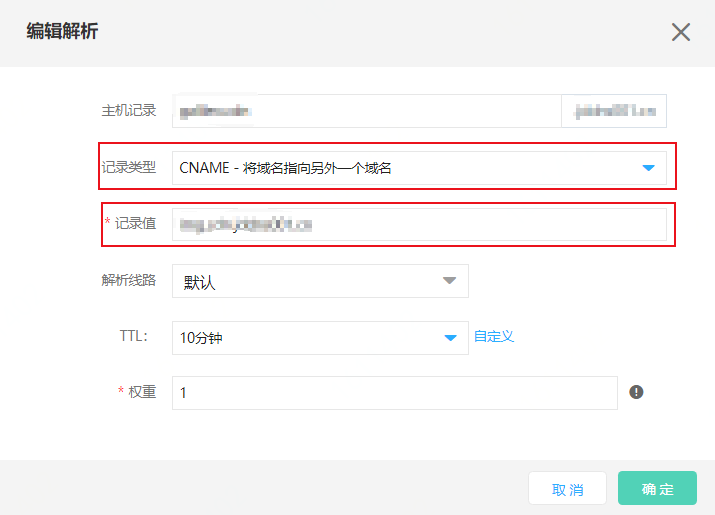

# 修改DNS解析

在Web应用防火墙添加网站后，您必须使用Web应用防火墙的CNAME地址修改域名的DNS解析设置，将网站的Web请求解析到Web应用防火墙进行安全清洗，Web应用防火墙再将安全的流量返回源站，实现网站防护。本文介绍了修改DNS解析的相关内容。

## 前提条件

- 已在Web应用防火墙（WAF）中添加要防护的网站信息。更多信息，请参见[添加网站](Step-1.md)。

- 已放行Web应用防火墙回源IP段。更多信息，请参见[放行回源IP](Step-2.md)。

  > 注意：如果源站服务器上使用了安全软件（如安全狗、云锁等），您需要在这些软件上设置放行Web应用防火墙的回源IP段，防止由Web应用防火墙转发到源站的正常业务流量被拦截。

- 已通过本地验证，确保Web应用防火墙的转发配置生效，防止因配置错误导致业务中断。更多信息，请参见[本地验证](Step-3.md)。

- 拥有在域名的DNS服务商处修改域名解析设置的权限。

## 背景信息

Web应用防火墙支持通过CNAME方式接入，即将域名解析到WAF CNAME地址。在某些极端情况下（如节点故障、机房故障等），CNAME接入可以实现切换节点IP甚至直接将请求返回到源站，最大程度的保证源站业务的稳定运行，提供高可用性和灾备能力。

本文主要介绍为网站单独开启Web应用防火墙防护，即网站不接入CDN、DDos高防等其他代理型服务。

## 操作步骤

1.登录[Web应用防火墙控制台](https://cloudwaf-console.jdcloud.com/overview/business)。

2.在左侧导航栏，单击**网站配置**。

3.获取CNAME值。在**网站配置**页面，定位到您添加的域名，将鼠标悬浮到CNAME上方，可以查看到CNAME的值，点击 ，获取并复制CNAME。

4.修改域名DNS解析。到该域名的DNS服务商处，配置防护域名的别名解析，具体操作请咨询您的域名服务提供商。

   以下操作以京东智联云云解析DNS为例，介绍修改域名解析记录的方法。如果您的域名解析托管在京东智联云云解析DNS，您可以直接参照以下步骤进行操作。如果您使用其他服务商的DNS服务，请参照以下步骤在域名DNS服务商的系统上进行类似配置。

​	i. 登录[云解析DNS控制台](https://dns-console.jdcloud.com/list)。

​	ii. 在左侧导航栏，单击**域名解析**。在**域名解析**页面，定位到要设置的域名，单击其操作设置下的**解析设置**。

​	iii.在**解析设置**页面，定位到要设置的主机记录，单击其操作列下的**修改**。

​    iv.在**编辑解析**对话框，选择使用CNAME接入的方式修改记录。

- 主机记录：在WAF中配置的域名
- 记录类型：选择“CNAME-将域名指向另外一个域名”。
- 记录值：WAF 的CNAME值。解析线路：默认。
- TTL：一般设置为10分钟，TTL值越大，则DNS记录的同步和更新越慢。
- 权重：默认选1。

​		CNAME接入：将**记录类型**设置为**CNAME**、**记录值**修改为**WAF CNAME**地址，其余设置保持不变。

关于不同记录类型的冲突，需要注意以下情况：

- 对于同一个主机记录，CNAME解析记录值只能填写一个，您需要将其修改为WAF CNAME地址。

- 不同DNS解析记录类型间存在冲突。例如，对于同一个主机记录，CNAME记录与A记录、MX记录、TXT记录等其他记录互相冲突。在无法直接修改记录类型的情况下，您可以先删除存在冲突的其他记录，再添加一条新的CNAME记录。

  > 警告：删除其他解析记录并新增CNAME解析记录的过程应尽可能在短时间内完成。如果删除A记录后长时间没有添加CNAME解析记录，可能导致域名无法正常解析。