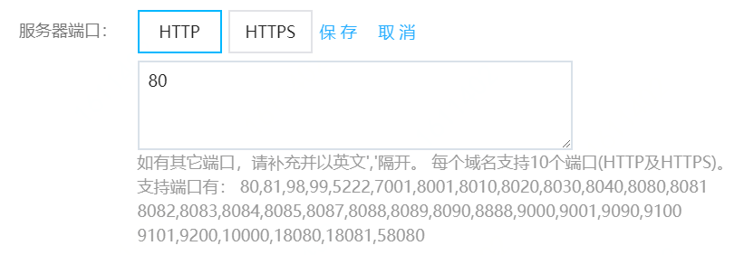

# 支持的自定义端口范围

Web应用防火墙默认支持防护80、8080（HTTP）和443、8443（HTTPS）标准端口的业务，以及特定的非标准端口业务。如果您的源站服务器使用80（HTTP）、443（HTTPS）以外的端口，则需要在接入设置中自定义服务器端口，Web应用防火墙通过您设置的服务器端口为网站提供流量的接入与转发服务。

## 前提条件

- 已开通Web应用防火墙实例。更多信息，请参见[开通Web应用防火墙](https://docs.jdcloud.com/cn/web-application-firewall/purchase-process)。
- 已完成网站接入。更多信息，请参见[添加网站](https://docs.jdcloud.com/cn/web-application-firewall/step-1)。
- 包年包月实例套餐必须是高级版及以上规格，更多信息，请参见版本功能说明

**说明** 本文以编辑网站接入设置为例，介绍如何自定义服务器端口。您也可以在添加网站时自定义服务器端口。更多信息，请参见[添加网站](https://docs.jdcloud.com/cn/web-application-firewall/step-1)。

## 背景信息

完成网站接入后，Web应用防火墙只通过已设置的服务器端口向源站服务器转发业务流量。对于未设置的端口，Web应用防火墙不会转发任何该端口的访问请求流量到源站服务器。

## 使用限制

**端口范围**

Web应用防火墙（**高级版**、**企业版**、**旗舰版**）的网站接入设置中支持使用的端口范围如下：

**说明** 具体端口的支持情况，请以控制台显示和查询结果为准。更多信息，请参见[查看可选端口范围](https://cloudwaf-console.jdcloud.com/instance)。

- HTTP

  协议

  80，81，98，99，5222，7001，8001，8010，8020，8030，8040，8080，8081，8082，8083，8084，8085，8087，8088，8089，8090，8888，9000，9001，9090，9100，9101, 9200, 10000, 18080, 18081, 58080

- HTTPS

  协议

  443，444，8443 

**端口数量**

- 各版本的Web应用防火墙实例：每个域名支持接入最多10个不同的端口（包含80、8080、443、8443端口）。

## 操作步骤

1. 登录[Web应用防火墙控制台](https://cloudwaf-console.jdcloud.com/overview/business)。

2. 在左侧导航栏，单击**网站配置**。

3. 在**网站配置**页面定位到要防护的域名，在操作栏单击**编辑**。

4. 在编辑页面，定位到服务器端口，如下图，点击自定义。

   

5. 单击要设置的协议类型（**HTTP**、**HTTPS**），输入要添加的端口，并单击**保存**。

   

   **说明** 输入的端口必须在可用范围内，否则无法保存。

6. 单击**确定**，保存网站接入设置。

