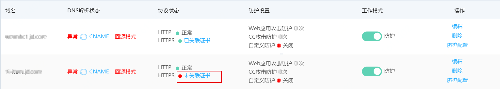
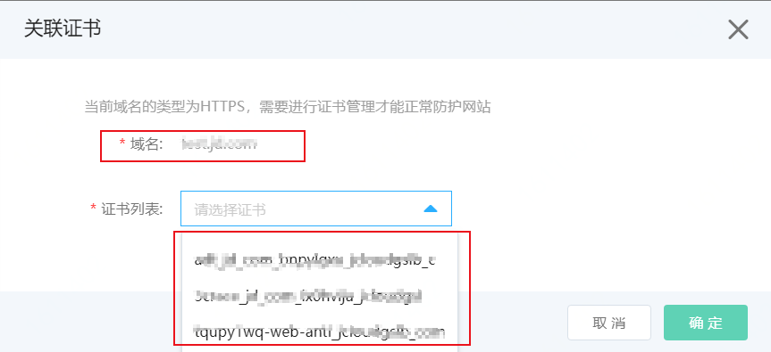

# 关联证书

如果您添加的网站信息的协议类型中包含**HTTPS**，您必须在Web应用防火墙控制台上传与该网站域名关联的HTTPS证书，且证书必须正确、有效，才能保证Web应用防火墙正常防护网站的HTTPS协议访问请求。

Web应用防火墙的证书服务关联了京东智联云SSL证书服务，在为网站域名关联证书时会展示SSL证书中与该域名匹配的证书。如果不存在所需证书，可以点击上传证书，跳转到SSL证书的证书管理页面去添加证书，通过SSL证书服务自动上传已有合法证书。如果您没有合法证书，您可以在京东云SSL证书服务购买所需证书。

操作步骤

1.登录京东智联云[Web应用防火墙控制台](https://cloudwaf-console.jdcloud.com/overview/business)。

2.在左侧导航栏，单击**网站配置**。

3.在**网站配置**页面，定位到要操作的域名，单击其协议状态列HTTPS的**未关联证书**。

4.在**关联证书**对话框，**关联证书**或者**上传证书**。

a.点击证书列表，下拉框会展示SSL证书服务中包含待配置域名的相关证书，选择证书，点击确定则完成**关联证书**。

b.如果下拉框没有数据，或者没有想关联的证书，可以点击右侧上传按钮，跳转到SSL证书管理页面，**上传证书**，包括证书的私钥和公钥。具体操作，请参见[证书上传指引](https://docs.jdcloud.com/cn/ssl-certificate/upload-ssl-certificate)。上传证书完成后，回到步骤a，完成**关联证书**操作。

c.如果您需要申请新证书，可以到[SSL证书管理页面](https://docs.jdcloud.com/cn/ssl-certificate/manage-ssl-certificate)，单击**申购证书**。具体操作，请参见[证书购买](https://docs.jdcloud.com/cn/ssl-certificate/apply-ssl-certificate)。

d.如果您需要更新证书，只需去SSL控制台更新证书，Web应用防火墙会自动更新。