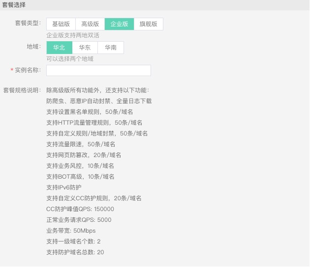
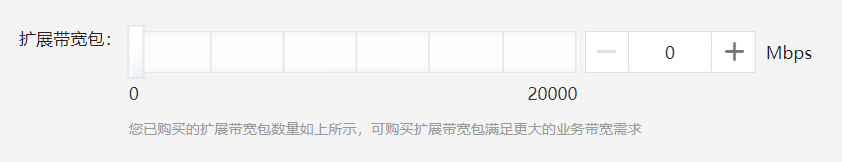

# 带宽扩展包

通过购买包年包月模式开通Web应用防火墙（简称WAF）时，各版本的WAF实例存在一定量的业务带宽限制。如果您的业务有更大的带宽需求，您可以购买带宽扩展包。本文主要介绍了相关概念和相关评估方法。

## **什么是业务带宽限制**？

WAF的业务带宽是指每个WAF实例（包含所有该WAF实例防护的域名、站点）中正常业务流量的大小，单位为Mbps。50Mbps带宽对应1000-1500 QPS（Query Per Second，即每秒钟的请求量，例如一个 HTTP GET 一个网址请求，就是一个Query）。根据请求资源大小不同，对应的QPS略有不同。

购买WAF不同版本实例都存在一定量的业务带宽限制。例如，在WAF企业版套餐中，对于京东云内源站的业务带宽限制为100Mbps，而对于京东云外的服务器的业务带宽限制为50Mbps。 

## 如何选择带宽限制

购买WAF时，您需要提前考虑您准备通过WAF配置防护的所有域名（站点）的日常入方向和出方向总流量的峰值，确保您所选购的WAF套餐所对应的业务带宽限制大于入方向和出方向总流量峰值中较大的值。

> 说明：一般情况下，出方向的流量会比较大。

您可以参考您站点服务器的监控工具来评估您实际业务流量大小。例如，您需要通过WAF配置防护五个站点，每个站点的出方向的正常流量的峰值都不超过10Mbps，流量总和不超过50Mbps。这种情况下，您只需选择购买WAF企业版套餐即可。

> 说明：评估业务所需流量是指正常的业务流量。您可以在购买WAF实例时，通过购买扩展带宽包来提升您WAF实例的业务带宽限制。

## 超过业务带宽

如果您的正常业务流量超过您已购买的WAF实例的业务带宽限制，您在WAF实例中配置的全部业务的流量转发将可能受到影响。

超出业务带宽限制后，可能出现限流、随机丢包等现象，导致您的正常业务在一定时间内不可用、卡顿、延迟等。

如果出现这种情况，您需要升级WAF版本或者购买带宽扩展包扩展业务带宽，避免正常业务流量超出业务带宽限制所产生的影响。

## 如何选择带宽扩展包

如果您通过WAF防护的域名（站点）业务流量较大，您可以购买带宽扩展包以防超过WAF实例的业务带宽限制。例如，您当前的业务流量需求为80Mbps（京东云外的源站服务器），您已经购买了WAF企业版实例（带宽限制为50Mbps），这种情况下您需要额外购买30Mbps的扩展带宽，确保您的业务访问正常。

- 如果您已经购买WAF实例，您可以通过**升级当前的WAF实例**来变更带宽扩展包配置，满足更大的业务带宽需求。在**实例管理**页面，找到对应的实例名称，点击**升级**，打开**升级套餐**页面，选择所需的扩展带宽包大小，并完成支付。具体操作请参考[续费与升级](Renew-And-Upgrade.md)。

- 您也可以在购买WAF实例时，根据实际业务需求，增加额外业务带宽扩展。

