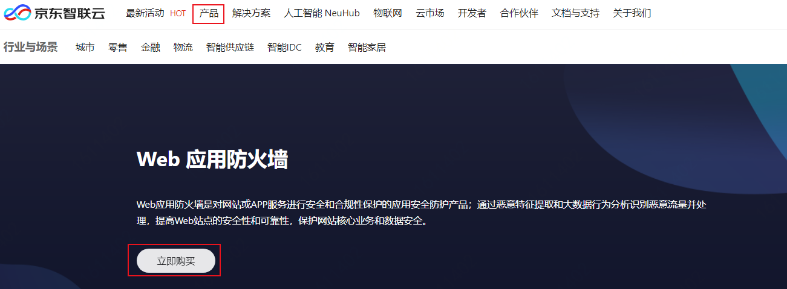
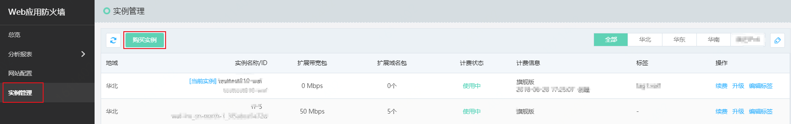
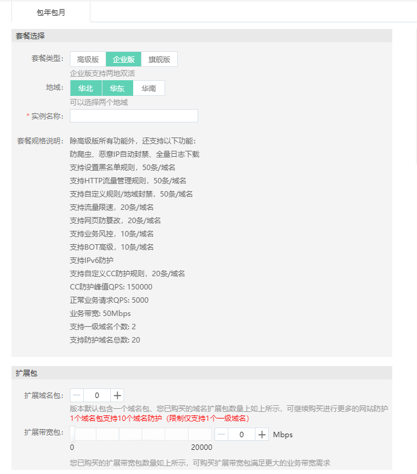

## 购买方式

本文介绍了开通Web应用防火墙服务的具体操作。

## 购买Web应用防火墙

1、进入[Web应用防火墙购买页面](https://cloudwaf-console.jdcloud.com/create)并登陆京东智联云账号。有以下两种方式：

​			方式1、官网页购买。进入京东智联云官网页面，选择**产品**->**云安全**->**Web应用防火墙**，点击**立即购买**，进入Web应用防火墙购买页面。

​			方式2、控制台购买。进入京东智联云官网页面，点击右上方**控制台**->**云产品**->**Web应用防火墙**，进入Web应用防火墙页面，单击左侧**实例管理**，进入实例管理页面，点击上方**购买实例**，进入Web应用防火墙购买页面。

2、在**Web应用防火墙购买页面**，完成以下配置。

| 配置项     | 说明                                                         |
| ---------- | ------------------------------------------------------------ |
| 套餐选择   | 您可以选择： **高级版** **企业版** **旗舰版** 选择一个套餐后，下方**套餐规格说明**中为您简要描述所选择版本的功能规格，请参见**版本功能说明**。 说明：企业版和旗舰版支持IPv6防护。 |
| 地域       | 选择WAF服务集群所在地域。可选值： **华北** **华东** **华南** 说明：**企业版**可以支持选择两个地域，两地双活。**旗舰版**可以支持选择3个地域，三城容灾，提高业务稳定性。 |
| 扩展域名包 | 指定要开通的域名扩展包数量。 如果您有多个域名（或超过套餐自带的域名数）需要接入WAF进行防护，您可以开通域名扩展包。更多信息，请参见[域名扩展包说明](domain-Expansion-Pack.md)。 |
| 扩展带宽包 | 指定要开通的带宽扩展包大小，单位：Mbps。 如果您需要接入WAF防护的业务总带宽超过所选套餐规格，您可以开通带宽扩展包。更多信息，请参见[带宽扩展包说明](Bandwidth-Expansion-Pack.md)。 |
| 购买量     | 选择WAF服务的有效时长。                                      |

 3.单击**立即购买**并完成支付。

