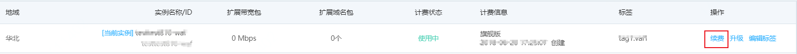
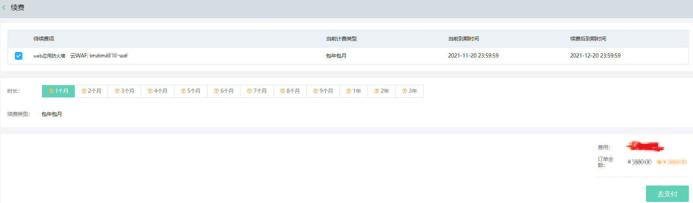
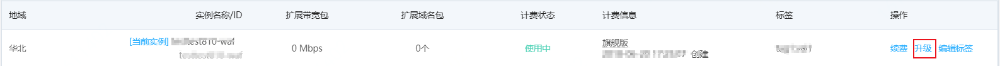
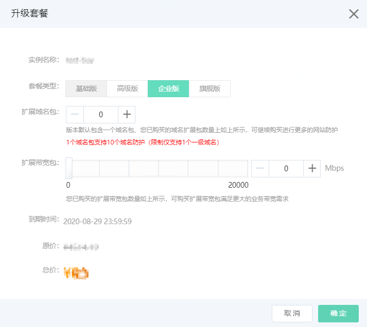

# 续费与升级

为了避免您购买的Web应用防火墙实例过期对您业务造成影响，您可以在实例到期前为其续费。如果当前您购买的Web应用防火墙实例不能满足您的业务需求，您可以升级实例，从较低版本升级到更高的版本，也可以根据需求增加域名扩展包和带宽扩展包的数量。

## 续费说明

如果您购买了Web应用防火墙实例，您可以在实例到期前为其续费，延长其服务周期。

距离服务到期前7天，系统会以短信或邮件的形式提醒您服务即将到期，并提醒您续费。服务到期后，防护服务停止，Web应用防火墙实例的配置为您保留7天，7天内续费则继续防护。到期7天后仍未续费，Web应用防火墙实例会被释放，网站防护将失效。

## 续费操作

1.登录[Web应用防火墙控制台](https://cloudwaf-console.jdcloud.com/overview/business)。

2.在左侧导航栏，单击**实例管理**。

3.在**实例管理**页面，定位到要升级的实例，单击操作栏下方的**续费**。

4.在续费页面，选择需要续费的时长，并完成支付，即可根据选择的时长延长您的Web应用防火墙实例的服务到期时间，完成续费。

## 升级

对于已购买的Web应用防火墙实例，如果其实例规格不能满足您的业务需要，您可以将其升级到更高的版本，获取更高级的防护效果。关于Web应用防火墙各版本功能的区别，请参见[价格与版本功能](Price-Overview.md)。

1.登录[Web应用防火墙控制台](https://cloudwaf-console.jdcloud.com/overview/business)。

2.在左侧导航栏，单击**实例管理**。

3.在**实例管理**页面，定位到要升级的实例，单击操作栏下方的**升级**。

4.在升级套餐页面，选择需要变更的配置，并完成支付，即可根据选择的配置信息升级您的Web应用防火墙实例。关于配置选择，请参见[Web应用防火墙购买方式](Purchase-Process.md)。

