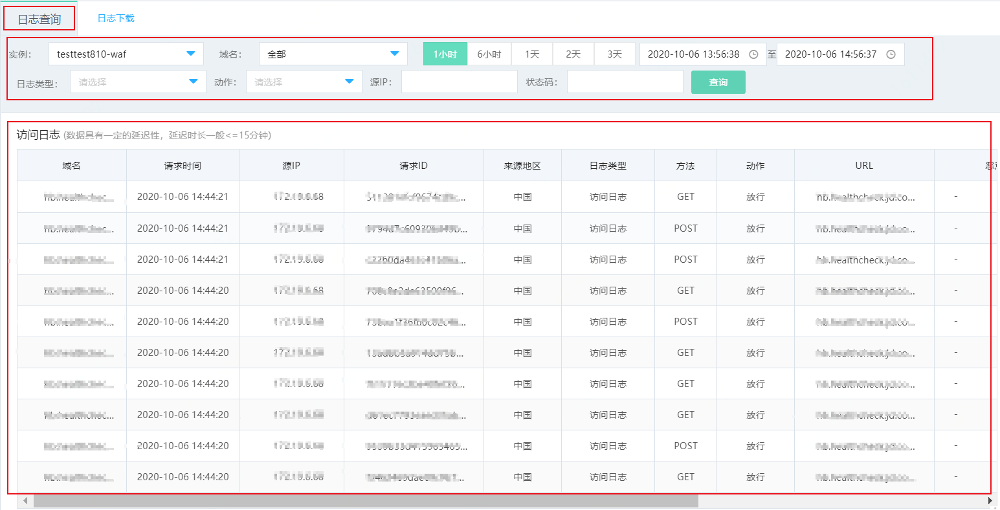
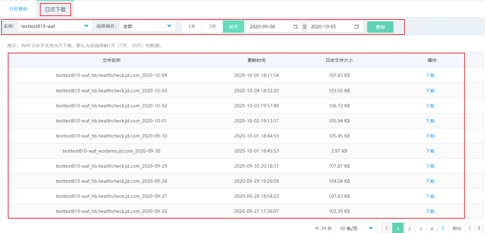

# 使用全量日志

开通Web应用防火墙后，Web应用防火墙将记录您网站的所有访问请求日志，您可以通过日志搜索快速定位请求记录，满足运维、安全方面的管理需求。您也可以通过日志下载，对请求原始日志进行分析，满足运维需求。

## 背景信息

全量日志功能可以帮助您轻松地完成以下运维工作：

- 确认某个具体请求是否被Web应用防火墙拦截或放行。
- 确认某个具体拦截是由Web攻击、CC安全防护、黑白名单或是自定义的访问控制规则触发。
- 查询源站对于某个具体请求的状态码及状态码标识，观察是否超时或出错等。
- 通过源IP、URL关键字、恶意负载、服务器响应状态码及状态标识等条件组合查询具体的请求。

## 使用须知

- Web应用防火墙服务支持保存最近一个月内的网站访问日志。

## 日志查询

1. 登录[Web应用防火墙控制台](https://cloudwaf-console.jdcloud.com/overview/business)。

2. 在左侧导航栏，单击**分析报表**下的**全量日志**。

3. 在**日志查询**页面，您可以使用域名、查询时间、日志类型、动作、源IP、状态码等，点击查询后搜索某个域名在查询时间范围内的数据。

   

4. 查看日志搜索结果。以下是访问日志字段含义。

   | 名称     | 含义                                                         |
   | :------- | :----------------------------------------------------------- |
   | 域名     | 访问请求的域名。                                             |
   | 请求时间 | 访问请求的发生时间，在所下载的日志文件中以UTC时间记录。      |
   | 源IP     | 访问的客户端来源IP。                                         |
   | 请求ID   | 指定访问请求。如果存在访问请求被拦截，可以填写拦截页面中的该请求的ID进行搜索。 |
   | 来源地区 | 访问来源IP所属地区，中国内地地区可精确到市级。               |
   | 方法     | 访问的请求行中的请求类型。                                   |
   | 动作     | WAF对请求的执行动作，包括放行、观察、浏览器跳转、人机交互、拦截。 |
   | URL      | 访问请求行中的所访问的服务器资源。                           |
   | 恶意负载 | 请求中的攻击内容。                                           |
   | 攻击详情 | 可以查看攻击请求的详细信息。                                 |
   | 状态码   | WAF返回给客户端的响应状态信息。                              |
   | 状态标识 | 对状态码的解释标记。                                         |

## 日志下载

1. 登录[Web应用防火墙控制台](https://cloudwaf-console.jdcloud.com/overview/business)。

2. 在左侧导航栏，单击**分析报表**下的**全量日志**。

3. 在**日志下载**页面，您可以使用域名、查询时间搜索某个域名在查询时间范围内的全量日志数据。暂不支持第一天数据下载，可以选择**日志查询**页签去查看筛选，最多支持30天内全量日志下载。

   

4. 查看日志下载页面结果，以下是字段含义。

   | 名称         | 含义                                                         |
   | :----------- | :----------------------------------------------------------- |
   | 文件名称     | 通过账号Pin-waf-域名_时间，同一天因日志大小不同可能有多个日志文件。 |
   | 更新时间     | 文件更新时间                                                 |
   | 日志文件大小 | 日志文件的大小                                               |
   | 操作         | 下载，点击可以直接下载。                                     |

