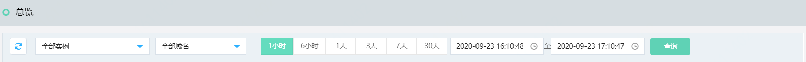
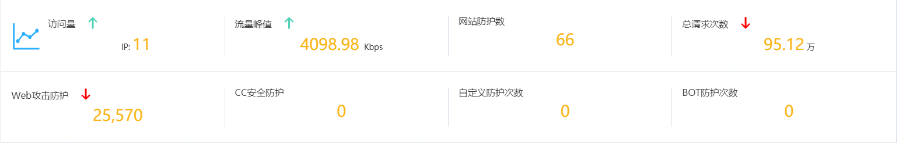
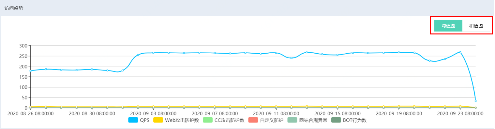
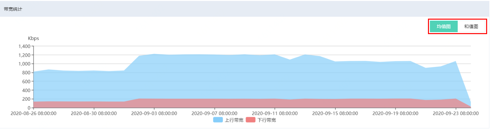
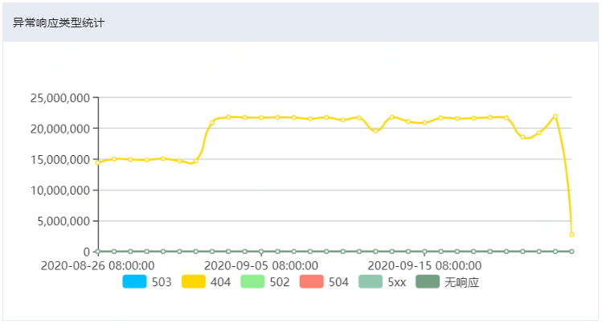
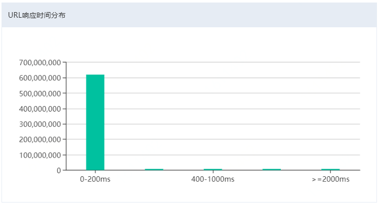
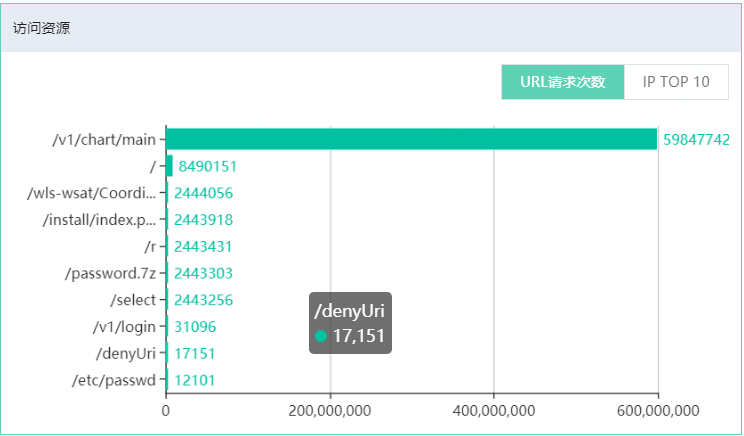
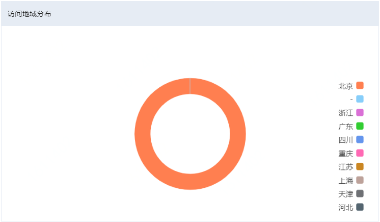

# 查看总览信息

Web应用防火墙（WAF）的总览页面展示了已接入WAF防护的所有网站的总体防护信息，包括防护统计数据、访问趋势、带宽统计、异常响应类型统计、访问资源统计等。您可以查看总览信息了解网站业务的安全状态和做安全分析。

## 访问总览页面

1. 登录[Web应用防火墙控制台](https://cloudwaf-console.jdcloud.com/overview/business)。

2. 在左侧导航栏，单击**总览**。

3. 在**总览**页面左侧列表上方，设置要查询的网站域名（全部域名或已接入防护的单个域名）和时间段（**1小时**、**6小时**、**1天**、**3天**、**7天**、**30天**、**自定义**），查看对应的总览信息。

   

   **说明** 支持查看最近30天内的总览信息，使用自定义时间可以查看最近30天内指定时间段的数据。

## 防护统计数据解读

展示网站域名**访问量**、**流量峰值**、**网站防护数**、收到的**全部**请求次数和触发不同防护模块的请求次数，包括**Web攻击防护**、**CC安全防护**、**自定义防护次数**、**Bot防护次数**。

访问量是指访问的IP数，流量峰值是每s的流量最大值，网站防护数是指所选实例防护的网站数量。

单击不同防护模块下的请求次数，可以跳转到对应的**安全报表**页面，查看详细数据。更多信息，请参见**查看安全报表**。

## 请求分析图表解读

- 访问趋势：展示指定时间段内的请求趋势，均值图表示指定时间段内的QPS均值的趋势，和值图表示指定时间段的请求总量的趋势。包含全部请求次数、Web入侵防护次数、CC安全防护次数、扫描防护次数、访问控制命中次数、Bot防护次数。

  

- 带宽统计：包含入方向带宽和出方向带宽，单位：kbps。

  

- 异常响应码：包含503、404、502、5xx等异常响应码的数量趋势。

  

- URL响应时间：从WAF向源站发送请求到WAF收到源站响应的时间。

  

- 访问资源：**URL请求次数**页签展示被请求URL的排名情况和请求次数的Top10。**IP Top10**页签下展示访问来源IP的排名情况和访问次数。

  

- 访问地域分布：以饼状图展示访问源的地域分布情况。

  

  

  