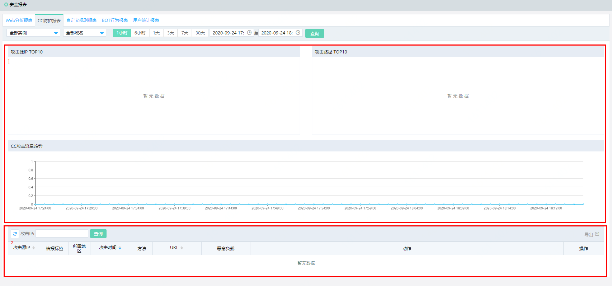
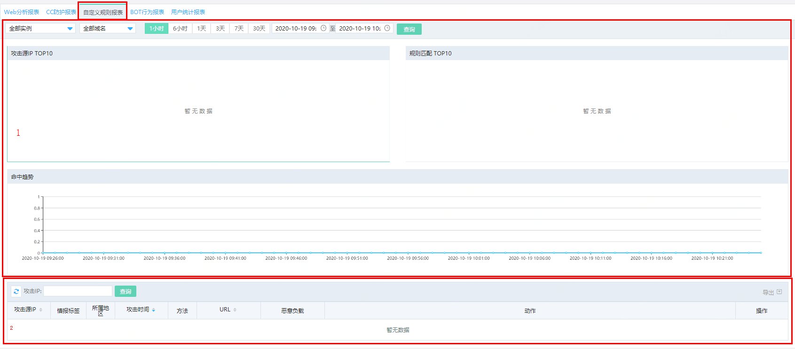
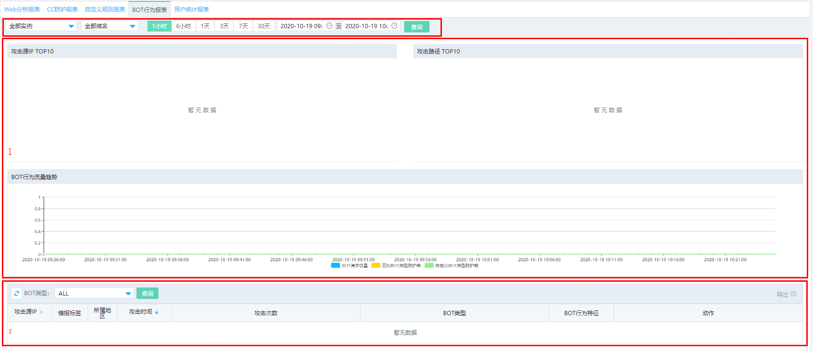

# 查看安全报表

Web应用防火墙（WAF）安全报表向您展示WAF各个防护模块的防护记录。您可以使用安全报表查看WAF已防护域名的**Web分析报表**、**CC防护报表**、**自定义规则报表**、**Bot行为报表**、**用户统计报表**。

## 前提条件

- 已开通Web应用防火墙实例，更多信息，请参见[开通Web应用防火墙](https://docs.jdcloud.com/cn/web-application-firewall/purchase-process)。
- 已完成网站接入。更多信息，请参见[添加域名](https://docs.jdcloud.com/cn/web-application-firewall/step-1)。

## 访问报表页面

1. 登录[Web应用防火墙控制台](https://cloudwaf-console.jdcloud.com/overview/business)。
2. 在左侧导航栏，单击**分析报表**下的**安全报表**。
3. 在**安全报表**页面，通过页签选择要查看的报表类型（**Web分析报表**、**CC防护报表**、**自定义规则报表**、**Bot行为报表**、**用户统计报表**），查看对应报表。

## Web分析报表解读

**Web分析报表**展示了WAF阻断的所有Web应用攻击，分为攻击统计信息（图示中1）和攻击日志记录（图示中2）。您可以使用域名、查询时间搜索某个域名在查询时间范围内的数据。

- 攻击统计信息包括**安全攻击类型分布**、**攻击来源地域分布**、**攻击来源IP TOP5**和**攻击来源区域 TOP5**。

- 攻击详情记录展示Web攻击的详细信息，包括攻击源IP、情报标签、所属地区、攻击时间、方法、URL、恶意负载、攻击类型、动作。您可以使用攻击IP筛选您关注的记录。

  单击某个记录操作列下的**查看详情**，可以查看**攻击详情**。

  

关于Web入侵防护的设置方法，请参见以下文档：

- [设置Web应用攻击防护](https://docs.jdcloud.com/cn/web-application-firewall/web-application-firewall-engine)
- [设置智能语义防护引擎](https://docs.jdcloud.com/cn/web-application-firewall/intelligent-semantics-protection-engine)

## CC防护报表

**CC防护报表**展示了WAF阻断的所有CC攻击，分为攻击统计信息（图示中1）和攻击日志记录（图示中2）。您可以使用域名、查询时间搜索某个域名在查询时间范围内的数据。

- 攻击统计信息包括**安全攻击类型分布**、**攻击路径 TOP10**和**CC攻击流量趋势**。
- 攻击详情记录展示CC攻击的详细信息，包括攻击源IP、情报标签、所属地区、攻击时间、方法、URL、恶意负载、动作。您可以使用攻击IP筛选您关注的记录。

关于CC攻击防护的设置方法，请参见以下文档：

- [设置CC安全防护](https://docs.jdcloud.com/cn/web-application-firewall/set-up-safety-protection)

## 自定义规则报表

**自定义规则报表**展示了WAb自定义规则攻击情况统计，分为攻击统计信息（图示中1）和攻击日志记录（图示中2）。您可以使用域名、查询时间搜索某个域名在查询时间范围内的数据。

- 攻击统计信息包括**攻击源Top10**、**规则匹配 TOP10**和**规则命中趋势**。
- 攻击日志记录详细信息，包括攻击源IP、情报标签、所属地区、攻击时间、方法、URL、恶意负载、动作。您可以使用攻击IP筛选您关注的记录。

关于自定义规则的设置方法，请参见以下文档：

- [设置自定义安全防护](https://docs.jdcloud.com/cn/web-application-firewall/set-up-custom-protection)

## Bot行为报表解读

**Bot行为**报表展示了网站业务的爬虫情况统计，分为攻击统计信息（图示中1）和攻击日志记录（图示中2）。您可以使用域名、查询时间搜索某个域名在查询时间范围内的数据。

- 攻击统计信息包括**攻击源Top10**、**攻击路径 TOP10**和**BOT行为流量趋势**。
- 攻击日志记录详细信息，包括攻击源IP、情报标签、所属地区、攻击时间、方法、URL、恶意负载、动作。您可以使用BOT类型筛选您关注的记录。

关于Bot管理的设置方法，请参见以下文档：

- [设置已知爬虫库规则](https://docs.jdcloud.com/cn/web-application-firewall/set-up-known-crawler-rules)
- [设置自定义BOT规则](https://docs.jdcloud.com/cn/web-application-firewall/set-up-custom-bot-rules-currency)

## 用户统计报表

**用户统计报表**展示业务的用户情况，包括访问用户IP Top10、访问用户地区Top10、用户的访问趋势的报表数据。

更多信息，请参见**全量日志**。

