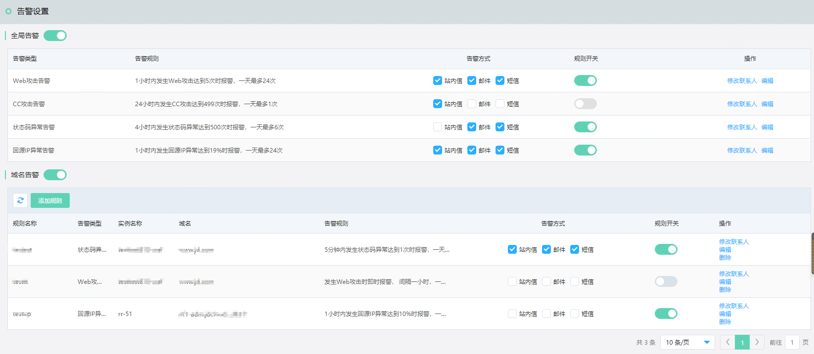
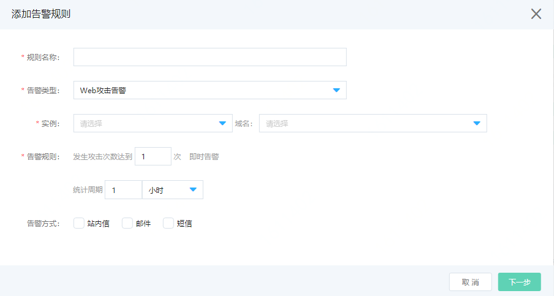

# 设置告警监控

Web应用防火墙支持自定义告警和告警通知方式的自动化运维能力，通过所设定的告警通知方式向您推送安全事件和系统告警。

## 背景信息

Web应用防火墙告警支持全局告警和域名告警。全局告警对各实例维度统计攻击时间和系统流量异常发出告警。域名告警可以对指定域名基于指定告警类型统计，并设置告警规则。对于不同的告警支持设置短信、邮件、站内信等通知方式和联系人。设置告警帮助您梳理WAF生成的海量防护日志中的攻击事件和系统告警。您可以针对不同的事件类型自定义不同的通知和处置方式，便于您全面、有效地完成日常运维工作。

## 操作步骤

1. 登录[Web应用防火墙控制台](https://docs.jdcloud.com/cn/web-application-firewall/purchase-process)。

2. 在左侧导航栏，单击**分析报表**> **告警**。

3. 在**告警设置**页面，根据事件类型选择要使用的告警方式。

4. 配置告警规则。

   - 配置全局告警。对实例维度统计

     | 表项           | 解释项                                                       |
     | -------------- | ------------------------------------------------------------ |
     | **告警类型**   | 支持告警类型Web攻击告警、CC攻击告警、状态码异常告警、回源IP段异常告警。 |
     | **告警规则**   | 通过点击操作下的编辑，配置频次（时间&次数），达到频次发告警消息。 |
     | **告警方式**   | 发送告警消息的方式，可选站内信、邮件、短信等。               |
     | **规则开关**   | 开启则规则生效，关闭则规则禁用。                             |
     | **修改联系人** | 点击可以修改消息发送的联系人。                               |
     | **编辑**       | 点击编辑，可以修改告警规则。                                 |

   - 配置域名告警。以域名维度统计，点击添加规则。

     

     | 表项           | 解释项                                                       |
     | -------------- | ------------------------------------------------------------ |
     | **规则名称**   | 输入规则的名称。                                             |
     | **告警类型**   | 支持告警类型Web攻击告警、CC攻击告警、状态码异常告警、回源IP段异常告警。 |
     | **实例/域名**  | 选择实例下的域名，域名支持多选                               |
     | **告警规则**   | 通过点击操作下的编辑，配置频次（时间&次数），达到频次发告警消息。 |
     | **告警方式**   | 发送告警消息的方式，可选站内信、邮件、短信等。               |
     | **修改联系人** | 点击下一步，可以修改消息发送的联系人。                       |

     填写完对话框，点击**确定**。生成一条域名告警规则。