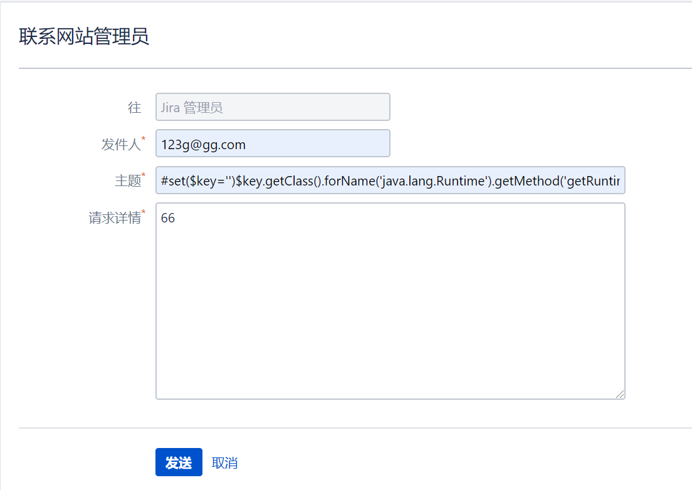
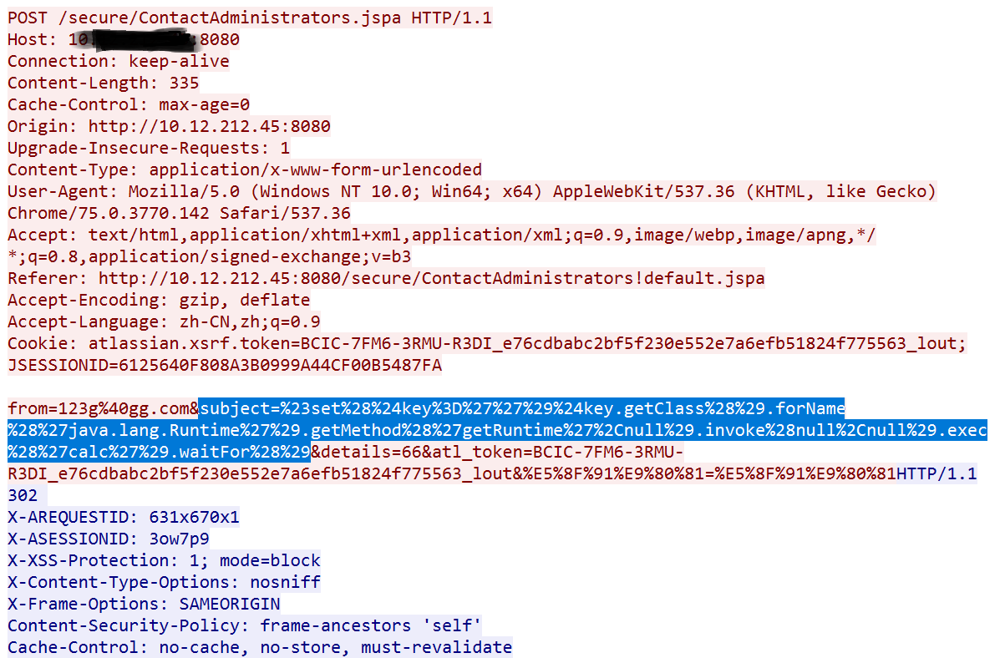

## **Atlassian Jira服务端模板注入漏洞**

**漏洞名称：**Atlassian Jira服务端模板注入漏洞

**漏洞描述**

Jira是Atlassian公司出品的项目与事务跟踪工具，被广泛应用于缺陷跟踪、客户服务、需求收集、流程审批、任务跟踪、项目跟踪和敏捷管理等工作领域。Jira配置灵活、功能全面、部署简单、扩展丰富，具有较广泛的应用范围。

Atlassian Jira Server和Jira Data Center存在服务端模板注入漏洞，成功利用此漏洞的攻击者可在运行受影响版本的Jira Server或Jira Data Center系统上执行任意命令。

**漏洞分析**

该软件在实现上，在处理邮件时，根据对象成员变量source的类型，调用不同的方法解析模板。

当传入payload进行攻击时，通过asPlainText()创建出TemplateSource$Fragment对象，再通过DefaultRenderRequest构造方法把source成员变量赋值为这个Fragment对象，调用this.getVe().evaluate()，最终调用ASTMethod.execute()。

通过EmailBuilder的withSubject()方法，创建一个TemplateSources$fragment对象，参数即是我们传入的payload，随后调用renderLater()方法创建出EmailBuilder对象，再将该对象作为参数传递给RenderingMailQueueItem类，于是最终创建出一个MailQueueItem对象，并将该对象放入邮件发送队列。

Jira默认配置是不开启联系管理员功能，邮件发送也需要单独配置SMTP，设置完成后，在联系管理员页面直接提交恶意代码，不涉及编码问题。

在联系管理员页面填入payload进行攻击即可：

具体抓包结果如下：

**影响范围**

Jira 4.4.0 < 7.6.14

Jira 7.7.0 < 7.13.5

Jira 8.0.0 < 8.0.3

Jira 8.1.0 < 8.1.2

Jira 8.2.0 < 8.2.3

**官方解决方案**

升级至Jira最新版本，该漏洞需升级至7.6.14、7.13.5、8.0.3、8.1.2或8.2.3及以上版本。

**防护建议**

Web应用防火墙和应用安全网关用户的Web攻击防护策略中已发布相应策略，用于防护该Jira 0day漏洞，开启相应策略即可防御针对该漏洞的攻击。